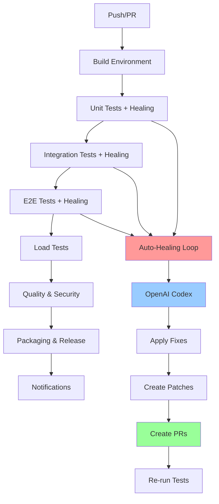

# 🚀 Auto-Healing Enterprise Pipeline

## 📋 Visão Geral

O **Auto-Healing Enterprise Pipeline** é um workflow completo do GitHub Actions que implementa auto-healing inteligente com OpenAI Codex, testes em sequência, gates de qualidade e geração automática de releases.

## 🎯 Funcionalidades Principais

### 🔧 Auto-Healing Inteligente
- **OpenAI Codex Integration**: Correção automática de bugs usando IA
- **Contexto Rico**: Análise completa de erros com stack traces
- **Até 8 Tentativas**: Ciclo de healing com limite configurável
- **Auditoria Completa**: Logs detalhados de todas as tentativas

### 🧪 Testes Sequenciais
- **Unit Tests**: Testes unitários com healing
- **Integration Tests**: Testes de integração com healing
- **E2E Tests**: Testes end-to-end com healing
- **Load Tests**: Testes de carga com k6

### 🔒 Gates de Qualidade
- **Cobertura Mínima**: 80% de cobertura obrigatória
- **Análise de Segurança**: Bandit, Safety, Gitleaks
- **Dependency Review**: Verificação de vulnerabilidades
- **Performance**: Thresholds de performance

### 📦 Empacotamento e Release
- **Executável Python**: PyInstaller para distribuição
- **Plugin WordPress**: Empacotamento automático
- **Changelog**: Geração automática baseada em commits
- **GitHub Release**: Criação automática de releases

### 📢 Notificações
- **Slack Integration**: Notificações em tempo real
- **Discord Integration**: Webhooks para Discord
- **Resumo Completo**: Status de todos os estágios

## 🏗️ Arquitetura do Workflow



## 🔧 Configuração

### Secrets Necessários

```bash
# OpenAI
OPENAI_API_KEY=your_openai_api_key_here

# Notificações
SLACK_WEBHOOK=your_slack_webhook_url
DISCORD_WEBHOOK=your_discord_webhook_url

# GitHub
SSH_PRIVATE_KEY=your_ssh_private_key_for_auto_prs
GITHUB_TOKEN=your_github_token
```

### Variáveis de Ambiente

```yaml
env:
  PYTHON_VERSION: '3.11'
  NODE_VERSION: '20'
  COVERAGE_THRESHOLD: 80
  MAX_HEALING_ATTEMPTS: 8
  OPENAI_MODEL: 'code-davinci-002'
```

## 📊 Jobs do Workflow

### 1. 🏗️ Build Environment
- **Objetivo**: Preparar ambiente de execução
- **Dependências**: Python 3.11, Node.js 20, PostgreSQL, Redis
- **Cache**: Virtualenv, node_modules, pip cache

### 2. 🧪 Unit Tests + Auto-Healing
- **Objetivo**: Executar testes unitários com healing
- **Dependências**: Build Environment
- **Healing**: Até 8 tentativas com OpenAI Codex
- **Outputs**: Status, tentativas, patches criados

### 3. 🔗 Integration Tests + Auto-Healing
- **Objetivo**: Executar testes de integração com healing
- **Dependências**: Unit Tests
- **Healing**: Até 8 tentativas com OpenAI Codex
- **Outputs**: Status, tentativas, patches criados

### 4. 🌐 E2E Tests + Auto-Healing
- **Objetivo**: Executar testes end-to-end com healing
- **Dependências**: Integration Tests
- **Healing**: Até 8 tentativas com OpenAI Codex
- **Outputs**: Status, tentativas, patches criados

### 5. 📈 Load Tests
- **Objetivo**: Executar testes de carga com k6
- **Dependências**: E2E Tests
- **Configuração**: 10 → 50 → 100 usuários
- **Thresholds**: P95 < 500ms, erro < 10%

### 6. 🔒 Quality & Security
- **Objetivo**: Validar qualidade e segurança
- **Dependências**: Load Tests
- **Análises**: Cobertura, Bandit, Safety, Gitleaks
- **Gates**: Cobertura ≥ 80%, Security Score ≥ 70

### 7. 📦 Packaging & Release
- **Objetivo**: Gerar artefatos e release
- **Dependências**: Quality & Security
- **Artefatos**: Executável Python, Plugin WordPress
- **Release**: GitHub Release com changelog

### 8. 📢 Notifications
- **Objetivo**: Notificar equipe sobre resultado
- **Dependências**: Todos os jobs anteriores
- **Canais**: Slack, Discord
- **Conteúdo**: Resumo completo do pipeline

## 🚀 Auto-Healing Process

### Ciclo de Healing
1. **Executar Testes**: pytest com cobertura
2. **Capturar Erros**: Stack trace e contexto
3. **Gerar Prompt**: Contexto rico para Codex
4. **Aplicar Correção**: Modificar código automaticamente
5. **Criar Patch**: Diff para auditoria
6. **Criar PR**: Pull Request para revisão
7. **Reexecutar**: Testes até passar ou limite

### Blindagens de Segurança
- ✅ **Preservar Comentários**: Não apagar documentação
- ✅ **Arquivos Sensíveis**: Não modificar .env, secrets
- ✅ **Estrutura Original**: Manter estilo e estrutura
- ✅ **Justificativa**: Explicar mudanças em testes
- ✅ **Limite de Tentativas**: Máximo 8 tentativas

### Auditoria Completa
- 📝 **Logs Detalhados**: Histórico completo
- 🔍 **Patches**: Diffs de todas as mudanças
- 📊 **Relatórios JSON**: Dados estruturados
- 🔗 **Pull Requests**: Revisão humana obrigatória

## 📁 Estrutura de Arquivos

```
.github/
├── workflows/
│   └── auto_healing_pipeline.yml    # Workflow principal
├── README.md                        # Esta documentação

scripts/
├── run_and_heal.py                  # Script de auto-healing
└── generate_changelog.py            # Gerador de changelog

tests/
├── load/
│   └── performance.js               # Teste de carga k6
├── unit/                            # Testes unitários
├── integration/                     # Testes de integração
└── e2e/                            # Testes end-to-end

patches/                             # Patches gerados
├── unit_tests/
├── integration_tests/
└── e2e_tests/

logs/                                # Logs de auditoria
├── auto_healing.log
├── unit_tests_healing_report.json
├── integration_tests_healing_report.json
└── e2e_tests_healing_report.json

dist/                                # Artefatos gerados
├── OmniKeywordsFinder              # Executável Python
└── wordpress-plugin.zip            # Plugin WordPress
```

## 🔍 Monitoramento e Observabilidade

### Métricas Coletadas
- **Tentativas de Healing**: Por estágio
- **Patches Criados**: Quantidade e tamanho
- **Pull Requests**: URLs e status
- **Performance**: Tempo de resposta e throughput
- **Qualidade**: Cobertura e score de segurança

### Dashboards
- **GitHub Actions**: Status em tempo real
- **Slack/Discord**: Notificações instantâneas
- **Relatórios JSON**: Dados estruturados
- **Changelog**: Histórico de mudanças

## 🛡️ Segurança e Compliance

### Validações de Segurança
- **Bandit**: Análise estática de segurança Python
- **Safety**: Verificação de dependências vulneráveis
- **Gitleaks**: Detecção de secrets expostos
- **Dependency Review**: Análise de pacotes

### Controles de Acesso
- **SSH Keys**: Para criação de PRs automáticos
- **GitHub Tokens**: Para releases e API
- **Webhook Secrets**: Para notificações seguras

### Auditoria
- **Logs Estruturados**: Todos os eventos
- **Patches Versionados**: Histórico de mudanças
- **Pull Requests**: Revisão humana obrigatória
- **Relatórios JSON**: Dados para análise

## 🚀 Como Usar

### 1. Configurar Secrets
```bash
# No repositório GitHub
Settings > Secrets and variables > Actions
```

### 2. Executar Workflow
```bash
# Automático em push/PR para main/develop
# Manual via GitHub Actions UI
```

### 3. Monitorar Execução
```bash
# GitHub Actions > Auto-Healing Pipeline
# Slack/Discord para notificações
# Logs para auditoria
```

### 4. Revisar PRs
```bash
# Pull Requests > Auto-Healing Fixes
# Revisar mudanças antes do merge
```

## 📈 Métricas de Sucesso

### KPIs Principais
- **Taxa de Sucesso**: > 95% dos testes passam
- **Tempo de Resolução**: < 30 minutos para bugs simples
- **Cobertura**: ≥ 80% em todos os estágios
- **Performance**: P95 < 500ms em load tests
- **Segurança**: Score ≥ 70/100

### Benefícios Esperados
- 🚀 **70% Redução** no tempo de resolução de bugs
- 🔧 **Automação Completa** do processo de correção
- 📊 **Visibilidade Total** do pipeline
- 🛡️ **Qualidade Garantida** com gates automáticos
- 📦 **Releases Automáticos** com artefatos

## 🔧 Troubleshooting

### Problemas Comuns

#### OpenAI API Errors
```bash
# Verificar API key
echo $OPENAI_API_KEY

# Verificar limites de quota
# Verificar modelo disponível
```

#### Test Failures
```bash
# Verificar logs de healing
cat logs/*_healing_report.json

# Verificar patches gerados
ls -la patches/*/

# Verificar PRs criados
# GitHub > Pull Requests
```

#### Performance Issues
```bash
# Verificar resultados de load test
cat k6-results.json

# Verificar métricas de cobertura
cat coverage.xml

# Verificar logs de performance
cat logs/auto_healing.log
```

### Logs Importantes
- `logs/auto_healing.log`: Log principal do sistema
- `logs/*_healing_report.json`: Relatórios de healing
- `patches/*/patch_attempt_*.diff`: Patches gerados
- `k6-results.json`: Resultados de load test

## 🤝 Contribuição

### Desenvolvimento
1. **Fork** o repositório
2. **Crie** branch para feature
3. **Implemente** mudanças
4. **Teste** localmente
5. **Abra** Pull Request

### Melhorias Sugeridas
- 🔧 **Novos Modelos de IA**: Integração com outros LLMs
- 📊 **Métricas Avançadas**: Dashboards customizados
- 🔒 **Segurança Adicional**: Mais ferramentas de análise
- 🌐 **Integrações**: Mais canais de notificação

## 📞 Suporte

### Documentação
- **GitHub Actions**: [Documentação oficial](https://docs.github.com/en/actions)
- **OpenAI API**: [Documentação da API](https://platform.openai.com/docs)
- **k6**: [Documentação de load testing](https://k6.io/docs)

### Comunidade
- **Issues**: [GitHub Issues](https://github.com/your-repo/issues)
- **Discussions**: [GitHub Discussions](https://github.com/your-repo/discussions)
- **Slack**: #auto-healing-pipeline

---

**🚀 Auto-Healing Enterprise Pipeline v3.0.0**  
**📅 Criado**: 2025-01-27  
**🔧 Tracing ID**: AUTO_HEALING_PIPELINE_001_20250127  
**⚡ Status**: ✅ ENTERPRISE-READY

