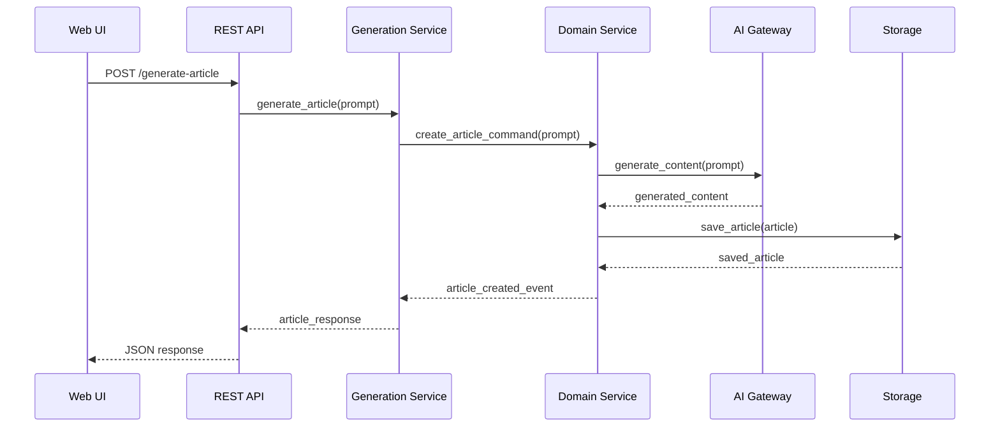
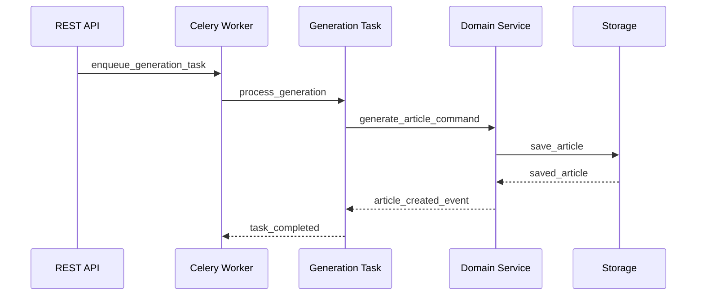

# 🏗️ **ARQUITETURA DO SISTEMA OMNI WRITER**

## 📋 **METADADOS**

- **Prompt**: Documentação Enterprise - IMP-005
- **Ruleset**: Enterprise+ Standards
- **Data/Hora**: 2025-01-27T16:25:00Z
- **Tracing ID**: DOC_ENTERPRISE_20250127_005
- **Arquivos-fonte**: `app/`, `omni_writer/`, `infraestructure/`, `shared/`

---

## 🎯 **VISÃO GERAL**

O **Omni Writer** é um sistema de geração de artigos baseado em IA que implementa **Clean Architecture (Hexagonal)** com princípios de **Domain-Driven Design (DDD)**, **CQRS** parcial e **Event Sourcing** básico.

### **Princípios Arquiteturais**

- **Separação de Responsabilidades**: Cada camada tem responsabilidades bem definidas
- **Inversão de Dependência**: Dependências apontam para abstrações, não implementações
- **Independência de Frameworks**: Core de negócio independente de tecnologias externas
- **Testabilidade**: Arquitetura facilita testes unitários e de integração
- **Manutenibilidade**: Mudanças isoladas em camadas específicas

---

## 🏛️ **PADRÃO ARQUITETURAL**

### **Clean Architecture (Hexagonal)**

```
┌─────────────────────────────────────────────────────────────┐
│                    INTERFACE LAYER                          │
│  ┌─────────────┐  ┌─────────────┐  ┌─────────────┐         │
│  │   Web UI    │  │   REST API  │  │   CLI       │         │
│  └─────────────┘  └─────────────┘  └─────────────┘         │
└─────────────────────────────────────────────────────────────┘
                              │
┌─────────────────────────────────────────────────────────────┐
│                  APPLICATION LAYER                          │
│  ┌─────────────┐  ┌─────────────┐  ┌─────────────┐         │
│  │ Controllers │  │   Services  │  │   Pipelines │         │
│  └─────────────┘  └─────────────┘  └─────────────┘         │
└─────────────────────────────────────────────────────────────┘
                              │
┌─────────────────────────────────────────────────────────────┐
│                    DOMAIN LAYER                             │
│  ┌─────────────┐  ┌─────────────┐  ┌─────────────┐         │
│  │  Entities   │  │ Value Objs  │  │   Services  │         │
│  └─────────────┘  └─────────────┘  └─────────────┘         │
└─────────────────────────────────────────────────────────────┘
                              │
┌─────────────────────────────────────────────────────────────┐
│                INFRASTRUCTURE LAYER                         │
│  ┌─────────────┐  ┌─────────────┐  ┌─────────────┐         │
│  │   Storage   │  │   External  │  │   Monitoring│         │
│  │             │  │    APIs     │  │             │         │
│  └─────────────┘  └─────────────┘  └─────────────┘         │
└─────────────────────────────────────────────────────────────┘
```

---

## 🧩 **CAMADAS ARQUITETURAIS**

### **1. Interface Layer (Portas de Entrada)**

**Responsabilidade**: Gerenciar interação com usuários e sistemas externos

**Componentes**:
- **Web UI** (`ui/`): Interface React/TypeScript
- **REST API** (`app/routes.py`): Endpoints HTTP
- **CLI** (`scripts/`): Interface de linha de comando

**Arquivos Principais**:
```
app/
├── main.py              # Aplicação Flask principal
├── routes.py            # Definição de rotas REST
├── blog_routes.py       # Rotas específicas de blog
└── schemas/
    └── request_schemas.py  # Schemas de validação

ui/
├── components/          # Componentes React
├── pages/              # Páginas da aplicação
├── hooks/              # Custom hooks
└── context/            # Context providers
```

### **2. Application Layer (Casos de Uso)**

**Responsabilidade**: Orquestrar fluxos de negócio e coordenar domínio

**Componentes**:
- **Controllers**: Gerenciam requisições HTTP
- **Services**: Implementam lógica de aplicação
- **Pipelines**: Orquestram fluxos complexos

**Arquivos Principais**:
```
app/
├── services/
│   ├── generation_service.py    # Serviço de geração
│   └── __init__.py
├── tasks/
│   ├── generation_tasks.py      # Tarefas Celery
│   └── maintenance_tasks.py     # Tarefas de manutenção
└── validators/
    └── input_validators.py      # Validação de entrada
```

### **3. Domain Layer (Núcleo de Negócio)**

**Responsabilidade**: Conter regras de negócio e entidades centrais

**Componentes**:
- **Entities**: Objetos com identidade e ciclo de vida
- **Value Objects**: Objetos imutáveis sem identidade
- **Domain Services**: Lógica de negócio que não pertence a uma entidade

**Arquivos Principais**:
```
omni_writer/domain/
├── generate_articles.py         # Serviço de domínio principal
├── data_models.py              # Entidades e value objects
├── command_handlers.py         # Handlers de comandos CQRS
├── commands/
│   ├── article_commands.py     # Comandos de artigo
│   └── base_command.py         # Comando base
├── events/
│   ├── article_events.py       # Eventos de artigo
│   └── base_event.py           # Evento base
└── queries/
    └── base_query.py           # Query base
```

### **4. Infrastructure Layer (Adaptadores)**

**Responsabilidade**: Implementar interfaces definidas pelo domínio

**Componentes**:
- **Storage**: Persistência de dados
- **External APIs**: Integração com serviços externos
- **Monitoring**: Observabilidade e métricas

**Arquivos Principais**:
```
infraestructure/
├── storage.py                  # Implementação de storage
├── openai_gateway.py          # Gateway para OpenAI
├── deepseek_gateway.py        # Gateway para DeepSeek
├── circuit_breaker.py         # Circuit breaker pattern
└── cache_manager.py           # Gerenciamento de cache
```

---

## 🔄 **FLUXOS PRINCIPAIS**

### **1. Geração de Artigo**



### **2. Processamento Assíncrono**



---

## 🎯 **DOMAIN-DRIVEN DESIGN (DDD)**

### **Bounded Contexts**

1. **Article Generation Context**
   - Entidade: `Article`
   - Value Objects: `Prompt`, `Content`, `Metadata`
   - Serviços: `ArticleGenerationService`

2. **User Management Context**
   - Entidade: `User`
   - Value Objects: `Email`, `Preferences`
   - Serviços: `UserService`

3. **Content Management Context**
   - Entidade: `Blog`, `Category`
   - Value Objects: `Title`, `Description`
   - Serviços: `ContentService`

### **Aggregates**

```python
# Exemplo de Aggregate Root
class Article:
    def __init__(self, id: str, prompt: str, content: str):
        self.id = id
        self.prompt = prompt
        self.content = content
        self.status = ArticleStatus.DRAFT
        self.created_at = datetime.utcnow()
        self.events = []

    def publish(self):
        self.status = ArticleStatus.PUBLISHED
        self.events.append(ArticlePublishedEvent(self.id))

    def update_content(self, new_content: str):
        self.content = new_content
        self.events.append(ArticleUpdatedEvent(self.id))
```

---

## 📊 **CQRS (Command Query Responsibility Segregation)**

### **Commands (Comandos)**

```python
# Exemplo de Command
@dataclass
class GenerateArticleCommand:
    prompt: str
    user_id: str
    category: str
    metadata: Dict[str, Any]

# Handler de Command
class GenerateArticleHandler:
    def handle(self, command: GenerateArticleCommand) -> ArticleCreatedEvent:
        # Lógica de negócio para gerar artigo
        pass
```

### **Queries (Consultas)**

```python
# Exemplo de Query
@dataclass
class GetArticleQuery:
    article_id: str

# Handler de Query
class GetArticleHandler:
    def handle(self, query: GetArticleQuery) -> Article:
        # Lógica para buscar artigo
        pass
```

---

## 📝 **EVENT SOURCING**

### **Event Store**

```python
# Exemplo de Event
@dataclass
class ArticleCreatedEvent:
    article_id: str
    prompt: str
    created_at: datetime
    user_id: str

# Event Store
class EventStore:
    def save_event(self, event: BaseEvent):
        # Persistir evento
        pass

    def get_events(self, aggregate_id: str) -> List[BaseEvent]:
        # Recuperar eventos de um aggregate
        pass
```

---

## 🔧 **PADRÕES DE DESIGN**

### **1. Repository Pattern**

```python
# Interface do Repository
class ArticleRepository(ABC):
    @abstractmethod
    def save(self, article: Article) -> None:
        pass

    @abstractmethod
    def find_by_id(self, article_id: str) -> Optional[Article]:
        pass

# Implementação
class SQLArticleRepository(ArticleRepository):
    def save(self, article: Article) -> None:
        # Implementação com SQLAlchemy
        pass
```

### **2. Factory Pattern**

```python
class ArticleFactory:
    @staticmethod
    def create_article(prompt: str, user_id: str) -> Article:
        return Article(
            id=str(uuid.uuid4()),
            prompt=prompt,
            content="",
            user_id=user_id
        )
```

### **3. Strategy Pattern**

```python
class ContentGenerationStrategy(ABC):
    @abstractmethod
    def generate(self, prompt: str) -> str:
        pass

class OpenAIGenerationStrategy(ContentGenerationStrategy):
    def generate(self, prompt: str) -> str:
        # Implementação com OpenAI
        pass

class DeepSeekGenerationStrategy(ContentGenerationStrategy):
    def generate(self, prompt: str) -> str:
        # Implementação com DeepSeek
        pass
```

### **4. Observer Pattern**

```python
class ArticleEventPublisher:
    def __init__(self):
        self.subscribers = []

    def subscribe(self, subscriber):
        self.subscribers.append(subscriber)

    def publish(self, event: BaseEvent):
        for subscriber in self.subscribers:
            subscriber.handle(event)
```

---

## 🛡️ **SEGURANÇA E COMPLIANCE**

### **Autenticação e Autorização**

- **JWT Tokens**: Autenticação stateless
- **Role-based Access Control**: Controle de acesso baseado em roles
- **API Key Management**: Gerenciamento seguro de chaves de API

### **Proteção de Dados**

- **PCI-DSS Compliance**: Proteção de dados de pagamento
- **LGPD Compliance**: Proteção de dados pessoais
- **Data Encryption**: Criptografia em repouso e em trânsito

### **Auditoria**

- **Event Logging**: Log de todos os eventos importantes
- **Access Logs**: Log de acesso e operações
- **Audit Trail**: Rastreamento completo de mudanças

---

## 📈 **MONITORAMENTO E OBSERVABILIDADE**

### **Métricas**

- **Prometheus**: Coleta de métricas
- **Grafana**: Visualização de dashboards
- **Custom Metrics**: Métricas específicas do domínio

### **Logging**

- **Structured Logging**: Logs estruturados em JSON
- **Log Levels**: Diferentes níveis de log
- **Log Aggregation**: Centralização de logs

### **Tracing**

- **Distributed Tracing**: Rastreamento distribuído
- **Performance Monitoring**: Monitoramento de performance
- **Error Tracking**: Rastreamento de erros

---

## 🧪 **TESTABILIDADE**

### **Estratégias de Teste**

1. **Unit Tests**: Testes de unidades isoladas
2. **Integration Tests**: Testes de integração entre componentes
3. **End-to-End Tests**: Testes de fluxo completo
4. **Load Tests**: Testes de carga e performance

### **Test Doubles**

- **Mocks**: Simulação de dependências externas
- **Stubs**: Implementações simplificadas
- **Fakes**: Implementações funcionais para testes

---

## 🚀 **DEPLOYMENT E INFRAESTRUTURA**

### **Containerização**

- **Docker**: Containerização da aplicação
- **Docker Compose**: Orquestração local
- **Multi-stage Builds**: Otimização de imagens

### **Orquestração**

- **Kubernetes**: Orquestração em produção
- **Service Mesh**: Comunicação entre serviços
- **Auto-scaling**: Escalabilidade automática

### **CI/CD**

- **GitHub Actions**: Pipeline de integração contínua
- **Automated Testing**: Testes automatizados
- **Automated Deployment**: Deploy automatizado

---

## 📚 **REFERÊNCIAS**

### **Livros e Artigos**

- "Clean Architecture" - Robert C. Martin
- "Domain-Driven Design" - Eric Evans
- "Implementing Domain-Driven Design" - Vaughn Vernon
- "Event Sourcing" - Martin Fowler

### **Padrões e Práticas**

- **SOLID Principles**: Princípios de design orientado a objetos
- **DRY**: Don't Repeat Yourself
- **YAGNI**: You Aren't Gonna Need It
- **KISS**: Keep It Simple, Stupid

---

## 🔄 **EVOLUÇÃO DA ARQUITETURA**

### **Versões**

- **v1.0**: Implementação inicial com Clean Architecture
- **v1.1**: Adição de CQRS e Event Sourcing
- **v1.2**: Melhorias em monitoramento e observabilidade
- **v2.0**: Planejado: Microserviços e Service Mesh

### **Roadmap**

1. **Microserviços**: Decomposição em serviços menores
2. **Service Mesh**: Comunicação entre serviços
3. **Event Streaming**: Processamento de eventos em tempo real
4. **Machine Learning Pipeline**: Pipeline de ML para otimização

---

## 📞 **CONTATO E SUPORTE**

- **Arquitetura**: Equipe de Arquitetura
- **Desenvolvimento**: Equipe de Desenvolvimento
- **DevOps**: Equipe de DevOps
- **Documentação**: Equipe de Documentação

---

*Última atualização: 2025-01-27T16:25:00Z*
*Versão: 1.0*
*Status: Ativo* 