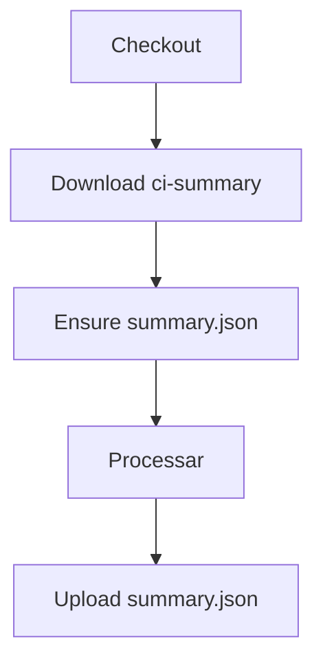
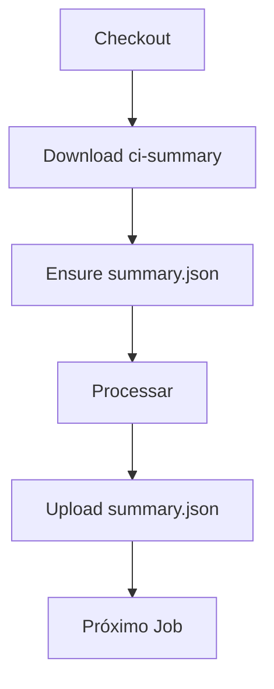

# 🛟 Guia de Implementação do Summary Fallback

## 📋 **VISÃO GERAL**

Este guia explica como implementar o sistema de fallback para o arquivo `.ci/config/summary.json` em todo o repositório, garantindo que workflows e scripts nunca falhem por ausência deste arquivo.

---

## 🎯 **OBJETIVOS**

- ✅ **Impedir falhas** por ausência de `.ci/config/summary.json`
- ✅ **Implementar fallback automático** em todos os workflows
- ✅ **Adicionar guardas** em scripts que referenciam o arquivo
- ✅ **Garantir compatibilidade** com commits antigos
- ✅ **Manter funcionalidade** existente intacta

---

## 🏗️ **ARQUITETURA DO FALLBACK**

### **Estrutura de Steps**

Cada job que usa `summary.json` deve ter esta sequência:

```yaml
steps:
  # 1. Download opcional do artifact (se existir de jobs anteriores)
  - name: 📥 Download ci-summary (optional)
    uses: actions/download-artifact@v4
    with:
      name: ci-summary
      path: .ci/config
    continue-on-error: true
  
  # 2. Garantir o arquivo (fallback)
  - name: 🛟 Ensure .ci/config/summary.json
    id: ensure_summary
    shell: bash
    run: |
      set -euo pipefail
      mkdir -p .ci/config
      if [ ! -f ".ci/config/summary.json" ]; then
        TS="$(date -u +%Y-%m-%dT%H:%M:%SZ)"
        REPO="${{ github.repository }}"
        RUN_ID="${{ github.run_id }}"
        SHA="${{ github.sha }}"
        BRANCH="${{ github.ref_name }}"
        cat > .ci/config/summary.json << 'EOF'
{
  "version": "3.0.0",
  "environment": "production",
  "tracing_id": "AUTO_HEALING_CONFIG_001_20250127",
  "repository": "$REPO",
  "run_id": "$RUN_ID",
  "sha": "$SHA",
  "branch": "$BRANCH",
  "jobs_completed": {},
  "totals": { "healing_attempts": 0, "patches_created": 0, "tests_passed": 0, "tests_failed": 0 },
  "timestamp": "$TS"
}
EOF
      fi
      echo "path=.ci/config/summary.json" >> "$GITHUB_OUTPUT"
  
  # 3. Usar o arquivo summary.json
  - name: 📖 Use Summary File
    run: |
      echo "Using summary from: ${{ steps.ensure_summary.outputs.path }}"
      # ... seu código aqui ...
  
  # 4. Upload do artifact para jobs subsequentes
  - name: 📦 Upload summary.json
    if: always()
    uses: actions/upload-artifact@v4
    with:
      name: ci-summary
      path: .ci/config/summary.json
      if-no-files-found: warn
```

---

## 🚀 **IMPLEMENTAÇÃO AUTOMÁTICA**

### **Script PowerShell**

```powershell
# Executar em modo dry-run primeiro
.\scripts\apply_summary_fallback.ps1 -DryRun

# Aplicar mudanças
.\scripts\apply_summary_fallback.ps1
```

### **Script Python**

```bash
# Executar em modo dry-run primeiro
python scripts/apply_summary_fallback.py --dry-run

# Aplicar mudanças
python scripts/apply_summary_fallback.py
```

---

## 🛡️ **GUARDAS EM SCRIPTS**

### **Scripts Shell (.sh)**

```bash
#!/bin/bash

# 🛟 Garantir que o arquivo summary.json existe
SUMMARY_FILE=".ci/config/summary.json"
[ -f "$SUMMARY_FILE" ] || { mkdir -p .ci/config; echo '{}' > "$SUMMARY_FILE"; }

# ... resto do script ...
```

### **Scripts Python (.py)**

```python
#!/usr/bin/env python3

# 🛟 Garantir que o arquivo summary.json existe
from pathlib import Path
summary_path = Path(".ci/config/summary.json")
summary_path.parent.mkdir(parents=True, exist_ok=True)
if not summary_path.exists():
    summary_path.write_text("{}", encoding="utf-8")

# ... resto do script ...
```

---

## 📁 **ARQUIVOS BASE**

### **Arquivo Baseline**

O arquivo `.ci/config/summary.json` deve conter:

```json
{
  "version": "3.0.0",
  "environment": "production",
  "tracing_id": "AUTO_HEALING_CONFIG_001_20250127",
  "repository": "",
  "run_id": "",
  "sha": "",
  "branch": "",
  "jobs_completed": {},
  "totals": { 
    "healing_attempts": 0, 
    "patches_created": 0, 
    "tests_passed": 0, 
    "tests_failed": 0 
  },
  "timestamp": "1970-01-01T00:00:00Z"
}
```

### **Gitignore**

O `.gitignore` deve permitir o arquivo:

```gitignore
# Ignorar toda pasta .ci/ EXCETO summary.json
.ci/
# MAS permitir versionar summary.json
!.ci/
!.ci/config/
!.ci/config/summary.json
```

---

## 🔄 **FLUXO DE EXECUÇÃO**

### **1. Job Inicial (dependencies)**



### **2. Jobs Subsequentes**



---

## ✅ **CHECKLIST DE VALIDAÇÃO**

### **Arquivos Base**
- [ ] `.ci/config/summary.json` existe e não é ignorado
- [ ] `.gitignore` permite versionar o arquivo
- [ ] Conteúdo do arquivo é JSON válido

### **Workflows**
- [ ] Todo job que usa `summary.json` tem step de download
- [ ] Todo job que usa `summary.json` tem step de ensure
- [ ] Todo job que usa `summary.json` tem step de upload
- [ ] Steps estão na ordem correta

### **Scripts**
- [ ] Scripts `.sh` têm guardas shell
- [ ] Scripts `.py` têm guardas Python
- [ ] Guardas são executados antes do uso do arquivo

### **Funcionalidade**
- [ ] Workflows executam em commits antigos
- [ ] Scripts não quebram sem o arquivo
- [ ] Fallback cria arquivo válido
- [ ] Artifacts são transportados entre jobs

---

## 🧪 **TESTES**

### **Teste de Commits Antigos**

```bash
# Fazer checkout de um commit antigo
git checkout <commit-hash>

# Executar workflow
# Deve funcionar sem falhas por ausência de summary.json
```

### **Teste de Scripts**

```bash
# Executar scripts sem o arquivo summary.json
# Deve criar o arquivo automaticamente
python scripts/example_summary_reader.py
bash scripts/example_summary_reader.sh
```

---

## 🚨 **TROUBLESHOOTING**

### **Problemas Comuns**

#### **1. YAML Inválido**
- **Sintoma**: Erro de parsing YAML
- **Solução**: Verificar indentação e formatação dos steps

#### **2. Heredoc Não Funciona**
- **Sintoma**: Erro no step ensure
- **Solução**: Usar `echo` com JSON inline em vez de heredoc

#### **3. Artifact Não Encontrado**
- **Sintoma**: Warning no download
- **Solução**: Normal em primeiro job, verificar se upload está funcionando

#### **4. Permissões Negadas**
- **Sintoma**: Erro ao criar diretório
- **Solução**: Verificar permissões do workspace

---

## 📚 **REFERÊNCIAS**

- [GitHub Actions Artifacts](https://docs.github.com/en/actions/using-workflows/storing-workflow-data-as-artifacts)
- [GitHub Actions Expressions](https://docs.github.com/en/actions/learn-github-actions/expressions)
- [YAML Syntax](https://yaml.org/spec/1.2/spec.html)

---

## 🎯 **PRÓXIMOS PASSOS**

1. **Executar scripts** de implementação automática
2. **Validar workflows** em modo dry-run
3. **Testar em commits antigos** para verificar compatibilidade
4. **Monitorar execuções** para identificar problemas
5. **Documentar casos especiais** e exceções

---

**🔧 Tracing ID**: `CI_SUMMARY_FALLBACK_001_20250127`  
**📅 Última Atualização**: 2025-01-27  
**👤 Responsável**: Omni Writer Team
