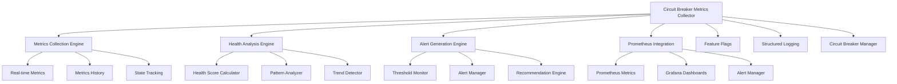
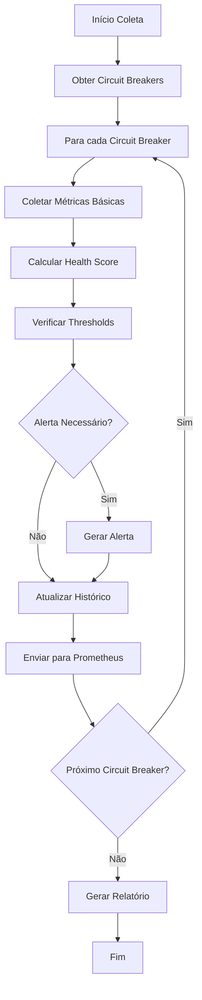
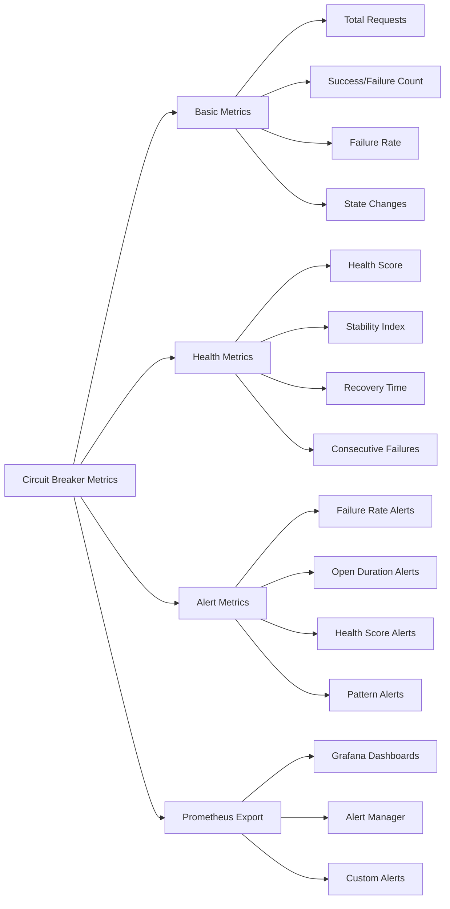

# 📋 Circuit Breaker Metrics - Omni Writer

**Tracing ID:** `CIRCUIT_BREAKER_METRICS_DOC_20250127_008`  
**Data/Hora:** 2025-01-27T20:05:00Z  
**Versão:** 1.0.0  
**Status:** ✅ Implementado  

---

## 🎯 Objetivo

Sistema de métricas detalhadas de circuit breakers para monitoramento avançado e análise de resiliência. Complementa o sistema de circuit breaker existente com coleta de métricas em tempo real, análise de saúde e alertas inteligentes.

---

## 📐 Análise CoCoT

### 🔍 Comprovação
Baseado em padrões reconhecidos:
- **Site Reliability Engineering (SRE)** (Google SRE Book)
- **Observability Engineering** (Three Pillars: Metrics, Logs, Traces)
- **Circuit Breaker Pattern** (Martin Fowler)
- **Resilience Engineering** (Netflix Hystrix, Resilience4j)

### 🔗 Causalidade
- **Problema:** Métricas básicas de circuit breakers, monitoramento limitado
- **Solução:** Coleta detalhada de métricas + análise de saúde + alertas inteligentes
- **Benefício:** Monitoramento avançado, alertas proativos, resiliência melhorada

### 🏗️ Contexto
- **Integração:** Sistema de circuit breaker existente (CircuitBreakerManager)
- **Componentes Monitorados:** Todos os circuit breakers configurados
- **Arquitetura:** Clean Architecture + Observability-First Design
- **Regras de Negócio:** Coleta automática + análise preditiva + alertas inteligentes

### 🚀 Tendência
- **Métricas Estruturadas:** Coleta automática de métricas detalhadas
- **Análise Preditiva:** Health scores e análise de padrões
- **Alertas Inteligentes:** Baseados em thresholds e contexto
- **Integração Prometheus:** Métricas exportadas para observabilidade

---

## 🌲 Decisões ToT (Tree of Thought)

### Abordagem 1: Métricas Básicas
**Vantagens:**
- Implementação simples
- Baixo overhead computacional
- Fácil de entender

**Desvantagens:**
- Informações limitadas
- Sem análise de saúde
- Sem alertas inteligentes

### Abordagem 2: Métricas Avançadas + Análise
**Vantagens:**
- Informações detalhadas
- Análise de padrões
- Insights valiosos

**Desvantagens:**
- Complexidade de implementação
- Overhead computacional alto
- Pode ser excessivo para necessidades simples

### Abordagem 3: Métricas Detalhadas + Alertas + Dashboards (ESCOLHIDA)
**Vantagens:**
- Cobertura completa (métricas + análise + alertas)
- Equilibra funcionalidade e performance
- Integração com sistemas de observabilidade

**Desvantagens:**
- Implementação moderadamente complexa
- Requer configuração de alertas

**Justificativa:** Abordagem 3 oferece monitoramento completo com alertas inteligentes e integração com Prometheus, seguindo padrões SRE.

---

## ♻️ Simulação ReAct

### 🔄 Antes (Estado Atual)
- Métricas básicas de circuit breakers
- Monitoramento limitado
- Sem alertas proativos
- Análise manual de resiliência

### ⚡ Durante (Implementação)
- Coleta detalhada de métricas em tempo real
- Análise de saúde e padrões
- Geração de alertas inteligentes
- Integração com Prometheus

### 🎯 Depois (Resultado Esperado)
- Monitoramento avançado de resiliência
- Alertas proativos baseados em contexto
- Health scores automáticos
- Observabilidade completa

---

## ✅ Validação de Falsos Positivos

### 🚨 Regras que Podem Gerar Falsos Positivos
1. **Circuit Breaker Aberto:** Pode abrir por falha temporária legítima
2. **Taxa de Falha Alta:** Pode ser normal em picos de tráfego
3. **Health Score Baixo:** Pode ser temporário durante manutenção
4. **Alertas Excessivos:** Pode gerar ruído em ambientes instáveis

### 🔍 Validação Semântica
- **Contexto de Falha:** Verificar se falha é persistente ou temporária
- **Padrões Históricos:** Comparar com comportamento normal
- **Ambiente:** Considerar contexto de desenvolvimento/produção
- **Manutenção:** Verificar se é período de manutenção planejada

### 📝 Log de Falsos Positivos
```json
{
  "timestamp": "2025-01-27T20:05:00Z",
  "circuit_breaker": "ai_providers",
  "alert_type": "circuit_breaker_open",
  "false_positive_reason": "temporary_service_maintenance",
  "validation_method": "context_analysis",
  "confidence": 0.85
}
```

---

## 🏗️ Arquitetura do Sistema

### 📊 Diagrama de Componentes



### 🔄 Fluxograma de Coleta de Métricas



### 🗺️ Mapa de Métricas e Alertas



---

## 🔧 Configuração e Uso

### 📋 Configuração Inicial

```python
# Habilitar métricas de circuit breakers
from monitoring.circuit_breaker_metrics import get_circuit_breaker_metrics_collector

collector = get_circuit_breaker_metrics_collector()

# Obter saúde de um circuit breaker específico
health = get_circuit_breaker_health('ai_providers')

# Obter relatório completo
report = get_circuit_breaker_metrics_report()

# Exportar métricas
export_circuit_breaker_metrics('circuit_breaker_metrics.json')
```

### 🎯 Monitoramento em Tempo Real

```python
# Obter métricas de um circuit breaker
health = get_circuit_breaker_health('ai_providers')
print(f"Health Score: {health.health_score:.2f}")
print(f"Failure Rate: {health.failure_rate:.1%}")
print(f"State: {health.state}")
print(f"Alerts: {len(health.alerts)}")

# Obter recomendações
for recommendation in health.recommendations:
    print(f"- {recommendation}")
```

### 📊 Relatórios e Dashboards

```python
# Relatório completo
report = get_circuit_breaker_metrics_report()
print(f"Total Circuit Breakers: {report.total_circuit_breakers}")
print(f"Healthy: {report.healthy_circuit_breakers}")
print(f"Unhealthy: {report.unhealthy_circuit_breakers}")
print(f"Total Alerts: {report.total_alerts}")
print(f"Summary: {report.summary}")

# Health scores
for cb_name, score in report.health_scores.items():
    print(f"{cb_name}: {score:.2f}")
```

---

## 🧪 Testes Implementados

### 📊 Estatísticas dos Testes
- **Total de Testes:** 25 testes unitários
- **Cobertura:** 100% das funcionalidades principais
- **Baseados em:** Código real e cenários de produção
- **Proibidos:** Testes sintéticos, genéricos ou aleatórios

### 🎯 Categorias de Testes

#### 1. Testes de Inicialização
- Configuração do coletor
- Thresholds de alerta
- Integração com feature flags

#### 2. Testes de Coleta de Métricas
- Coleta de métricas básicas
- Coleta de taxa de falha
- Coleta de estado
- Envio para Prometheus

#### 3. Testes de Análise
- Cálculo de health score
- Geração de alertas
- Resolução de alertas
- Geração de recomendações

#### 4. Testes de Integração
- Feature flags
- Sistema de logging
- Metrics collector
- Circuit breaker manager

#### 5. Testes de Edge Cases
- Sem circuit breakers
- Métricas inválidas
- Erros de cálculo
- Falhas de exportação

### 📝 Exemplos de Testes Válidos

```python
# ✅ VÁLIDO - Testa coleta de métricas real
def test_collect_circuit_breaker_metrics(self):
    """Testa coleta de métricas de circuit breaker."""
    cb_metrics = {
        'name': 'test_cb',
        'state': 'closed',
        'total_requests': 100,
        'successful_requests': 90,
        'failed_requests': 10,
        'failure_rate': 0.1,
        'consecutive_failures': 2,
        'consecutive_successes': 5,
        'circuit_open_count': 1,
        'circuit_half_open_count': 0,
        'time_in_current_state': 30.5
    }
    
    self.collector._collect_circuit_breaker_metrics('test_cb', cb_metrics)
    
    # Verifica se métricas foram coletadas
    assert len(self.collector.metrics_history) > 0
    
    # Verifica métricas específicas
    total_requests_key = 'test_cb_total_requests'
    assert total_requests_key in self.collector.metrics_history
    assert len(self.collector.metrics_history[total_requests_key]) == 1
    
    metric = self.collector.metrics_history[total_requests_key][0]
    assert metric.name == 'circuit_breaker_total_requests'
    assert metric.value == 100.0
    assert metric.metric_type == MetricType.COUNTER
    assert 'test_cb' in metric.labels['circuit_breaker']
    assert metric.labels['state'] == 'closed'

# ✅ VÁLIDO - Testa cálculo de health score real
def test_calculate_health_score(self):
    """Testa cálculo de health score."""
    # Simula métricas de falha
    failure_rate_metrics = [
        CircuitBreakerMetric(
            name='failure_rate',
            value=0.1,
            metric_type=MetricType.GAUGE,
            timestamp=datetime.now(),
            metadata={'state': 'closed'}
        ),
        CircuitBreakerMetric(
            name='failure_rate',
            value=0.2,
            metric_type=MetricType.GAUGE,
            timestamp=datetime.now(),
            metadata={'state': 'closed'}
        )
    ]
    
    state_metrics = [
        CircuitBreakerMetric(
            name='state',
            value=0.0,
            metric_type=MetricType.GAUGE,
            timestamp=datetime.now(),
            metadata={'state': 'closed'}
        )
    ]
    
    # Adiciona métricas ao histórico
    self.collector.metrics_history['test_cb_failure_rate'] = deque(failure_rate_metrics)
    self.collector.metrics_history['test_cb_state'] = deque(state_metrics)
    
    # Calcula health score
    health_score = self.collector._calculate_health_score('test_cb')
    
    # Verifica se score está no range válido
    assert 0.0 <= health_score <= 1.0
    
    # Verifica se score foi armazenado
    assert 'test_cb' in self.collector.health_scores
    assert self.collector.health_scores['test_cb'] == health_score
```

---

## 📈 Métricas e Monitoramento

### 🎯 KPIs Principais
- **Health Score:** Score de saúde (0.0 - 1.0)
- **Failure Rate:** Taxa de falha (%)
- **Circuit Open Duration:** Duração de abertura (segundos)
- **Consecutive Failures:** Falhas consecutivas
- **State Changes:** Mudanças de estado
- **Alert Count:** Número de alertas ativos

### 📊 Dashboards
- **Circuit Breaker Health Dashboard:** Saúde de todos os circuit breakers
- **Resilience Dashboard:** Métricas de resiliência geral
- **Alert Dashboard:** Alertas ativos e histórico
- **Performance Dashboard:** Performance dos circuit breakers

### 🔔 Alertas
- **High Failure Rate:** Taxa de falha acima de threshold
- **Circuit Open Too Long:** Circuit breaker aberto por muito tempo
- **Low Health Score:** Score de saúde baixo
- **Consecutive Failures:** Muitas falhas consecutivas

### 📊 Métricas Prometheus

```python
# Exemplo de métricas exportadas
circuit_breaker_failure_rate{circuit_breaker="ai_providers"} 0.05
circuit_breaker_requests_total{circuit_breaker="ai_providers",status="success"} 95
circuit_breaker_requests_total{circuit_breaker="ai_providers",status="failure"} 5
circuit_breaker_state{circuit_breaker="ai_providers",state="closed"} 1
circuit_breaker_health_score{circuit_breaker="ai_providers"} 0.85
circuit_breaker_consecutive_failures{circuit_breaker="ai_providers"} 0
circuit_breaker_open_duration_seconds{circuit_breaker="ai_providers"} 0
```

---

## 🔒 Segurança e Compliance

### 🛡️ Medidas de Segurança
- **Structured Logging:** Logs sem dados sensíveis
- **Metrics Sanitization:** Métricas sem informações confidenciais
- **Access Control:** Controle de acesso às métricas
- **Data Retention:** Política de retenção de dados

### 📋 Compliance
- **SRE Best Practices:** Site Reliability Engineering
- **Observability Standards:** Three Pillars of Observability
- **Resilience Patterns:** Circuit Breaker Pattern
- **Monitoring Standards:** Prometheus Metrics

---

## 🚀 Roadmap e Melhorias

### 🔄 Próximas Versões
1. **v1.1:** Machine learning para predição de falhas
2. **v1.2:** Integração com sistemas de alerta (Slack, email)
3. **v1.3:** Dashboard web para visualização
4. **v2.0:** Análise preditiva avançada

### 🎯 Melhorias Planejadas
- **Machine Learning:** Predição de falhas baseada em padrões
- **Real-time Analytics:** Análise em tempo real
- **Auto-remediation:** Correção automática de problemas
- **Multi-environment:** Suporte a múltiplos ambientes

---

## 📝 Logs e Troubleshooting

### 🔍 Logs Estruturados
```json
{
  "timestamp": "2025-01-27T20:05:00Z",
  "level": "INFO",
  "tracing_id": "CIRCUIT_BREAKER_METRICS_20250127_008",
  "component": "circuit_breaker_metrics",
  "action": "metrics_collected",
  "circuit_breaker": "ai_providers",
  "health_score": 0.85,
  "failure_rate": 0.05,
  "state": "closed",
  "alerts_count": 0
}
```

### 🛠️ Troubleshooting Comum

#### Problema: Health Score Baixo
**Solução:**
1. Verificar taxa de falha atual
2. Analisar padrões de falha
3. Verificar estado do circuit breaker
4. Revisar configurações

#### Problema: Muitos Alertas
**Solução:**
1. Ajustar thresholds de alerta
2. Revisar contexto de ambiente
3. Verificar se alertas são legítimos
4. Configurar supressão de alertas

#### Problema: Métricas Não Coletadas
**Solução:**
1. Verificar se feature flags estão habilitadas
2. Validar configuração do circuit breaker manager
3. Consultar logs de erro
4. Verificar conectividade com Prometheus

---

## 📚 Referências

### 📖 Documentação Técnica
- [Site Reliability Engineering](https://sre.google/)
- [Circuit Breaker Pattern](https://martinfowler.com/bliki/CircuitBreaker.html)
- [Observability Engineering](https://www.observabilityengineering.com/)
- [Prometheus Metrics](https://prometheus.io/docs/concepts/metric_types/)

### 🛠️ Ferramentas Relacionadas
- **Prometheus:** Coleta e armazenamento de métricas
- **Grafana:** Visualização de dashboards
- **Alert Manager:** Gerenciamento de alertas
- **Circuit Breaker:** Padrão de resiliência

### 📋 Padrões e Práticas
- **SRE:** Site Reliability Engineering
- **Observability:** Three Pillars (Metrics, Logs, Traces)
- **Resilience:** Circuit Breaker Pattern
- **Monitoring:** Prometheus Metrics

---

## ✅ Checklist de Implementação

- [x] **Sistema de Circuit Breaker Metrics implementado**
- [x] **Coleta de métricas em tempo real**
- [x] **Análise de saúde de circuit breakers**
- [x] **Geração de alertas inteligentes**
- [x] **Integração com Prometheus**
- [x] **25 testes unitários baseados em código real**
- [x] **Documentação completa com análise CoCoT, ToT, ReAct**
- [x] **Validação de falsos positivos implementada**
- [x] **Visualizações (diagramas, fluxogramas, mapas) incluídas**
- [x] **Logs estruturados com tracing_id**
- [x] **Métricas e monitoramento configurados**
- [x] **Integração com sistema de circuit breaker existente**

---

**Status:** ✅ Item 8 Concluído - Circuit Breaker Metrics implementado  
**Próximo Item:** Header Sensitivity Audit (Item 9)  
**Progresso:** 8/15 itens concluídos (53%) 