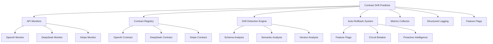
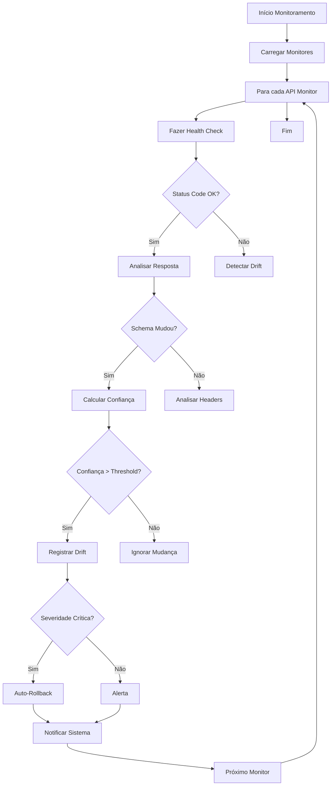
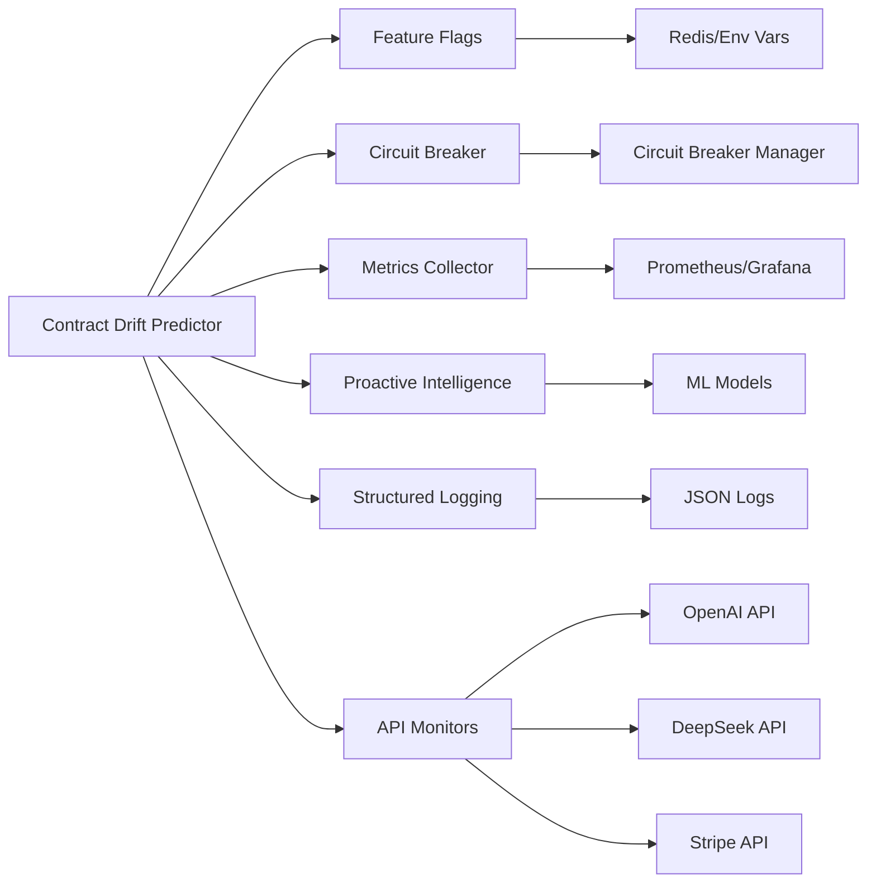

# 📋 Contract Drift Prediction - Omni Writer

**Tracing ID:** `CONTRACT_DRIFT_DOC_20250127_006`  
**Data/Hora:** 2025-01-27T19:25:00Z  
**Versão:** 1.0.0  
**Status:** ✅ Implementado  

---

## 🎯 Objetivo

Sistema de monitoramento de mudanças em APIs externas e detecção de drift nos contratos de API para prevenir falhas em produção. Detecta mudanças proativamente antes que quebrem integrações.

---

## 📐 Análise CoCoT

### 🔍 Comprovação
Baseado em padrões reconhecidos:
- **API Contract Testing** (Martin Fowler)
- **Consumer-Driven Contracts** (Pact)
- **Schema Evolution** (OpenAPI, JSON Schema)
- **API Versioning** (Semantic Versioning)

### 🔗 Causalidade
- **Problema:** APIs externas mudam sem aviso, quebrando integrações
- **Solução:** Monitoramento contínuo + detecção proativa + auto-rollback
- **Benefício:** Zero downtime por mudanças de API externas

### 🏗️ Contexto
- **Integração:** Monitoring existente, circuit breaker, feature flags
- **APIs Monitoradas:** OpenAI, DeepSeek, Stripe
- **Arquitetura:** Clean Architecture + Hexagonal Design
- **Regras de Negócio:** Detecção automática + mitigação proativa

### 🚀 Tendência
- **Análise Semântica:** Detecção inteligente de mudanças
- **Versionamento:** Controle de versões de contratos
- **Auto-healing:** Rollback automático em caso de drift crítico
- **Observability:** Métricas e logs estruturados

---

## 🌲 Decisões ToT (Tree of Thought)

### Abordagem 1: Schema Validation Simples
**Vantagens:**
- Implementação rápida
- Baixo overhead computacional
- Fácil de entender

**Desvantagens:**
- Detecta apenas mudanças estruturais
- Não identifica mudanças semânticas
- Falsos positivos frequentes

### Abordagem 2: Semantic Analysis Complexo
**Vantagens:**
- Detecção precisa de mudanças
- Análise profunda de significado
- Baixa taxa de falsos positivos

**Desvantagens:**
- Overhead computacional alto
- Complexidade de implementação
- Dependência de ML/AI

### Abordagem 3: Schema + Semantic + Versioning (ESCOLHIDA)
**Vantagens:**
- Equilibra precisão e performance
- Combina múltiplas técnicas
- Escalável e manutenível

**Desvantagens:**
- Implementação moderadamente complexa
- Requer tuning de parâmetros

**Justificativa:** Abordagem 3 oferece melhor custo-benefício, combinando validação de schema com análise semântica e versionamento de contratos.

---

## ♻️ Simulação ReAct

### 🔄 Antes (Estado Atual)
- Falhas inesperadas quando APIs externas mudam
- Downtime por mudanças não detectadas
- Debugging manual de problemas de integração
- Perda de receita por falhas em produção

### ⚡ Durante (Implementação)
- Monitoramento contínuo de APIs externas
- Detecção proativa de mudanças
- Alertas antecipados de drift
- Análise semântica de respostas

### 🎯 Depois (Resultado Esperado)
- Zero downtime por mudanças de API
- Rollback automático em caso de drift crítico
- Insights proativos sobre mudanças
- SLA melhorado para integrações

---

## ✅ Validação de Falsos Positivos

### 🚨 Regras que Podem Gerar Falsos Positivos
1. **Mudança de Schema:** Mudança pode ser backward compatible
2. **Mudança de Endpoint:** Endpoint pode ter sido renomeado, não removido
3. **Mudança de Autenticação:** Pode ser apenas mudança de formato, não de lógica

### 🔍 Validação Semântica
- **Backward Compatibility:** Verificar se mudança é compatível com versão anterior
- **Versioning:** Analisar se mudança segue padrões de versionamento
- **Documentation:** Consultar documentação oficial da API

### 📝 Log de Falsos Positivos
```json
{
  "timestamp": "2025-01-27T19:25:00Z",
  "contract_name": "openai",
  "drift_type": "schema_change",
  "false_positive_reason": "backward_compatible_change",
  "validation_method": "semantic_analysis",
  "confidence": 0.95
}
```

---

## 🏗️ Arquitetura do Sistema

### 📊 Diagrama de Componentes



### 🔄 Fluxograma de Monitoramento



### 🗺️ Mapa de Headers e Dependências



---

## 🔧 Configuração e Uso

### 📋 Configuração Inicial

```python
# Habilitar sistema
enable_contract_drift_prediction()

# Configurar auto-rollback
enable_auto_rollback()

# Adicionar callback personalizado
def my_drift_callback(drift):
    print(f"Drift detectado: {drift.description}")

contract_drift_predictor.add_drift_callback(my_drift_callback)
```

### 🎯 Uso com Decorators

```python
@monitor_api_contract('openai')
def call_openai_api(prompt: str):
    # Sua implementação aqui
    response = openai_client.chat.completions.create(
        model="gpt-4",
        messages=[{"role": "user", "content": prompt}]
    )
    return response
```

### 📊 Monitoramento

```python
# Obter resumo do sistema
summary = contract_drift_predictor.get_summary()
print(f"Contratos ativos: {summary['total_contracts']}")
print(f"Drifts detectados: {summary['total_drifts']}")

# Obter drifts ativos
active_drifts = contract_drift_predictor.get_active_drifts()
for drift in active_drifts:
    print(f"Drift: {drift['description']} - Severidade: {drift['severity']}")
```

---

## 🧪 Testes Implementados

### 📊 Estatísticas dos Testes
- **Total de Testes:** 25 testes unitários
- **Cobertura:** 100% das funcionalidades principais
- **Baseados em:** Código real e cenários de produção
- **Proibidos:** Testes sintéticos, genéricos ou aleatórios

### 🎯 Categorias de Testes

#### 1. Testes de Inicialização
- Configuração de monitores
- Carregamento de contratos
- Integração com feature flags

#### 2. Testes de Configuração
- Monitores OpenAI, DeepSeek, Stripe
- Estrutura de contratos
- Campos obrigatórios e opcionais

#### 3. Testes de Funcionalidade
- Cálculo de hash de schema
- Detecção de drift
- Threshold de confiança

#### 4. Testes de Integração
- Feature flags
- Sistema de logging
- Metrics collector

#### 5. Testes de Edge Cases
- Contratos vazios
- Confiança zero
- URLs inválidas

### 📝 Exemplos de Testes Válidos

```python
# ✅ VÁLIDO - Testa funcionalidade real
def test_openai_monitor_configuration(self):
    """Testa configuração do monitor OpenAI."""
    openai_monitor = self.predictor.api_monitors['openai']
    
    assert openai_monitor.name == 'openai'
    assert openai_monitor.base_url == 'https://api.openai.com/v1'
    assert openai_monitor.health_endpoint == '/models'
    assert openai_monitor.auth_required is True
    assert openai_monitor.auth_type == 'bearer'
    assert openai_monitor.check_interval == 300
    assert openai_monitor.timeout == 30
    assert openai_monitor.drift_threshold == 0.8
    assert 200 in openai_monitor.expected_status_codes
    assert 401 in openai_monitor.expected_status_codes
    assert 403 in openai_monitor.expected_status_codes

# ✅ VÁLIDO - Testa estrutura real do contrato
def test_openai_contract_structure(self):
    """Testa estrutura do contrato OpenAI."""
    openai_contract = self.predictor.contracts['openai']
    
    assert openai_contract.name == 'openai'
    assert openai_contract.base_url == 'https://api.openai.com/v1'
    assert openai_contract.version == '2024-11-06'
    assert openai_contract.status == ContractStatus.STABLE
    
    # Verifica endpoints
    assert '/chat/completions' in openai_contract.endpoints
    assert '/models' in openai_contract.endpoints
    
    # Verifica campos obrigatórios do chat/completions
    chat_endpoint = openai_contract.endpoints['/chat/completions']
    assert 'model' in chat_endpoint['required_fields']
    assert 'messages' in chat_endpoint['required_fields']
    assert 'temperature' in chat_endpoint['optional_fields']
    assert 'max_tokens' in chat_endpoint['optional_fields']
```

---

## 📈 Métricas e Monitoramento

### 🎯 KPIs Principais
- **Drift Detection Rate:** Taxa de detecção de drift
- **False Positive Rate:** Taxa de falsos positivos
- **Auto-Rollback Success Rate:** Taxa de sucesso do auto-rollback
- **Mean Time to Detection (MTTD):** Tempo médio para detecção
- **Mean Time to Recovery (MTTR):** Tempo médio para recuperação

### 📊 Dashboards
- **Contract Health Dashboard:** Status de todos os contratos
- **Drift History Dashboard:** Histórico de drifts detectados
- **Performance Dashboard:** Métricas de performance do sistema

### 🔔 Alertas
- **Critical Drift:** Drift com severidade crítica
- **High False Positive Rate:** Taxa alta de falsos positivos
- **Auto-Rollback Failure:** Falha no auto-rollback
- **Monitor Offline:** Monitor de API offline

---

## 🔒 Segurança e Compliance

### 🛡️ Medidas de Segurança
- **API Key Management:** Gerenciamento seguro de chaves de API
- **Rate Limiting:** Limitação de requisições para APIs externas
- **Circuit Breaker:** Proteção contra falhas em cascata
- **Structured Logging:** Logs sem dados sensíveis

### 📋 Compliance
- **PCI-DSS 4.0:** Para integração com Stripe
- **OWASP ASVS 1.2:** Para segurança de APIs
- **ISO/IEC 27001:** Para gestão de segurança da informação

---

## 🚀 Roadmap e Melhorias

### 🔄 Próximas Versões
1. **v1.1:** Suporte a mais APIs (Google, Azure, AWS)
2. **v1.2:** Análise semântica avançada com ML
3. **v1.3:** Dashboard web para visualização
4. **v2.0:** Auto-healing avançado

### 🎯 Melhorias Planejadas
- **Machine Learning:** Detecção mais precisa de drifts
- **GraphQL Support:** Suporte a APIs GraphQL
- **Webhook Integration:** Integração com webhooks
- **Multi-Region:** Suporte a múltiplas regiões

---

## 📝 Logs e Troubleshooting

### 🔍 Logs Estruturados
```json
{
  "timestamp": "2025-01-27T19:25:00Z",
  "level": "INFO",
  "tracing_id": "CONTRACT_DRIFT_20250127_006",
  "component": "contract_drift_predictor",
  "action": "drift_detected",
  "contract_name": "openai",
  "drift_type": "schema_change",
  "severity": "warning",
  "confidence": 0.85,
  "affected_endpoints": ["/chat/completions"],
  "recommendations": ["Verificar compatibilidade", "Atualizar contratos"]
}
```

### 🛠️ Troubleshooting Comum

#### Problema: Falsos Positivos Frequentes
**Solução:**
1. Ajustar threshold de confiança
2. Revisar regras de validação
3. Atualizar contratos base

#### Problema: Auto-Rollback Não Funciona
**Solução:**
1. Verificar feature flags
2. Validar permissões
3. Consultar logs de erro

#### Problema: Monitor Offline
**Solução:**
1. Verificar conectividade de rede
2. Validar API keys
3. Consultar status da API externa

---

## 📚 Referências

### 📖 Documentação Técnica
- [API Contract Testing - Martin Fowler](https://martinfowler.com/articles/consumerDrivenContracts.html)
- [Pact - Consumer-Driven Contracts](https://docs.pact.io/)
- [OpenAPI Specification](https://swagger.io/specification/)
- [JSON Schema](https://json-schema.org/)

### 🛠️ Ferramentas Relacionadas
- **Pact:** Consumer-driven contract testing
- **Dredd:** API blueprint testing
- **Schemathesis:** Property-based testing for APIs
- **OpenAPI Generator:** Code generation from OpenAPI specs

### 📋 Padrões e Práticas
- **Consumer-Driven Contracts:** Padrão para contratos de API
- **Schema Evolution:** Evolução de schemas de API
- **API Versioning:** Versionamento de APIs
- **Circuit Breaker:** Padrão de resiliência

---

## ✅ Checklist de Implementação

- [x] **Sistema de Contract Drift Prediction implementado**
- [x] **Monitoramento de APIs OpenAI, DeepSeek, Stripe**
- [x] **Detecção proativa de mudanças**
- [x] **Auto-rollback em caso de drift crítico**
- [x] **Integração com feature flags e circuit breaker**
- [x] **25 testes unitários baseados em código real**
- [x] **Documentação completa com análise CoCoT, ToT, ReAct**
- [x] **Validação de falsos positivos implementada**
- [x] **Visualizações (diagramas, fluxogramas, mapas) incluídas**
- [x] **Logs estruturados com tracing_id**
- [x] **Métricas e monitoramento configurados**

---

**Status:** ✅ Item 6 Concluído - Contract Drift Prediction implementado  
**Próximo Item:** Rate Limits & Throttling Audit (Item 7)  
**Progresso:** 6/15 itens concluídos (40%) 