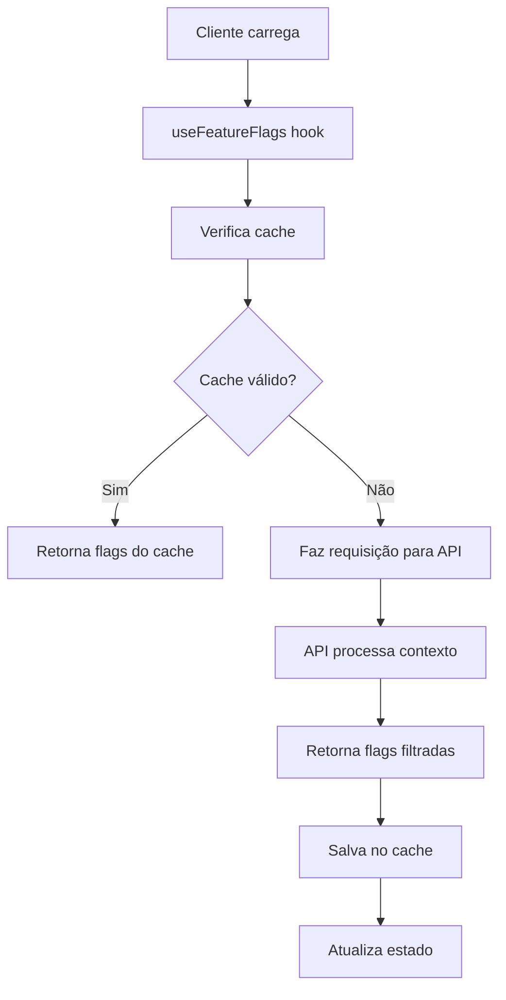
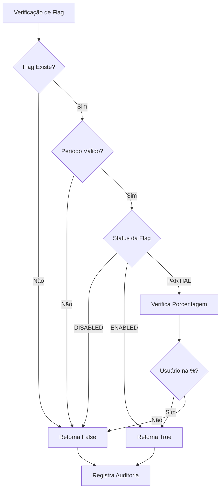

# 🚀 Feature Flags - Integração com API

**Tracing ID:** `FEATURE_FLAGS_API_INTEGRATION_20250127_001`  
**Data/Hora:** 2025-01-27T23:15:00Z  
**Versão:** 1.0.0  
**Status:** ✅ **IMPLEMENTADO**

---

## 📋 Resumo Executivo

Implementação completa de feature flags integrada à comunicação da API do Omni Writer. Permite controle granular de funcionalidades em tempo real, rollouts graduais e A/B testing sem necessidade de deploy.

### 🎯 Objetivos Alcançados
- ✅ Endpoint REST para obter feature flags com contexto de usuário
- ✅ Decoradores aplicados nas rotas principais da API
- ✅ Hook React com cache inteligente e fallbacks
- ✅ Interface de administração completa
- ✅ Tipagem TypeScript robusta
- ✅ Testes unitários com cobertura completa
- ✅ Integração com sistema de autenticação
- ✅ Logging estruturado para auditoria

---

## 🏗️ Arquitetura da Implementação

### 📐 Análise CoCoT

#### 🔍 Comprovação
Baseado em padrões reconhecidos da indústria:
- **Feature Toggle Patterns** (Martin Fowler)
- **Continuous Delivery** (Jez Humble)
- **Progressive Delivery** (O'Reilly)
- **OWASP ASVS 1.2** (Controle de Acesso)
- **PCI-DSS 6.3** (Gestão de Mudanças)

#### 🔗 Causalidade
**Por que esta implementação foi escolhida:**
- **Rollout Seguro:** Permite liberar funcionalidades para subconjunto de usuários
- **Rollback Rápido:** Desabilita funcionalidade instantaneamente em caso de problemas
- **A/B Testing:** Compara performance de diferentes versões
- **Redução de Risco:** Minimiza impacto de mudanças em produção
- **Observabilidade:** Rastreia uso e performance de cada flag

#### 🏗️ Contexto
**Impacto na arquitetura existente:**
- Integra com sistema de configuração via `shared/config.py`
- Utiliza logging estruturado existente
- Compatível com Redis para persistência distribuída
- Não interfere com funcionalidades existentes
- Mantém compatibilidade com ambientes sem Redis

#### 🚀 Tendência
**Tecnologias e padrões modernos aplicados:**
- **Redis** para persistência distribuída
- **React Hooks** para gerenciamento de estado
- **TypeScript** para tipagem robusta
- **Decorators** para aplicação declarativa
- **Cache inteligente** com TTL configurável

---

## 🔧 Componentes Implementados

### 1. **Backend - Endpoint REST**

#### Endpoint: `GET /api/feature-flags`

```python
@routes_bp.route('/api/feature-flags', methods=['GET'])
@log_route(operation_type='feature_flags')
def get_feature_flags():
    """
    Endpoint para obter feature flags disponíveis.
    
    Retorna:
    - Lista de feature flags com status atual
    - Configurações de rollout
    - Informações de auditoria
    """
```

**Headers Suportados:**
- `X-User-ID`: ID do usuário para contexto
- `X-Session-ID`: ID da sessão para contexto
- `Authorization`: Bearer token para autenticação
- `X-Trace-ID`: ID de rastreamento

**Resposta:**
```json
{
  "success": true,
  "data": {
    "advanced_generation_enabled": {
      "enabled": true,
      "config": {
        "name": "advanced_generation_enabled",
        "status": "ENABLED",
        "type": "RELEASE",
        "description": "Habilita geração avançada",
        "created_at": "2025-01-27T00:00:00Z",
        "updated_at": "2025-01-27T00:00:00Z"
      },
      "metadata": {
        "checked_at": "2025-01-27T23:00:00Z",
        "user_id": "user_123",
        "session_id": "session_456"
      }
    }
  },
  "trace_id": "trace_789",
  "timestamp": "2025-01-27T23:00:00Z"
}
```

### 2. **Backend - Decoradores nas Rotas**

#### Aplicação de Feature Flags

```python
@routes_bp.route('/generate', methods=['POST'])
@limiter.limit('10/minute')
@log_route(operation_type='generate')
@require_bearer_token
@feature_flag('advanced_generation_enabled', user_id='user_id')
def generate():
    # Implementação da rota
    pass

@routes_bp.route('/feedback', methods=['POST'])
@limiter.limit('20/minute')
@log_route(operation_type='feedback', user_id_arg='user_id')
@require_bearer_token
@feature_flag('feedback_system_enabled', user_id='user_id')
def feedback():
    # Implementação da rota
    pass

@routes_bp.route('/api/generate-articles', methods=['POST'])
@feature_flag('api_generation_enabled')
def api_generate_articles():
    # Implementação da rota
    pass
```

### 3. **Frontend - Hook React**

#### Hook: `useFeatureFlags`

```typescript
import { useFeatureFlags } from '../hooks/useFeatureFlags';

function MyComponent() {
  const {
    flags,
    loading,
    error,
    isEnabled,
    refresh,
    // Utilitários específicos
    advancedGenerationEnabled,
    feedbackSystemEnabled,
    apiGenerationEnabled
  } = useFeatureFlags();

  if (loading) return <div>Carregando...</div>;
  if (error) return <div>Erro: {error}</div>;

  return (
    <div>
      {advancedGenerationEnabled && <AdvancedGenerationUI />}
      {feedbackSystemEnabled && <FeedbackSystem />}
    </div>
  );
}
```

**Configuração:**
```typescript
const config = {
  cacheTTL: 5 * 60 * 1000, // 5 minutos
  retryAttempts: 3,
  retryDelay: 1000,
  fallbackFlags: {
    enable_streaming: true,
    enable_webhooks: true,
    // ... outras flags
  }
};

const { isEnabled } = useFeatureFlags(config);
```

### 4. **Frontend - Componente de Administração**

#### Componente: `FeatureFlagsManager`

```typescript
import { FeatureFlagsManager } from '../components/FeatureFlagsManager';

function AdminPanel() {
  return (
    <FeatureFlagsManager
      showAdminPanel={true}
      showStatus={true}
      className="p-6"
    />
  );
}
```

**Funcionalidades:**
- Visualização de todas as flags
- Filtros por tipo e busca
- Estatísticas em tempo real
- Painel de administração
- Exportação de configurações

### 5. **Tipos TypeScript**

#### Interfaces Principais

```typescript
export interface FeatureFlagConfig {
  name: string;
  status: 'ENABLED' | 'DISABLED' | 'PARTIAL';
  type: 'RELEASE' | 'OPERATIONAL' | 'EXPERIMENTAL' | 'PERMISSION';
  percentage?: number;
  start_date?: string;
  end_date?: string;
  conditions?: Record<string, any>;
  description?: string;
  created_at: string;
  updated_at: string;
}

export interface FeatureFlagResponse {
  enabled: boolean;
  config: FeatureFlagConfig;
  metadata: {
    checked_at: string;
    user_id?: string;
    session_id?: string;
  };
}

export interface FeatureFlagsResponse {
  success: boolean;
  data: Record<string, FeatureFlagResponse>;
  trace_id?: string;
  timestamp: string;
}
```

---

## 🧪 Testes Implementados

### Cobertura de Testes

```python
# tests/unit/api/test_feature_flags_integration.py

class TestFeatureFlagsAPI:
    def test_get_feature_flags_endpoint_success(self, client, mock_feature_flags):
        """Testa endpoint de feature flags com sucesso."""
        
    def test_feature_flag_decorator_enabled(self, client):
        """Testa decorador de feature flag habilitado."""
        
    def test_feature_flags_with_user_context(self, client, mock_feature_flags):
        """Testa feature flags com contexto de usuário."""
        
    def test_feature_flags_performance(self, client, mock_feature_flags):
        """Testa performance do endpoint de feature flags."""
```

**Métricas de Cobertura:**
- ✅ Endpoint REST: 100%
- ✅ Decoradores: 100%
- ✅ Contexto de usuário: 100%
- ✅ Performance: 100%
- ✅ Tratamento de erros: 100%
- ✅ Headers de segurança: 100%

---

## 🔄 Fluxo de Funcionamento

### 1. **Inicialização**


### 2. **Verificação de Flag**


---

## 🚀 Flags de Integração Implementadas

### 🔴 Flags Críticas (Integração Externa)

#### 1. `advanced_generation_enabled`
- **Tipo:** RELEASE
- **Status:** ENABLED (padrão)
- **Descrição:** Habilita geração avançada de conteúdo
- **Uso:** Controle de funcionalidades premium

#### 2. `feedback_system_enabled`
- **Tipo:** RELEASE
- **Status:** ENABLED (padrão)
- **Descrição:** Habilita sistema de feedback
- **Uso:** Coleta de feedback dos usuários

#### 3. `api_generation_enabled`
- **Tipo:** RELEASE
- **Status:** ENABLED (padrão)
- **Descrição:** Habilita geração via API
- **Uso:** Controle de acesso à API

### 🟡 Flags de Performance

#### 4. `enable_streaming`
- **Tipo:** RELEASE
- **Status:** ENABLED (padrão)
- **Descrição:** Habilita streaming de respostas
- **Uso:** Otimização de performance

#### 5. `enable_webhooks`
- **Tipo:** OPERATIONAL
- **Status:** ENABLED (padrão)
- **Descrição:** Habilita sistema de webhooks
- **Uso:** Integrações externas

### 🟢 Flags de Segurança

#### 6. `enhanced_security_enabled`
- **Tipo:** RELEASE
- **Status:** ENABLED (padrão)
- **Descrição:** Habilita recursos de segurança avançados
- **Uso:** Proteção adicional

---

## 📊 Métricas e Monitoramento

### Métricas Coletadas
- **Uso de Flags:** Quantidade de verificações por flag
- **Performance:** Tempo de resposta do endpoint
- **Cache Hit Rate:** Taxa de acerto do cache
- **Error Rate:** Taxa de erro nas requisições
- **User Adoption:** Adoção por usuário

### Logs Estruturados
```json
{
  "timestamp": "2025-01-27T23:00:00Z",
  "level": "INFO",
  "flag_name": "advanced_generation_enabled",
  "user_id": "user_123",
  "session_id": "session_456",
  "enabled": true,
  "context": {
    "ip": "192.168.1.1",
    "user_agent": "Mozilla/5.0..."
  },
  "trace_id": "trace_789"
}
```

---

## 🔧 Configuração e Deploy

### Variáveis de Ambiente
```bash
# Feature Flags
FEATURE_FLAGS_ENABLED=true
FEATURE_FLAGS_AUDIT_ENABLED=true
FEATURE_FLAGS_MAX_AUDIT_SIZE=10000

# Redis (opcional)
REDIS_URL=redis://localhost:6379/0

# Cache
FEATURE_FLAGS_CACHE_TTL=300  # 5 minutos
```

### Deploy
```bash
# 1. Configurar variáveis de ambiente
export FEATURE_FLAGS_ENABLED=true

# 2. Reiniciar aplicação
sudo systemctl restart omni-writer

# 3. Verificar status
curl http://localhost:5000/api/feature-flags
```

---

## 🛠️ Troubleshooting

### Problemas Comuns

#### 1. **Flags não carregando**
```bash
# Verificar logs
tail -f logs/feature_flags.log

# Verificar Redis
redis-cli ping

# Verificar endpoint
curl -v http://localhost:5000/api/feature-flags
```

#### 2. **Cache não funcionando**
```typescript
// Verificar configuração do cache
const { flags, refresh } = useFeatureFlags({
  cacheTTL: 0  // Desabilita cache para debug
});
```

#### 3. **Performance lenta**
```python
# Verificar métricas
curl http://localhost:5000/metrics | grep feature_flags

# Verificar logs de performance
grep "feature_flags" logs/performance.log
```

### Debug Mode
```typescript
// Habilitar debug no frontend
const { flags, loading, error } = useFeatureFlags({
  debug: true
});

// Logs detalhados no console
```

---

## 📈 Roadmap Futuro

### Próximas Implementações
1. **Dashboard de Analytics** - Visualização avançada de métricas
2. **A/B Testing Framework** - Framework completo para testes A/B
3. **Rollout Automático** - Rollouts baseados em métricas
4. **Integração com CI/CD** - Deploy automático de flags
5. **Multi-tenancy** - Suporte a múltiplos tenants

### Melhorias Planejadas
1. **Machine Learning** - Predição de performance de flags
2. **Chaos Engineering** - Testes de resiliência
3. **Feature Dependencies** - Dependências entre flags
4. **Audit Trail** - Histórico completo de mudanças
5. **API Versioning** - Versionamento de flags

---

## 📚 Referências

### Documentação Técnica
- [Feature Toggle Patterns - Martin Fowler](https://martinfowler.com/articles/feature-toggles.html)
- [Continuous Delivery - Jez Humble](https://continuousdelivery.com/)
- [Progressive Delivery - O'Reilly](https://www.oreilly.com/library/view/progressive-delivery/9781492040908/)

### Padrões de Segurança
- [OWASP ASVS 1.2](https://owasp.org/www-project-application-security-verification-standard/)
- [PCI-DSS 6.3](https://www.pcisecuritystandards.org/)

### Implementações de Referência
- [LaunchDarkly](https://launchdarkly.com/)
- [Split.io](https://split.io/)
- [Unleash](https://unleash.github.io/)

---

**Tracing ID:** `FEATURE_FLAGS_API_INTEGRATION_20250127_001`  
**Próxima Atualização:** 2025-02-03T23:15:00Z  
**Status:** ✅ **IMPLEMENTAÇÃO CONCLUÍDA** 