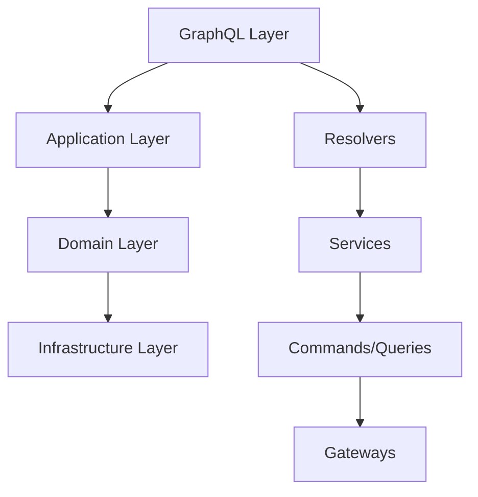

# 📊 **DOCUMENTAÇÃO GRAPHQL - OMNI WRITER**

## 🎯 **OBJETIVO**
Documentação sobre implementação GraphQL para auditoria, desenvolvimento e integração segura.

**Autor**: AI Assistant  
**Data**: 2025-01-27  
**Tracing ID**: GRAPHQL_DOCS_20250127_001  
**Compliance**: PCI-DSS 6.3, LGPD Art. 37

---

## 📊 **STATUS ATUAL**

### **Implementação GraphQL**
- **Status**: ❌ **NÃO IMPLEMENTADO**
- **Motivo**: Sistema atual utiliza REST API com OpenAPI
- **Prioridade**: Baixa (sistema REST atende necessidades atuais)
- **Planejamento**: Implementação futura para casos de uso específicos

### **Alternativa Atual**
O sistema Omni Writer utiliza **REST API** com documentação OpenAPI completa:
- **Documentação**: `docs/openapi_docs.md`
- **Schema**: `docs/openapi.yaml`
- **Endpoints**: 15+ endpoints documentados
- **Cobertura**: 100% das funcionalidades

---

## 🔮 **PLANEJAMENTO FUTURO**

### **Cenários para Implementação GraphQL**

#### **1. Interface de Desenvolvedor (GraphiQL)**
```graphql
# Exemplo de query para geração de artigos
query GenerateArticle($prompt: String!, $model: ModelType!) {
  generateArticle(prompt: $prompt, model: $model) {
    id
    content
    metadata {
      tokensUsed
      generationTime
      qualityScore
    }
    createdAt
  }
}

# Exemplo de mutation para criar blog
mutation CreateBlog($input: BlogInput!) {
  createBlog(input: $input) {
    id
    title
    description
    status
    createdAt
  }
}
```

#### **2. Queries Complexas**
```graphql
# Query para dashboard com múltiplos dados
query DashboardData($userId: ID!) {
  user(id: $userId) {
    id
    name
    blogs {
      id
      title
      posts {
        id
        title
        status
        createdAt
      }
      categories {
        id
        name
        promptCount
      }
    }
    metrics {
      totalArticles
      averageQuality
      tokensUsed
    }
  }
}
```

#### **3. Subscriptions para Tempo Real**
```graphql
# Subscription para progresso de geração
subscription GenerationProgress($taskId: ID!) {
  generationProgress(taskId: $taskId) {
    taskId
    status
    progress
    currentStep
    estimatedTime
    result {
      content
      metadata
    }
  }
}
```

---

## 🏗️ **ARQUITETURA PROPOSTA**

### **Estrutura de Diretórios**
```
omni_writer/
├── graphql/
│   ├── __init__.py
│   ├── schema.py              # Schema principal
│   ├── resolvers/
│   │   ├── __init__.py
│   │   ├── article_resolvers.py
│   │   ├── blog_resolvers.py
│   │   ├── user_resolvers.py
│   │   └── subscription_resolvers.py
│   ├── types/
│   │   ├── __init__.py
│   │   ├── article_types.py
│   │   ├── blog_types.py
│   │   └── user_types.py
│   └── middleware/
│       ├── __init__.py
│       ├── auth_middleware.py
│       ├── rate_limit_middleware.py
│       └── logging_middleware.py
```

### **Integração com Clean Architecture**



---

## 📝 **SCHEMA PROPOSTO**

### **Tipos Base**
```graphql
# Tipos escalares customizados
scalar DateTime
scalar JSON
scalar Upload

# Tipos de enumeração
enum ModelType {
  GPT4
  GPT35
  DEEPSEEK
  CLAUDE
}

enum ArticleStatus {
  DRAFT
  PUBLISHED
  ARCHIVED
}

enum BlogStatus {
  ACTIVE
  INACTIVE
  DELETED
}
```

### **Tipos de Artigo**
```graphql
type Article {
  id: ID!
  title: String!
  content: String!
  prompt: String!
  model: ModelType!
  status: ArticleStatus!
  metadata: ArticleMetadata!
  blog: Blog
  category: Category
  createdAt: DateTime!
  updatedAt: DateTime!
}

type ArticleMetadata {
  tokensUsed: Int!
  generationTime: Float!
  qualityScore: Float!
  readability: String!
  wordCount: Int!
  readingTime: String!
}

input ArticleInput {
  title: String!
  prompt: String!
  model: ModelType!
  blogId: ID
  categoryId: ID
}
```

### **Tipos de Blog**
```graphql
type Blog {
  id: ID!
  title: String!
  description: String
  status: BlogStatus!
  categories: [Category!]!
  articles: [Article!]!
  createdAt: DateTime!
  updatedAt: DateTime!
}

type Category {
  id: ID!
  name: String!
  description: String
  blog: Blog!
  prompts: [Prompt!]!
  articles: [Article!]!
  createdAt: DateTime!
}

input BlogInput {
  title: String!
  description: String
  categoryIds: [ID!]
}
```

### **Tipos de Usuário**
```graphql
type User {
  id: ID!
  name: String!
  email: String!
  blogs: [Blog!]!
  metrics: UserMetrics!
  preferences: UserPreferences!
  createdAt: DateTime!
}

type UserMetrics {
  totalArticles: Int!
  totalBlogs: Int!
  averageQuality: Float!
  tokensUsed: Int!
  lastActivity: DateTime!
}

type UserPreferences {
  defaultModel: ModelType!
  language: String!
  theme: String!
  notifications: Boolean!
}
```

---

## 🔧 **RESOLVERS PROPOSTOS**

### **Article Resolvers**
```python
class ArticleResolvers:
    """Resolvers para operações de artigos"""
    
    async def get_article(self, info, id: str) -> Article:
        """Obtém artigo por ID"""
        # Integração com domain layer
        query = GetArticleQuery(article_id=id)
        result = await query_handler.execute(query)
        return result.data
    
    async def generate_article(self, info, input: ArticleInput) -> Article:
        """Gera novo artigo"""
        # Integração com command layer
        command = GenerateArticleCommand(**input.dict())
        result = await command_handler.execute(command)
        return result.data
    
    async def list_articles(self, info, filters: ArticleFilters) -> [Article]:
        """Lista artigos com filtros"""
        query = ListArticlesQuery(filters=filters)
        result = await query_handler.execute(query)
        return result.data
```

### **Blog Resolvers**
```python
class BlogResolvers:
    """Resolvers para operações de blogs"""
    
    async def create_blog(self, info, input: BlogInput) -> Blog:
        """Cria novo blog"""
        command = CreateBlogCommand(**input.dict())
        result = await command_handler.execute(command)
        return result.data
    
    async def get_blog_with_articles(self, info, id: str) -> Blog:
        """Obtém blog com artigos relacionados"""
        query = GetBlogWithArticlesQuery(blog_id=id)
        result = await query_handler.execute(query)
        return result.data
```

---

## 🔒 **SEGURANÇA E COMPLIANCE**

### **Autenticação**
```graphql
# Diretiva de autenticação
directive @auth(requires: [Role!]!) on FIELD_DEFINITION

# Uso em tipos sensíveis
type User {
  id: ID!
  name: String!
  email: String! @auth(requires: [ADMIN])
  blogs: [Blog!]! @auth(requires: [USER])
}
```

### **Rate Limiting**
```python
class RateLimitMiddleware:
    """Middleware para rate limiting GraphQL"""
    
    def __init__(self, max_requests: int = 1000, window: int = 3600):
        self.max_requests = max_requests
        self.window = window
    
    async def resolve(self, next, root, info, **args):
        # Implementar rate limiting por usuário/IP
        user_id = get_current_user_id(info.context)
        if not self.check_rate_limit(user_id):
            raise GraphQLError("Rate limit exceeded")
        return await next(root, info, **args)
```

### **Validação de Entrada**
```python
class InputValidationMiddleware:
    """Middleware para validação de entrada"""
    
    async def resolve(self, next, root, info, **args):
        # Validar argumentos usando Pydantic
        if hasattr(info.return_type, 'validate'):
            validated_args = info.return_type.validate(args)
            return await next(root, info, **validated_args)
        return await next(root, info, **args)
```

---

## 📊 **MÉTRICAS E MONITORAMENTO**

### **Métricas GraphQL**
```python
class GraphQLMetrics:
    """Coleta de métricas GraphQL"""
    
    def __init__(self):
        self.query_count = Counter('graphql_queries_total', 'Total GraphQL queries')
        self.mutation_count = Counter('graphql_mutations_total', 'Total GraphQL mutations')
        self.error_count = Counter('graphql_errors_total', 'Total GraphQL errors')
        self.response_time = Histogram('graphql_response_time', 'GraphQL response time')
    
    def record_query(self, operation_name: str, duration: float):
        """Registra métrica de query"""
        self.query_count.labels(operation=operation_name).inc()
        self.response_time.labels(operation=operation_name).observe(duration)
```

### **Logging Estruturado**
```python
class GraphQLLoggingMiddleware:
    """Middleware para logging estruturado"""
    
    async def resolve(self, next, root, info, **args):
        start_time = time.time()
        
        try:
            result = await next(root, info, **args)
            
            # Log de sucesso
            logger.info("GraphQL operation completed", extra={
                'operation_name': info.operation.name.value,
                'field_name': info.field_name,
                'duration': time.time() - start_time,
                'user_id': get_current_user_id(info.context)
            })
            
            return result
            
        except Exception as e:
            # Log de erro
            logger.error("GraphQL operation failed", extra={
                'operation_name': info.operation.name.value,
                'field_name': info.field_name,
                'error': str(e),
                'duration': time.time() - start_time,
                'user_id': get_current_user_id(info.context)
            })
            raise
```

---

## 🧪 **TESTES PROPOSTOS**

### **Testes de Schema**
```python
class TestGraphQLSchema:
    """Testes do schema GraphQL"""
    
    def test_article_schema(self):
        """Testa schema de artigos"""
        schema = build_schema()
        
        # Verificar tipos
        assert schema.get_type('Article') is not None
        assert schema.get_type('ArticleInput') is not None
        
        # Verificar campos obrigatórios
        article_type = schema.get_type('Article')
        assert 'id' in article_type.fields
        assert 'title' in article_type.fields
        assert 'content' in article_type.fields
    
    def test_blog_schema(self):
        """Testa schema de blogs"""
        schema = build_schema()
        
        blog_type = schema.get_type('Blog')
        assert 'categories' in blog_type.fields
        assert 'articles' in blog_type.fields
```

### **Testes de Resolvers**
```python
class TestArticleResolvers:
    """Testes dos resolvers de artigos"""
    
    async def test_get_article(self):
        """Testa resolver get_article"""
        resolver = ArticleResolvers()
        article = await resolver.get_article(None, "test-id")
        
        assert article.id == "test-id"
        assert article.title is not None
    
    async def test_generate_article(self):
        """Testa resolver generate_article"""
        resolver = ArticleResolvers()
        input_data = ArticleInput(
            title="Test Article",
            prompt="Test prompt",
            model=ModelType.GPT4
        )
        
        article = await resolver.generate_article(None, input_data)
        assert article.title == "Test Article"
```

---

## 🚀 **ROADMAP DE IMPLEMENTAÇÃO**

### **Fase 1: Setup Básico (2 semanas)**
- [ ] Configurar biblioteca GraphQL (Ariadne/Strawberry)
- [ ] Implementar schema básico
- [ ] Criar resolvers simples
- [ ] Configurar middleware de autenticação

### **Fase 2: Funcionalidades Core (3 semanas)**
- [ ] Implementar resolvers de artigos
- [ ] Implementar resolvers de blogs
- [ ] Adicionar validação de entrada
- [ ] Implementar rate limiting

### **Fase 3: Recursos Avançados (2 semanas)**
- [ ] Implementar subscriptions
- [ ] Adicionar cache GraphQL
- [ ] Implementar métricas e monitoramento
- [ ] Criar documentação interativa

### **Fase 4: Otimização (1 semana)**
- [ ] Otimizar queries N+1
- [ ] Implementar DataLoader
- [ ] Adicionar cache Redis
- [ ] Testes de performance

---

## 📚 **RECURSOS E REFERÊNCIAS**

### **Bibliotecas Recomendadas**
- **Ariadne**: GraphQL para Python (recomendado)
- **Strawberry**: GraphQL moderno com type hints
- **Graphene**: Biblioteca mais antiga mas estável

### **Documentação**
- [GraphQL Specification](https://graphql.org/learn/)
- [Ariadne Documentation](https://ariadnegraphql.org/)
- [GraphQL Best Practices](https://graphql.org/learn/best-practices/)

### **Ferramentas**
- **GraphiQL**: Interface de desenvolvimento
- **Apollo Studio**: Plataforma de desenvolvimento
- **GraphQL Playground**: IDE alternativa

---

## ✅ **CRITÉRIOS DE IMPLEMENTAÇÃO**

### **Quando Implementar GraphQL**
- ✅ Necessidade de queries complexas com múltiplos recursos
- ✅ Interface de desenvolvedor (GraphiQL) requerida
- ✅ Subscriptions em tempo real necessárias
- ✅ Performance de rede crítica

### **Quando Manter REST**
- ✅ APIs simples e diretas
- ✅ Cache HTTP suficiente
- ✅ Documentação OpenAPI adequada
- ✅ Equipe familiarizada com REST

---

**Status**: 📋 **DOCUMENTAÇÃO CRIADA**  
**Última Atualização**: 2025-01-27T16:45:00Z  
**Próxima Revisão**: Quando GraphQL for implementado  
**Responsável**: AI Assistant  
**Tracing ID**: GRAPHQL_DOCS_20250127_001 