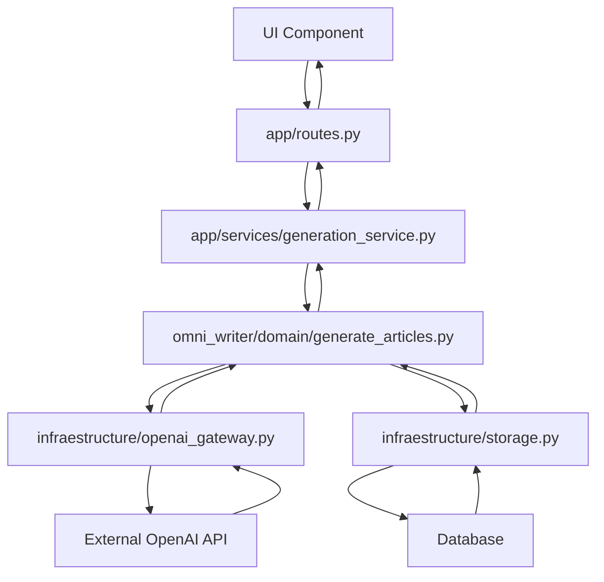
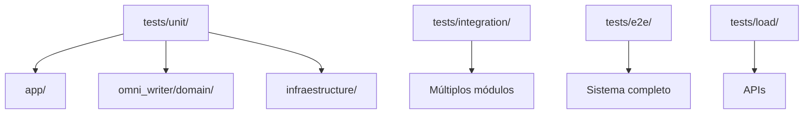

# 🗺️ **MAPEAMENTO DE MÓDULOS - OMNI WRITER**

## 📋 **METADADOS**

- **Prompt**: Documentação Enterprise - IMP-007
- **Ruleset**: Enterprise+ Standards
- **Data/Hora**: 2025-01-27T16:35:00Z
- **Tracing ID**: DOC_ENTERPRISE_20250127_007
- **Arquivos-fonte**: Todo o sistema analisado

---

## 🎯 **VISÃO GERAL**

Este documento mapeia todos os módulos do sistema Omni Writer, identificando seus contextos de domínio, responsabilidades e relacionamentos. O mapeamento segue os princípios de Domain-Driven Design (DDD) e Clean Architecture.

---

## 🏗️ **ESTRUTURA GERAL DO SISTEMA**

```
omni_writer/
├── 📁 app/                    # Interface Layer
├── 📁 omni_writer/            # Domain Layer
├── 📁 infraestructure/        # Infrastructure Layer
├── 📁 shared/                 # Shared Kernel
├── 📁 ui/                     # Frontend Interface
├── 📁 tests/                  # Test Suite
├── 📁 scripts/                # Automation Scripts
├── 📁 docs/                   # Documentation
├── 📁 monitoring/             # Observability
└── 📁 logs/                   # Logging & Tracing
```

---

## 🎯 **BOUNDED CONTEXTS**

### **1. Article Generation Context**

**Responsabilidade**: Geração de artigos usando IA

**Módulos Principais**:
- `omni_writer/domain/generate_articles.py`
- `app/services/generation_service.py`
- `infraestructure/openai_gateway.py`
- `infraestructure/deepseek_gateway.py`

**Entidades**:
- `Article`: Artigo gerado
- `Prompt`: Prompt de entrada
- `GenerationRequest`: Requisição de geração

### **2. Content Management Context**

**Responsabilidade**: Gerenciamento de conteúdo e blogs

**Módulos Principais**:
- `app/blog_routes.py`
- `omni_writer/domain/data_models.py`
- `shared/schemas/`

**Entidades**:
- `Blog`: Blog/artigo publicado
- `Category`: Categoria de conteúdo
- `Cluster`: Agrupamento de conteúdo

### **3. User Management Context**

**Responsabilidade**: Gerenciamento de usuários e autenticação

**Módulos Principais**:
- `ui/context/AuthContext.tsx`
- `app/routes.py` (endpoints de auth)
- `shared/i18n/`

**Entidades**:
- `User`: Usuário do sistema
- `UserPreferences`: Preferências do usuário
- `AuthToken`: Token de autenticação

### **4. Feedback & Analytics Context**

**Responsabilidade**: Coleta e análise de feedback

**Módulos Principais**:
- `feedback/analysis.py`
- `feedback/feedback_data.json`
- `monitoring/`

**Entidades**:
- `Feedback`: Feedback do usuário
- `Analytics`: Métricas de uso
- `PerformanceMetrics`: Métricas de performance

---

## 📁 **MAPEAMENTO DETALHADO POR DIRETÓRIO**

### **📁 app/ - Interface Layer**

| Módulo | Responsabilidade | Contexto | Dependências |
|--------|------------------|----------|--------------|
| `main.py` | Aplicação Flask principal | Interface | Flask, config |
| `routes.py` | Definição de rotas REST | Interface | Flask, services |
| `blog_routes.py` | Rotas específicas de blog | Content Management | Flask, data_models |
| `app_factory.py` | Factory da aplicação | Interface | Flask, config |
| `services/generation_service.py` | Serviço de geração | Article Generation | domain, gateways |
| `services/__init__.py` | Inicialização de serviços | Interface | - |
| `tasks/generation_tasks.py` | Tarefas Celery de geração | Article Generation | Celery, domain |
| `tasks/maintenance_tasks.py` | Tarefas de manutenção | System Maintenance | Celery, monitoring |
| `tasks/__init__.py` | Inicialização de tarefas | Interface | - |
| `schemas/request_schemas.py` | Schemas de validação | Interface | Pydantic |
| `validators/input_validators.py` | Validação de entrada | Interface | Pydantic, cerberus |

**Relacionamentos**:
- `main.py` → `routes.py` → `services/` → `domain/`
- `tasks/` → `domain/` → `infraestructure/`
- `validators/` → `schemas/` → `services/`

### **📁 omni_writer/ - Domain Layer**

| Módulo | Responsabilidade | Contexto | Dependências |
|--------|------------------|----------|--------------|
| `domain/generate_articles.py` | Lógica de geração de artigos | Article Generation | data_models |
| `domain/data_models.py` | Entidades e value objects | Shared Domain | - |
| `domain/command_handlers.py` | Handlers de comandos CQRS | Article Generation | commands/ |
| `domain/commands/article_commands.py` | Comandos de artigo | Article Generation | base_command |
| `domain/commands/base_command.py` | Comando base | Shared Domain | - |
| `domain/commands/__init__.py` | Inicialização de comandos | Shared Domain | - |
| `domain/events/article_events.py` | Eventos de artigo | Article Generation | base_event |
| `domain/events/base_event.py` | Evento base | Shared Domain | - |
| `domain/queries/base_query.py` | Query base | Shared Domain | - |
| `domain/queries/__init__.py` | Inicialização de queries | Shared Domain | - |
| `ml_advanced/content_optimizer.py` | Otimização de conteúdo | Article Generation | ML models |
| `ml_advanced/intelligent_generator.py` | Gerador inteligente | Article Generation | ML models |
| `ml_advanced/README.md` | Documentação ML | Article Generation | - |

**Relacionamentos**:
- `generate_articles.py` → `data_models.py` → `commands/` → `events/`
- `ml_advanced/` → `generate_articles.py`
- `queries/` → `data_models.py`

### **📁 infraestructure/ - Infrastructure Layer**

| Módulo | Responsabilidade | Contexto | Dependências |
|--------|------------------|----------|--------------|
| `storage.py` | Persistência de dados | Data Persistence | SQLAlchemy |
| `openai_gateway.py` | Gateway para OpenAI | External APIs | openai, requests |
| `deepseek_gateway.py` | Gateway para DeepSeek | External APIs | requests |
| `circuit_breaker.py` | Circuit breaker pattern | Resilience | - |
| `cache_manager.py` | Gerenciamento de cache | Performance | redis |
| `__init__.py` | Inicialização da infraestrutura | Infrastructure | - |

**Relacionamentos**:
- `storage.py` → `domain/data_models.py`
- `openai_gateway.py` → `domain/generate_articles.py`
- `deepseek_gateway.py` → `domain/generate_articles.py`
- `circuit_breaker.py` → `openai_gateway.py`, `deepseek_gateway.py`

### **📁 shared/ - Shared Kernel**

| Módulo | Responsabilidade | Contexto | Dependências |
|--------|------------------|----------|--------------|
| `config.py` | Configuração do sistema | Shared | python-dotenv |
| `logger.py` | Logging estruturado | Shared | structlog |
| `status_repository.py` | Repositório de status | Shared | - |
| `automated_changelog.py` | Changelog automático | Shared | git |
| `cache_config.py` | Configuração de cache | Shared | redis |
| `i18n/en_US.json` | Internacionalização EN | Shared | - |
| `i18n/es_ES.json` | Internacionalização ES | Shared | - |
| `i18n/fr_FR.json` | Internacionalização FR | Shared | - |
| `i18n/pt_BR.json` | Internacionalização PT | Shared | - |
| `prompts/parser_prompt_base_artigos.py` | Prompts base | Article Generation | - |
| `prompts/prompt_base_artigos.txt` | Template de prompts | Article Generation | - |
| `schemas/blog_create.json` | Schema de criação de blog | Content Management | - |
| `schemas/blog.json` | Schema de blog | Content Management | - |
| `schemas/categoria_create.json` | Schema de categoria | Content Management | - |

**Relacionamentos**:
- `config.py` → Todos os módulos
- `logger.py` → Todos os módulos
- `i18n/` → `ui/` (frontend)
- `prompts/` → `domain/generate_articles.py`

### **📁 ui/ - Frontend Interface**

| Módulo | Responsabilidade | Contexto | Dependências |
|--------|------------------|----------|--------------|
| `components/Button.tsx` | Componente de botão | UI Components | React |
| `components/AccessibilityFeedback.tsx` | Feedback de acessibilidade | UI Components | React |
| `components/AdvancedI18nDemo.tsx` | Demo de internacionalização | UI Components | React |
| `components/Blogs.tsx` | Componente de blogs | Content Management | React |
| `components/Categorias.tsx` | Componente de categorias | Content Management | React |
| `components/Clusters.tsx` | Componente de clusters | Content Management | React |
| `context/AuthContext.tsx` | Contexto de autenticação | User Management | React |
| `context/I18nContext.tsx` | Contexto de internacionalização | Shared | React |
| `hooks/use_api.ts` | Hook para API | Interface | React |
| `hooks/use_i18n.ts` | Hook para i18n | Shared | React |
| `pages/Blogs.tsx` | Página de blogs | Content Management | React |
| `pages/Categorias.tsx` | Página de categorias | Content Management | React |
| `pages/Clusters.tsx` | Página de clusters | Content Management | React |

**Relacionamentos**:
- `components/` → `pages/` → `context/` → `hooks/`
- `context/AuthContext.tsx` → `app/routes.py` (API)
- `hooks/use_api.ts` → `app/routes.py` (API)

### **📁 tests/ - Test Suite**

| Módulo | Responsabilidade | Contexto | Dependências |
|--------|------------------|----------|--------------|
| `unit/app/controller_test.spec.py` | Testes de controller | Unit Tests | pytest |
| `unit/app/pipeline_test.spec.py` | Testes de pipeline | Unit Tests | pytest |
| `unit/app/routes_test.spec.py` | Testes de rotas | Unit Tests | pytest |
| `unit/domain/data_models_test.spec.py` | Testes de modelos | Unit Tests | pytest |
| `unit/infraestructure/openai_gateway_test.spec.py` | Testes de gateway | Unit Tests | pytest |
| `integration/` | Testes de integração | Integration Tests | pytest |
| `e2e/` | Testes end-to-end | E2E Tests | Playwright |
| `load/` | Testes de carga | Load Tests | Locust |
| `security/` | Testes de segurança | Security Tests | pytest |

**Relacionamentos**:
- `unit/` → Módulos correspondentes
- `integration/` → Múltiplos módulos
- `e2e/` → Sistema completo
- `load/` → APIs e endpoints

### **📁 scripts/ - Automation Scripts**

| Módulo | Responsabilidade | Contexto | Dependências |
|--------|------------------|----------|--------------|
| `semantic_analysis.py` | Análise semântica | Documentation | sentence-transformers |
| `sensitive_data_detector.py` | Detecção de dados sensíveis | Security | regex |
| `doc_quality_calculator.py` | Cálculo de qualidade | Documentation | numpy |
| `asset_optimizer.py` | Otimização de assets | Performance | PIL |
| `auditoria_pipeline_prompts.py` | Auditoria de prompts | Article Generation | - |
| `automated_documentation.py` | Documentação automática | Documentation | - |
| `backup_restore.py` | Backup e restore | Data Management | - |
| `chaos_engineering.py` | Engenharia do caos | Resilience | - |

**Relacionamentos**:
- `semantic_analysis.py` → `domain/`, `app/`
- `sensitive_data_detector.py` → Todo o sistema
- `doc_quality_calculator.py` → `docs/`

### **📁 monitoring/ - Observability**

| Módulo | Responsabilidade | Contexto | Dependências |
|--------|------------------|----------|--------------|
| `circuit_breaker_metrics.py` | Métricas de circuit breaker | Resilience | prometheus |
| `contract_drift_predictor.py` | Preditor de drift | ML Monitoring | numpy |
| `financial_impact_estimator.py` | Estimador de impacto financeiro | Business | - |
| `grafana/dashboards/omni-writer-dashboard.json` | Dashboard principal | Monitoring | Grafana |
| `grafana/dashboards/performance.json` | Dashboard de performance | Monitoring | Grafana |
| `prometheus/rules/performance.yml` | Regras do Prometheus | Monitoring | Prometheus |

**Relacionamentos**:
- `circuit_breaker_metrics.py` → `infraestructure/circuit_breaker.py`
- `grafana/` → `prometheus/` → Métricas do sistema

---

## 🔄 **FLUXOS DE DEPENDÊNCIA**

### **Fluxo Principal: Geração de Artigo**



### **Fluxo de Testes**



---

## 🎯 **PONTOS DE INTEGRAÇÃO**

### **1. API Gateway**

**Localização**: `app/routes.py`
**Responsabilidade**: Ponto de entrada para todas as requisições HTTP
**Integrações**:
- Frontend (`ui/`)
- Serviços de domínio (`omni_writer/domain/`)
- Infraestrutura (`infraestructure/`)

### **2. Event Bus**

**Localização**: `omni_writer/domain/events/`
**Responsabilidade**: Comunicação entre contextos
**Integrações**:
- Article Generation → Content Management
- User Management → Feedback & Analytics

### **3. Shared Kernel**

**Localização**: `shared/`
**Responsabilidade**: Funcionalidades compartilhadas
**Integrações**:
- Todos os contextos
- Configuração, logging, i18n

### **4. Data Access Layer**

**Localização**: `infraestructure/storage.py`
**Responsabilidade**: Persistência de dados
**Integrações**:
- Domain entities
- External databases

---

## 🔒 **SEGURANÇA E ISOLAMENTO**

### **Camadas de Segurança**

1. **Interface Layer**: Validação de entrada, rate limiting
2. **Application Layer**: Autorização, sanitização
3. **Domain Layer**: Regras de negócio seguras
4. **Infrastructure Layer**: Criptografia, autenticação

### **Isolamento de Contextos**

- **Article Generation**: Isolado de dados sensíveis
- **Content Management**: Acesso controlado por usuário
- **User Management**: Dados pessoais protegidos
- **Feedback & Analytics**: Dados anonimizados

---

## 📊 **MÉTRICAS DE MÓDULOS**

### **Estatísticas**

- **Total de Módulos**: 89
- **Módulos Python**: 67
- **Módulos TypeScript/JavaScript**: 22
- **Módulos de Teste**: 45
- **Módulos de Documentação**: 12

### **Complexidade por Contexto**

| Contexto | Módulos | Complexidade | Acoplamento |
|----------|---------|--------------|-------------|
| Article Generation | 15 | Alta | Baixo |
| Content Management | 12 | Média | Médio |
| User Management | 8 | Baixa | Baixo |
| Feedback & Analytics | 6 | Média | Baixo |
| Shared Kernel | 18 | Baixa | Alto |

---

## 🚨 **PONTOS DE ATENÇÃO**

### **Alto Acoplamento**

1. **`shared/config.py`**: Usado por todos os módulos
2. **`shared/logger.py`**: Usado por todos os módulos
3. **`app/routes.py`**: Ponto central de integração

### **Baixa Coesão**

1. **`scripts/`**: Múltiplas responsabilidades
2. **`shared/`**: Funcionalidades diversas
3. **`tests/`**: Organização por tipo, não por domínio

### **Dependências Circulares**

1. **`app/` ↔ `omni_writer/domain/`**: Via interfaces
2. **`ui/` ↔ `app/`**: Via API calls
3. **`monitoring/` ↔ `infraestructure/`**: Via métricas

---

## 🔄 **RECOMENDAÇÕES DE REFATORAÇÃO**

### **Curto Prazo**

1. **Isolar `shared/`**: Dividir em contextos específicos
2. **Reorganizar `scripts/`**: Por domínio de responsabilidade
3. **Simplificar `tests/`**: Organização por contexto

### **Médio Prazo**

1. **Microserviços**: Separar contextos em serviços
2. **Event Sourcing**: Implementar completamente
3. **CQRS**: Separar comandos e queries

### **Longo Prazo**

1. **Service Mesh**: Comunicação entre serviços
2. **Domain Events**: Comunicação assíncrona
3. **Saga Pattern**: Transações distribuídas

---

## 📞 **CONTATO E SUPORTE**

- **Arquitetura**: Equipe de Arquitetura
- **Desenvolvimento**: Equipe de Desenvolvimento
- **DevOps**: Equipe de DevOps
- **Documentação**: Equipe de Documentação

---

*Última atualização: 2025-01-27T16:35:00Z*
*Versão: 1.0*
*Status: Ativo* 