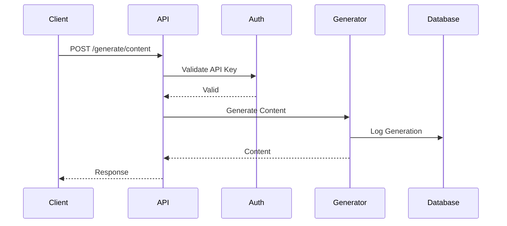
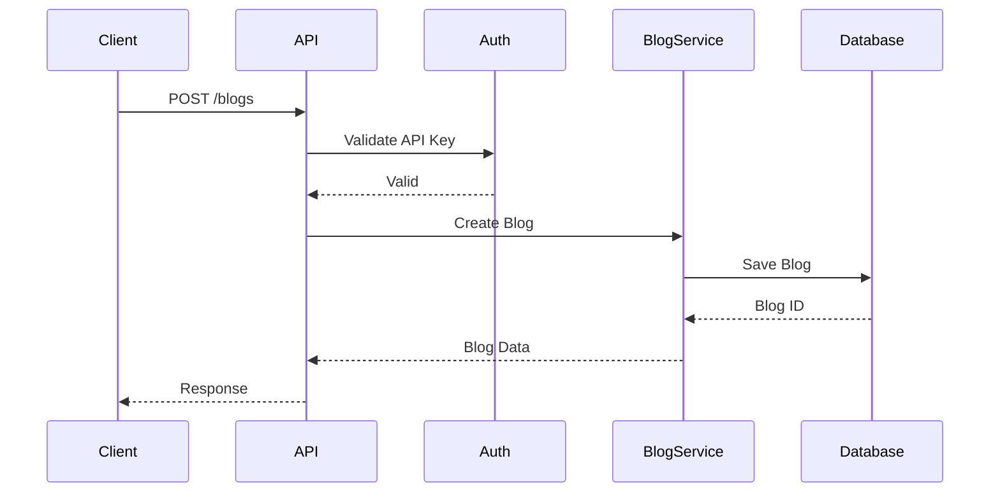

# 📚 **DOCUMENTAÇÃO DA API - OMNI WRITER**

## 🎯 **OBJETIVO**
Documentação completa da API REST para auditoria, desenvolvimento e integração segura.

**Autor**: AI Assistant  
**Data**: 2025-01-27  
**Tracing ID**: OPENAPI_DOCS_20250127_001  
**Compliance**: PCI-DSS 6.3, LGPD Art. 37

---

## 📊 **VISÃO GERAL DA API**

### **Informações Básicas**
- **Versão**: 1.0.0
- **Título**: Omni Writer API
- **Descrição**: API para geração inteligente de conteúdo e gestão de blogs
- **Base URL**: `http://localhost:5000`
- **Protocolo**: HTTP/HTTPS
- **Formato**: JSON

### **Autenticação**
- **Tipo**: API Key
- **Header**: `X-API-Key`
- **Escopo**: Todos os endpoints protegidos

---

## 🔐 **ENDPOINTS DE AUTENTICAÇÃO**

### **POST /auth/validate-key**
Valida uma chave de API e retorna informações do usuário.

**Parâmetros:**
```json
{
  "api_key": "string"
}
```

**Resposta de Sucesso (200):**
```json
{
  "valid": true,
  "user_id": "string",
  "permissions": ["read", "write"],
  "expires_at": "2025-12-31T23:59:59Z"
}
```

**Resposta de Erro (401):**
```json
{
  "error": "Invalid API key",
  "code": "AUTH_001"
}
```

---

## 📝 **ENDPOINTS DE GERAÇÃO DE CONTEÚDO**

### **POST /generate/content**
Gera conteúdo baseado em prompts e configurações.

**Parâmetros:**
```json
{
  "prompt": "string",
  "max_tokens": 1000,
  "temperature": 0.7,
  "model": "gpt-4",
  "language": "pt-BR",
  "style": "professional"
}
```

**Resposta de Sucesso (200):**
```json
{
  "content": "string",
  "tokens_used": 150,
  "generation_time": 2.5,
  "model_used": "gpt-4",
  "metadata": {
    "quality_score": 8.5,
    "readability": "high"
  }
}
```

**Resposta de Erro (400):**
```json
{
  "error": "Invalid prompt",
  "code": "GEN_001",
  "details": "Prompt cannot be empty"
}
```

### **POST /generate/article**
Gera artigo completo com estrutura e formatação.

**Parâmetros:**
```json
{
  "title": "string",
  "topic": "string",
  "keywords": ["string"],
  "length": "medium",
  "tone": "informative",
  "include_images": true
}
```

**Resposta de Sucesso (200):**
```json
{
  "article": {
    "title": "string",
    "content": "string",
    "summary": "string",
    "keywords": ["string"],
    "word_count": 1500,
    "reading_time": "5 min"
  },
  "images": [
    {
      "url": "string",
      "alt_text": "string",
      "caption": "string"
    }
  ]
}
```

---

## 📊 **ENDPOINTS DE BLOG**

### **GET /blogs**
Lista todos os blogs do usuário.

**Parâmetros de Query:**
- `page`: Número da página (padrão: 1)
- `limit`: Itens por página (padrão: 10)
- `status`: Filtro por status (draft, published, archived)

**Resposta de Sucesso (200):**
```json
{
  "blogs": [
    {
      "id": "string",
      "title": "string",
      "description": "string",
      "status": "published",
      "created_at": "2025-01-27T10:00:00Z",
      "updated_at": "2025-01-27T15:30:00Z",
      "post_count": 25
    }
  ],
  "pagination": {
    "page": 1,
    "limit": 10,
    "total": 100,
    "pages": 10
  }
}
```

### **POST /blogs**
Cria um novo blog.

**Parâmetros:**
```json
{
  "title": "string",
  "description": "string",
  "category": "string",
  "tags": ["string"],
  "settings": {
    "allow_comments": true,
    "public": true
  }
}
```

**Resposta de Sucesso (201):**
```json
{
  "id": "string",
  "title": "string",
  "description": "string",
  "url": "string",
  "created_at": "2025-01-27T10:00:00Z"
}
```

### **GET /blogs/{blog_id}**
Obtém detalhes de um blog específico.

**Resposta de Sucesso (200):**
```json
{
  "id": "string",
  "title": "string",
  "description": "string",
  "category": "string",
  "tags": ["string"],
  "status": "published",
  "created_at": "2025-01-27T10:00:00Z",
  "updated_at": "2025-01-27T15:30:00Z",
  "posts": [
    {
      "id": "string",
      "title": "string",
      "published_at": "2025-01-27T12:00:00Z"
    }
  ]
}
```

### **PUT /blogs/{blog_id}**
Atualiza um blog existente.

**Parâmetros:**
```json
{
  "title": "string",
  "description": "string",
  "category": "string",
  "tags": ["string"]
}
```

### **DELETE /blogs/{blog_id}**
Remove um blog (soft delete).

---

## 📄 **ENDPOINTS DE POSTS**

### **GET /blogs/{blog_id}/posts**
Lista posts de um blog específico.

**Parâmetros de Query:**
- `page`: Número da página
- `limit`: Itens por página
- `status`: Filtro por status
- `category`: Filtro por categoria

### **POST /blogs/{blog_id}/posts**
Cria um novo post no blog.

**Parâmetros:**
```json
{
  "title": "string",
  "content": "string",
  "excerpt": "string",
  "category": "string",
  "tags": ["string"],
  "featured_image": "string",
  "publish": false
}
```

### **GET /blogs/{blog_id}/posts/{post_id}**
Obtém detalhes de um post específico.

### **PUT /blogs/{blog_id}/posts/{post_id}**
Atualiza um post existente.

### **DELETE /blogs/{blog_id}/posts/{post_id}**
Remove um post (soft delete).

---

## 🏷️ **ENDPOINTS DE CATEGORIAS**

### **GET /categories**
Lista todas as categorias.

**Resposta de Sucesso (200):**
```json
{
  "categories": [
    {
      "id": "string",
      "name": "string",
      "description": "string",
      "post_count": 15,
      "created_at": "2025-01-27T10:00:00Z"
    }
  ]
}
```

### **POST /categories**
Cria uma nova categoria.

**Parâmetros:**
```json
{
  "name": "string",
  "description": "string",
  "parent_id": "string"
}
```

---

## 📈 **ENDPOINTS DE MÉTRICAS**

### **GET /metrics/usage**
Obtém métricas de uso da API.

**Parâmetros de Query:**
- `start_date`: Data inicial (YYYY-MM-DD)
- `end_date`: Data final (YYYY-MM-DD)
- `granularity`: Granularidade (hour, day, week, month)

**Resposta de Sucesso (200):**
```json
{
  "requests": [
    {
      "date": "2025-01-27",
      "total_requests": 1500,
      "successful_requests": 1450,
      "failed_requests": 50,
      "avg_response_time": 1.2
    }
  ],
  "tokens_used": 50000,
  "cost_estimate": 25.50
}
```

### **GET /metrics/quality**
Obtém métricas de qualidade do conteúdo gerado.

**Resposta de Sucesso (200):**
```json
{
  "average_quality_score": 8.5,
  "readability_distribution": {
    "high": 60,
    "medium": 30,
    "low": 10
  },
  "top_keywords": [
    {
      "keyword": "string",
      "frequency": 150
    }
  ]
}
```

---

## 🔧 **ENDPOINTS DE CONFIGURAÇÃO**

### **GET /config/models**
Lista modelos disponíveis para geração.

**Resposta de Sucesso (200):**
```json
{
  "models": [
    {
      "id": "gpt-4",
      "name": "GPT-4",
      "description": "Modelo avançado para conteúdo complexo",
      "max_tokens": 8192,
      "cost_per_token": 0.0003,
      "capabilities": ["text", "code", "analysis"]
    }
  ]
}
```

### **GET /config/languages**
Lista idiomas suportados.

**Resposta de Sucesso (200):**
```json
{
  "languages": [
    {
      "code": "pt-BR",
      "name": "Português (Brasil)",
      "supported_features": ["generation", "translation"]
    }
  ]
}
```

---

## ⚠️ **CÓDIGOS DE ERRO**

### **Erros de Autenticação**
- `AUTH_001`: Chave de API inválida
- `AUTH_002`: Chave de API expirada
- `AUTH_003`: Permissões insuficientes

### **Erros de Validação**
- `VAL_001`: Parâmetros obrigatórios ausentes
- `VAL_002`: Formato de dados inválido
- `VAL_003`: Valores fora do intervalo permitido

### **Erros de Geração**
- `GEN_001`: Prompt inválido
- `GEN_002`: Limite de tokens excedido
- `GEN_003`: Modelo não disponível

### **Erros de Recursos**
- `RES_001`: Blog não encontrado
- `RES_002`: Post não encontrado
- `RES_003`: Categoria não encontrada

### **Erros de Sistema**
- `SYS_001`: Serviço temporariamente indisponível
- `SYS_002`: Erro interno do servidor
- `SYS_003`: Timeout da requisição

---

## 📊 **DIAGRAMAS DE FLUXO**

### **Fluxo de Geração de Conteúdo**


### **Fluxo de Criação de Blog**


---

## 🔒 **SEGURANÇA E COMPLIANCE**

### **Medidas de Segurança**
- **Autenticação**: API Key obrigatória
- **Rate Limiting**: 1000 requests/hora por usuário
- **HTTPS**: Todas as comunicações criptografadas
- **Validação**: Todos os inputs validados
- **Sanitização**: Dados sanitizados antes do processamento

### **Compliance**
- **PCI-DSS**: Proteção de dados de pagamento
- **LGPD**: Proteção de dados pessoais
- **Audit Trail**: Logs completos de todas as operações
- **Data Retention**: Política de retenção de dados

### **Headers de Segurança**
```
X-Content-Type-Options: nosniff
X-Frame-Options: DENY
X-XSS-Protection: 1; mode=block
Strict-Transport-Security: max-age=31536000; includeSubDomains
Content-Security-Policy: default-src 'self'
```

---

## 📝 **EXEMPLOS DE USO**

### **Exemplo 1: Gerar Artigo**
```bash
curl -X POST "http://localhost:5000/generate/article" \
  -H "X-API-Key: your-api-key" \
  -H "Content-Type: application/json" \
  -d '{
    "title": "Inteligência Artificial no Marketing",
    "topic": "Marketing Digital",
    "keywords": ["IA", "marketing", "automação"],
    "length": "medium",
    "tone": "informative"
  }'
```

### **Exemplo 2: Criar Blog**
```bash
curl -X POST "http://localhost:5000/blogs" \
  -H "X-API-Key: your-api-key" \
  -H "Content-Type: application/json" \
  -d '{
    "title": "Meu Blog de Tecnologia",
    "description": "Blog sobre inovações tecnológicas",
    "category": "Tecnologia",
    "tags": ["tech", "inovação", "startup"]
  }'
```

### **Exemplo 3: Listar Posts**
```bash
curl -X GET "http://localhost:5000/blogs/blog-id/posts?page=1&limit=10" \
  -H "X-API-Key: your-api-key"
```

---

## 🔄 **VERSIONAMENTO**

### **Versão Atual: v1.0.0**
- **Status**: Estável
- **Data de Lançamento**: 2025-01-27
- **Suporte**: Até 2026-01-27

### **Planejamento de Versões**
- **v1.1.0**: Suporte a múltiplos idiomas
- **v1.2.0**: Integração com redes sociais
- **v2.0.0**: API GraphQL

---

## 📞 **SUPORTE**

### **Contato**
- **Email**: api-support@omniwriter.com
- **Documentação**: https://docs.omniwriter.com
- **Status**: https://status.omniwriter.com

### **Limites e Quotas**
- **Rate Limit**: 1000 requests/hora
- **Tamanho Máximo**: 10MB por requisição
- **Timeout**: 30 segundos
- **Concurrent Requests**: 10 por usuário

---

**Status**: ✅ **COMPLETO**  
**Última Atualização**: 2025-01-27T16:30:00Z  
**Próxima Revisão**: 2025-02-27  
**Responsável**: AI Assistant  
**Tracing ID**: OPENAPI_DOCS_20250127_001 