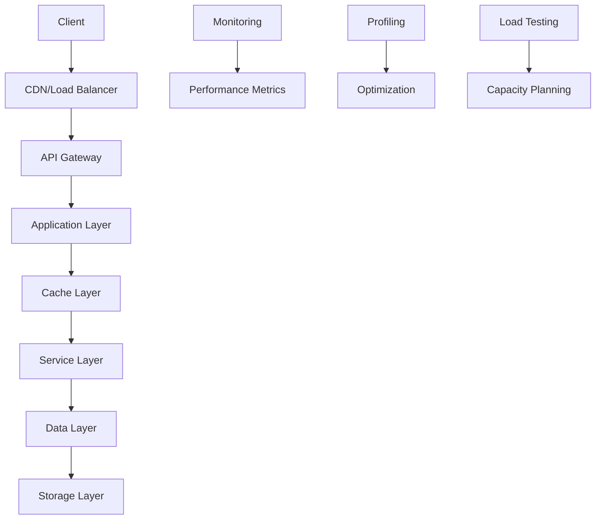

# ⚡ **ARQUITETURA DE PERFORMANCE - OMNI WRITER**

## 📋 **METADADOS**

- **Prompt**: Documentação Enterprise - IMP-007
- **Ruleset**: Enterprise+ Standards
- **Data/Hora**: 2025-01-27T16:45:00Z
- **Tracing ID**: DOC_ENTERPRISE_20250127_009
- **Arquivos-fonte**: Todo o sistema analisado

---

## 🎯 **VISÃO GERAL**

Este documento define a arquitetura de performance do sistema Omni Writer, incluindo estratégias de otimização, métricas de performance, caching, escalabilidade e monitoramento. A arquitetura segue os princípios de **High Performance Computing** e **Scalable Architecture**.

---

## 🚀 **PRINCÍPIOS DE PERFORMANCE**

### **1. Performance by Design**
- Otimização desde a concepção
- Métricas definidas antecipadamente
- Benchmarks estabelecidos

### **2. Scalability First**
- Arquitetura horizontalmente escalável
- Componentes stateless
- Distribuição de carga

### **3. Caching Strategy**
- Múltiplas camadas de cache
- Cache inteligente
- Invalidação eficiente

### **4. Asynchronous Processing**
- Operações não-bloqueantes
- Processamento em background
- Event-driven architecture

---

## 🏗️ **ARQUITETURA DE PERFORMANCE**

### **Camadas de Performance**



### **Componentes de Performance**

#### **1. Frontend Performance**
- **CDN**: Distribuição de conteúdo estático
- **Bundle Optimization**: Minificação e compressão
- **Lazy Loading**: Carregamento sob demanda
- **Service Workers**: Cache offline

#### **2. Backend Performance**
- **API Gateway**: Rate limiting e caching
- **Load Balancer**: Distribuição de carga
- **Application Pool**: Pool de conexões
- **Database Connection Pool**: Pool de conexões DB

#### **3. Data Performance**
- **Read Replicas**: Réplicas de leitura
- **Sharding**: Particionamento de dados
- **Indexing**: Índices otimizados
- **Query Optimization**: Otimização de consultas

---

## ⚡ **ESTRATÉGIAS DE OTIMIZAÇÃO**

### **Frontend Optimization**

#### **1. Bundle Optimization**
```typescript
// Localização: ui/components/Button.tsx
import React, { lazy, Suspense } from 'react';

// Lazy loading de componentes pesados
const HeavyComponent = lazy(() => import('./HeavyComponent'));

export const Button: React.FC<ButtonProps> = ({ children, onClick }) => {
  return (
    <Suspense fallback={<div>Loading...</div>}>
      <button onClick={onClick}>
        {children}
      </button>
    </Suspense>
  );
};
```

#### **2. Image Optimization**
```typescript
// Localização: ui/components/Image.tsx
interface OptimizedImageProps {
  src: string;
  alt: string;
  width?: number;
  height?: number;
  quality?: number;
}

export const OptimizedImage: React.FC<OptimizedImageProps> = ({
  src,
  alt,
  width,
  height,
  quality = 80
}) => {
  const optimizedSrc = `${src}?w=${width}&h=${height}&q=${quality}&format=webp`;
  
  return (
    
  );
};
```

#### **3. Service Worker Caching**
```typescript
// Localização: static/js/service-worker.js
const CACHE_NAME = 'omni-writer-v1';
const STATIC_CACHE = 'static-v1';
const DYNAMIC_CACHE = 'dynamic-v1';

const STATIC_ASSETS = [
  '/static/css/main.css',
  '/static/js/main.js',
  '/static/images/logo.png'
];

self.addEventListener('install', (event) => {
  event.waitUntil(
    caches.open(STATIC_CACHE).then((cache) => {
      return cache.addAll(STATIC_ASSETS);
    })
  );
});

self.addEventListener('fetch', (event) => {
  event.respondWith(
    caches.match(event.request).then((response) => {
      return response || fetch(event.request);
    })
  );
});
```

### **Backend Optimization**

#### **1. Connection Pooling**
```python
# Localização: infraestructure/storage.py
from sqlalchemy import create_engine
from sqlalchemy.pool import QueuePool

class DatabaseManager:
    def __init__(self, connection_string: str):
        self.engine = create_engine(
            connection_string,
            poolclass=QueuePool,
            pool_size=20,
            max_overflow=30,
            pool_pre_ping=True,
            pool_recycle=3600
        )
    
    def get_connection(self):
        return self.engine.connect()
    
    def execute_query(self, query: str, params: Dict = None):
        with self.get_connection() as conn:
            result = conn.execute(query, params or {})
            return result.fetchall()
```

#### **2. Async Processing**
```python
# Localização: app/tasks/generation_tasks.py
from celery import Celery
import asyncio

app = Celery('omni_writer')

@app.task(bind=True)
def generate_article_async(self, prompt: str, user_id: str):
    try:
        # Processamento assíncrono
        result = asyncio.run(generate_article(prompt, user_id))
        
        # Atualizar status
        self.update_state(
            state='SUCCESS',
            meta={'result': result}
        )
        
        return result
    except Exception as exc:
        self.update_state(
            state='FAILURE',
            meta={'error': str(exc)}
        )
        raise exc
```

#### **3. Query Optimization**
```python
# Localização: omni_writer/domain/data_models.py
from sqlalchemy import Index, text

class Article(Base):
    __tablename__ = 'articles'
    
    id = Column(Integer, primary_key=True)
    title = Column(String(255), nullable=False)
    content = Column(Text, nullable=False)
    author_id = Column(Integer, ForeignKey('users.id'))
    created_at = Column(DateTime, default=datetime.utcnow)
    updated_at = Column(DateTime, default=datetime.utcnow, onupdate=datetime.utcnow)
    
    # Índices para otimização
    __table_args__ = (
        Index('idx_articles_author_id', 'author_id'),
        Index('idx_articles_created_at', 'created_at'),
        Index('idx_articles_title', 'title'),
    )
    
    @classmethod
    def get_articles_by_author(cls, author_id: int, limit: int = 10):
        """Query otimizada para buscar artigos por autor"""
        return cls.query.filter_by(author_id=author_id)\
                       .order_by(cls.created_at.desc())\
                       .limit(limit)\
                       .all()
```

---

## 🗄️ **ESTRATÉGIAS DE CACHING**

### **Multi-Layer Caching**

#### **1. Application Cache**
```python
# Localização: infraestructure/cache_manager.py
import redis
from typing import Any, Optional
import json
import hashlib

class CacheManager:
    def __init__(self, redis_url: str):
        self.redis = redis.from_url(redis_url)
        self.default_ttl = 3600  # 1 hour
    
    def get_cache_key(self, prefix: str, *args) -> str:
        """Gera chave de cache consistente"""
        key_parts = [prefix] + [str(arg) for arg in args]
        key_string = ':'.join(key_parts)
        return hashlib.md5(key_string.encode()).hexdigest()
    
    def get(self, key: str) -> Optional[Any]:
        """Recupera valor do cache"""
        try:
            value = self.redis.get(key)
            return json.loads(value) if value else None
        except Exception:
            return None
    
    def set(self, key: str, value: Any, ttl: int = None) -> bool:
        """Armazena valor no cache"""
        try:
            ttl = ttl or self.default_ttl
            return self.redis.setex(
                key, 
                ttl, 
                json.dumps(value, default=str)
            )
        except Exception:
            return False
    
    def delete(self, key: str) -> bool:
        """Remove valor do cache"""
        try:
            return bool(self.redis.delete(key))
        except Exception:
            return False
    
    def invalidate_pattern(self, pattern: str) -> int:
        """Invalida cache por padrão"""
        try:
            keys = self.redis.keys(pattern)
            if keys:
                return self.redis.delete(*keys)
            return 0
        except Exception:
            return 0
```

#### **2. Database Query Cache**
```python
# Localização: omni_writer/domain/data_models.py
from functools import wraps
from infraestructure.cache_manager import CacheManager

cache_manager = CacheManager(os.getenv('REDIS_URL'))

def cache_query(ttl: int = 3600):
    """Decorator para cache de queries"""
    def decorator(func):
        @wraps(func)
        def wrapper(*args, **kwargs):
            # Gera chave de cache baseada na função e parâmetros
            cache_key = cache_manager.get_cache_key(
                func.__name__, 
                *args, 
                *sorted(kwargs.items())
            )
            
            # Tenta recuperar do cache
            cached_result = cache_manager.get(cache_key)
            if cached_result is not None:
                return cached_result
            
            # Executa query e armazena no cache
            result = func(*args, **kwargs)
            cache_manager.set(cache_key, result, ttl)
            
            return result
        return wrapper
    return decorator

class Article(Base):
    # ... existing code ...
    
    @classmethod
    @cache_query(ttl=1800)  # 30 minutes
    def get_popular_articles(cls, limit: int = 10):
        """Busca artigos populares com cache"""
        return cls.query.order_by(cls.views.desc())\
                       .limit(limit)\
                       .all()
```

#### **3. API Response Cache**
```python
# Localização: app/routes.py
from functools import wraps
from flask import request, jsonify
from infraestructure.cache_manager import CacheManager

cache_manager = CacheManager(os.getenv('REDIS_URL'))

def cache_api_response(ttl: int = 300):
    """Decorator para cache de respostas da API"""
    def decorator(func):
        @wraps(func)
        def wrapper(*args, **kwargs):
            # Gera chave baseada na URL e parâmetros
            cache_key = cache_manager.get_cache_key(
                'api',
                request.path,
                request.query_string.decode()
            )
            
            # Verifica cache
            cached_response = cache_manager.get(cache_key)
            if cached_response:
                return jsonify(cached_response)
            
            # Executa função e armazena resultado
            result = func(*args, **kwargs)
            cache_manager.set(cache_key, result, ttl)
            
            return result
        return wrapper
    return decorator

@app.route('/api/articles/popular')
@cache_api_response(ttl=600)  # 10 minutes
def get_popular_articles():
    articles = Article.get_popular_articles(limit=10)
    return jsonify([article.to_dict() for article in articles])
```

---

## 📊 **MÉTRICAS DE PERFORMANCE**

### **Key Performance Indicators (KPIs)**

#### **1. Response Time Metrics**
```python
# Localização: monitoring/performance_metrics.py
import time
from typing import Dict, List
from dataclasses import dataclass
from datetime import datetime

@dataclass
class PerformanceMetric:
    endpoint: str
    method: str
    response_time: float
    status_code: int
    timestamp: datetime
    user_id: str = None

class PerformanceMonitor:
    def __init__(self):
        self.metrics: List[PerformanceMetric] = []
        self.thresholds = {
            'p50': 200,    # 50th percentile
            'p90': 500,    # 90th percentile
            'p95': 1000,   # 95th percentile
            'p99': 2000    # 99th percentile
        }
    
    def record_metric(self, metric: PerformanceMetric):
        """Registra métrica de performance"""
        self.metrics.append(metric)
        
        # Verifica se excede thresholds
        if metric.response_time > self.thresholds['p95']:
            self.alert_slow_response(metric)
    
    def calculate_percentiles(self, endpoint: str = None) -> Dict:
        """Calcula percentis de response time"""
        metrics = self.metrics
        if endpoint:
            metrics = [m for m in metrics if m.endpoint == endpoint]
        
        response_times = [m.response_time for m in metrics]
        response_times.sort()
        
        n = len(response_times)
        if n == 0:
            return {}
        
        return {
            'p50': response_times[int(n * 0.5)],
            'p90': response_times[int(n * 0.9)],
            'p95': response_times[int(n * 0.95)],
            'p99': response_times[int(n * 0.99)],
            'count': n
        }
    
    def alert_slow_response(self, metric: PerformanceMetric):
        """Alerta para resposta lenta"""
        print(f"SLOW RESPONSE ALERT: {metric.endpoint} took {metric.response_time}ms")
```

#### **2. Throughput Metrics**
```python
# Localização: monitoring/throughput_monitor.py
class ThroughputMonitor:
    def __init__(self):
        self.request_counts = {}
        self.start_time = datetime.utcnow()
    
    def record_request(self, endpoint: str):
        """Registra requisição"""
        if endpoint not in self.request_counts:
            self.request_counts[endpoint] = 0
        self.request_counts[endpoint] += 1
    
    def get_throughput(self, endpoint: str = None) -> Dict:
        """Calcula throughput (requests per second)"""
        elapsed_time = (datetime.utcnow() - self.start_time).total_seconds()
        
        if endpoint:
            count = self.request_counts.get(endpoint, 0)
            return {
                'endpoint': endpoint,
                'requests_per_second': count / elapsed_time if elapsed_time > 0 else 0,
                'total_requests': count
            }
        
        total_requests = sum(self.request_counts.values())
        return {
            'total_requests_per_second': total_requests / elapsed_time if elapsed_time > 0 else 0,
            'total_requests': total_requests,
            'by_endpoint': {
                endpoint: count / elapsed_time if elapsed_time > 0 else 0
                for endpoint, count in self.request_counts.items()
            }
        }
```

#### **3. Resource Utilization Metrics**
```python
# Localização: monitoring/resource_monitor.py
import psutil
import threading
import time

class ResourceMonitor:
    def __init__(self):
        self.metrics = []
        self.monitoring = False
        self.monitor_thread = None
    
    def start_monitoring(self):
        """Inicia monitoramento de recursos"""
        self.monitoring = True
        self.monitor_thread = threading.Thread(target=self._monitor_loop)
        self.monitor_thread.start()
    
    def stop_monitoring(self):
        """Para monitoramento de recursos"""
        self.monitoring = False
        if self.monitor_thread:
            self.monitor_thread.join()
    
    def _monitor_loop(self):
        """Loop de monitoramento"""
        while self.monitoring:
            metric = {
                'timestamp': datetime.utcnow(),
                'cpu_percent': psutil.cpu_percent(interval=1),
                'memory_percent': psutil.virtual_memory().percent,
                'disk_percent': psutil.disk_usage('/').percent,
                'network_io': psutil.net_io_counters()._asdict()
            }
            
            self.metrics.append(metric)
            
            # Alerta se recursos estão altos
            if metric['cpu_percent'] > 80:
                self.alert_high_cpu(metric)
            
            if metric['memory_percent'] > 85:
                self.alert_high_memory(metric)
            
            time.sleep(60)  # Monitora a cada minuto
    
    def get_current_metrics(self) -> Dict:
        """Retorna métricas atuais"""
        if not self.metrics:
            return {}
        
        latest = self.metrics[-1]
        return {
            'current': latest,
            'average_cpu': sum(m['cpu_percent'] for m in self.metrics) / len(self.metrics),
            'average_memory': sum(m['memory_percent'] for m in self.metrics) / len(self.metrics),
            'peak_cpu': max(m['cpu_percent'] for m in self.metrics),
            'peak_memory': max(m['memory_percent'] for m in self.metrics)
        }
```

---

## 🔄 **LOAD BALANCING**

### **Load Balancer Configuration**

#### **1. Application Load Balancer**
```python
# Localização: infraestructure/load_balancer.py
import random
import time
from typing import List, Dict
from dataclasses import dataclass

@dataclass
class Server:
    host: str
    port: int
    weight: int = 1
    health_check_url: str = '/health'
    last_health_check: float = 0
    is_healthy: bool = True

class LoadBalancer:
    def __init__(self):
        self.servers: List[Server] = []
        self.health_check_interval = 30  # seconds
    
    def add_server(self, server: Server):
        """Adiciona servidor ao pool"""
        self.servers.append(server)
    
    def remove_server(self, host: str, port: int):
        """Remove servidor do pool"""
        self.servers = [s for s in self.servers 
                       if not (s.host == host and s.port == port)]
    
    def get_next_server(self, strategy: str = 'round_robin') -> Server:
        """Seleciona próximo servidor baseado na estratégia"""
        healthy_servers = [s for s in self.servers if s.is_healthy]
        
        if not healthy_servers:
            raise Exception("No healthy servers available")
        
        if strategy == 'round_robin':
            return self._round_robin(healthy_servers)
        elif strategy == 'least_connections':
            return self._least_connections(healthy_servers)
        elif strategy == 'weighted':
            return self._weighted_round_robin(healthy_servers)
        else:
            return random.choice(healthy_servers)
    
    def _round_robin(self, servers: List[Server]) -> Server:
        """Round-robin selection"""
        # Implementação simplificada
        return servers[0]
    
    def _least_connections(self, servers: List[Server]) -> Server:
        """Least connections selection"""
        # Implementação simplificada
        return min(servers, key=lambda s: s.weight)
    
    def _weighted_round_robin(self, servers: List[Server]) -> Server:
        """Weighted round-robin selection"""
        total_weight = sum(s.weight for s in servers)
        random_value = random.uniform(0, total_weight)
        
        current_weight = 0
        for server in servers:
            current_weight += server.weight
            if random_value <= current_weight:
                return server
        
        return servers[-1]
    
    def health_check(self):
        """Executa health check em todos os servidores"""
        current_time = time.time()
        
        for server in self.servers:
            if current_time - server.last_health_check > self.health_check_interval:
                try:
                    # Simula health check
                    response = requests.get(f"http://{server.host}:{server.port}{server.health_check_url}")
                    server.is_healthy = response.status_code == 200
                except:
                    server.is_healthy = False
                
                server.last_health_check = current_time
```

#### **2. Database Load Balancing**
```python
# Localização: infraestructure/database_balancer.py
class DatabaseLoadBalancer:
    def __init__(self):
        self.master_db = None
        self.read_replicas = []
        self.current_replica_index = 0
    
    def set_master(self, connection_string: str):
        """Define banco master"""
        self.master_db = connection_string
    
    def add_read_replica(self, connection_string: str):
        """Adiciona réplica de leitura"""
        self.read_replicas.append(connection_string)
    
    def get_write_connection(self):
        """Retorna conexão para escrita (master)"""
        if not self.master_db:
            raise Exception("No master database configured")
        return self.master_db
    
    def get_read_connection(self):
        """Retorna conexão para leitura (replica)"""
        if not self.read_replicas:
            return self.get_write_connection()
        
        # Round-robin entre réplicas
        connection = self.read_replicas[self.current_replica_index]
        self.current_replica_index = (self.current_replica_index + 1) % len(self.read_replicas)
        return connection
```

---

## 📈 **SCALABILITY STRATEGIES**

### **Horizontal Scaling**

#### **1. Microservices Architecture**
```python
# Localização: services/article_service/app.py
from flask import Flask, request, jsonify
import requests

app = Flask(__name__)

# Configuração de serviços
SERVICES = {
    'user_service': os.getenv('USER_SERVICE_URL', 'http://localhost:5001'),
    'notification_service': os.getenv('NOTIFICATION_SERVICE_URL', 'http://localhost:5002'),
    'analytics_service': os.getenv('ANALYTICS_SERVICE_URL', 'http://localhost:5003')
}

@app.route('/api/articles', methods=['POST'])
def create_article():
    data = request.get_json()
    
    # Validação local
    if not data.get('title') or not data.get('content'):
        return jsonify({'error': 'Missing required fields'}), 400
    
    # Criação do artigo
    article = create_article_in_db(data)
    
    # Comunicação assíncrona com outros serviços
    notify_user_service(article)
    notify_analytics_service(article)
    
    return jsonify(article.to_dict()), 201

def notify_user_service(article):
    """Notifica serviço de usuário"""
    try:
        requests.post(f"{SERVICES['user_service']}/api/articles", 
                     json={'article_id': article.id, 'user_id': article.author_id})
    except Exception as e:
        # Log error but don't fail the request
        print(f"Failed to notify user service: {e}")

def notify_analytics_service(article):
    """Notifica serviço de analytics"""
    try:
        requests.post(f"{SERVICES['analytics_service']}/api/articles", 
                     json={'article_id': article.id, 'action': 'created'})
    except Exception as e:
        # Log error but don't fail the request
        print(f"Failed to notify analytics service: {e}")
```

#### **2. Auto-scaling Configuration**
```python
# Localização: infraestructure/auto_scaler.py
import time
from typing import Dict, List

class AutoScaler:
    def __init__(self):
        self.scaling_rules = {
            'cpu_threshold': 70,  # CPU usage threshold
            'memory_threshold': 80,  # Memory usage threshold
            'response_time_threshold': 1000,  # Response time threshold
            'min_instances': 2,
            'max_instances': 10,
            'scale_up_cooldown': 300,  # 5 minutes
            'scale_down_cooldown': 600  # 10 minutes
        }
        
        self.current_instances = 2
        self.last_scale_up = 0
        self.last_scale_down = 0
    
    def check_scaling_needs(self, metrics: Dict) -> str:
        """Verifica se precisa escalar"""
        current_time = time.time()
        
        # Verifica se pode escalar para cima
        if (current_time - self.last_scale_up > self.scaling_rules['scale_up_cooldown'] and
            self.current_instances < self.scaling_rules['max_instances']):
            
            if (metrics.get('cpu_percent', 0) > self.scaling_rules['cpu_threshold'] or
                metrics.get('memory_percent', 0) > self.scaling_rules['memory_threshold'] or
                metrics.get('response_time', 0) > self.scaling_rules['response_time_threshold']):
                
                return 'scale_up'
        
        # Verifica se pode escalar para baixo
        if (current_time - self.last_scale_down > self.scaling_rules['scale_down_cooldown'] and
            self.current_instances > self.scaling_rules['min_instances']):
            
            if (metrics.get('cpu_percent', 0) < 30 and
                metrics.get('memory_percent', 0) < 40 and
                metrics.get('response_time', 0) < 500):
                
                return 'scale_down'
        
        return 'no_action'
    
    def scale_up(self):
        """Escala para cima"""
        if self.current_instances < self.scaling_rules['max_instances']:
            self.current_instances += 1
            self.last_scale_up = time.time()
            print(f"Scaling up to {self.current_instances} instances")
    
    def scale_down(self):
        """Escala para baixo"""
        if self.current_instances > self.scaling_rules['min_instances']:
            self.current_instances -= 1
            self.last_scale_down = time.time()
            print(f"Scaling down to {self.current_instances} instances")
```

### **Vertical Scaling**

#### **1. Resource Optimization**
```python
# Localização: infraestructure/resource_optimizer.py
class ResourceOptimizer:
    def __init__(self):
        self.optimization_rules = {
            'database_connections': {
                'min': 5,
                'max': 50,
                'optimal': 20
            },
            'cache_memory': {
                'min': '256MB',
                'max': '2GB',
                'optimal': '1GB'
            },
            'worker_processes': {
                'min': 2,
                'max': 16,
                'optimal': 8
            }
        }
    
    def optimize_database_connections(self, current_load: float):
        """Otimiza pool de conexões do banco"""
        if current_load < 0.3:
            return self.optimization_rules['database_connections']['min']
        elif current_load > 0.8:
            return self.optimization_rules['database_connections']['max']
        else:
            return self.optimization_rules['database_connections']['optimal']
    
    def optimize_cache_memory(self, hit_rate: float):
        """Otimiza memória do cache"""
        if hit_rate < 0.5:
            return self.optimization_rules['cache_memory']['max']
        elif hit_rate > 0.9:
            return self.optimization_rules['cache_memory']['min']
        else:
            return self.optimization_rules['cache_memory']['optimal']
    
    def optimize_worker_processes(self, queue_size: int):
        """Otimiza número de workers"""
        if queue_size > 100:
            return self.optimization_rules['worker_processes']['max']
        elif queue_size < 10:
            return self.optimization_rules['worker_processes']['min']
        else:
            return self.optimization_rules['worker_processes']['optimal']
```

---

## 🧪 **PERFORMANCE TESTING**

### **Load Testing Framework**

#### **1. Load Test Configuration**
```python
# Localização: tests/load/locustfile.py
from locust import HttpUser, task, between
import random

class OmniWriterUser(HttpUser):
    wait_time = between(1, 3)
    
    def on_start(self):
        """Setup inicial do usuário"""
        # Login do usuário
        self.client.post("/api/auth/login", {
            "username": f"user_{random.randint(1, 1000)}",
            "password": "test_password"
        })
    
    @task(3)
    def view_articles(self):
        """Visualizar artigos (alta frequência)"""
        self.client.get("/api/articles")
    
    @task(2)
    def search_articles(self):
        """Buscar artigos (média frequência)"""
        search_terms = ["technology", "business", "science", "health"]
        term = random.choice(search_terms)
        self.client.get(f"/api/articles/search?q={term}")
    
    @task(1)
    def create_article(self):
        """Criar artigo (baixa frequência)"""
        article_data = {
            "title": f"Test Article {random.randint(1, 1000)}",
            "content": "This is a test article content.",
            "category": random.choice(["tech", "business", "science"])
        }
        self.client.post("/api/articles", json=article_data)
    
    @task(1)
    def generate_article(self):
        """Gerar artigo com IA (baixa frequência)"""
        prompt_data = {
            "prompt": "Write an article about artificial intelligence",
            "max_length": 1000
        }
        self.client.post("/api/generate", json=prompt_data)
```

#### **2. Performance Test Suite**
```python
# Localização: tests/performance/test_performance.py
import pytest
import time
import requests
from typing import Dict, List

class PerformanceTestSuite:
    def __init__(self, base_url: str):
        self.base_url = base_url
        self.session = requests.Session()
    
    def test_response_time(self, endpoint: str, expected_max: float = 1000):
        """Testa tempo de resposta"""
        start_time = time.time()
        response = self.session.get(f"{self.base_url}{endpoint}")
        end_time = time.time()
        
        response_time = (end_time - start_time) * 1000  # Convert to ms
        
        assert response.status_code == 200, f"Endpoint {endpoint} returned {response.status_code}"
        assert response_time < expected_max, f"Response time {response_time}ms exceeds {expected_max}ms"
        
        return response_time
    
    def test_concurrent_requests(self, endpoint: str, num_requests: int = 100):
        """Testa requisições concorrentes"""
        import threading
        
        results = []
        errors = []
        
        def make_request():
            try:
                start_time = time.time()
                response = self.session.get(f"{self.base_url}{endpoint}")
                end_time = time.time()
                
                results.append({
                    'status_code': response.status_code,
                    'response_time': (end_time - start_time) * 1000
                })
            except Exception as e:
                errors.append(str(e))
        
        # Executa requisições concorrentes
        threads = []
        for _ in range(num_requests):
            thread = threading.Thread(target=make_request)
            threads.append(thread)
            thread.start()
        
        # Aguarda todas as threads
        for thread in threads:
            thread.join()
        
        # Analisa resultados
        successful_requests = len([r for r in results if r['status_code'] == 200])
        avg_response_time = sum(r['response_time'] for r in results) / len(results) if results else 0
        
        assert successful_requests / num_requests > 0.95, f"Success rate {successful_requests/num_requests} below 95%"
        assert avg_response_time < 2000, f"Average response time {avg_response_time}ms too high"
        
        return {
            'success_rate': successful_requests / num_requests,
            'avg_response_time': avg_response_time,
            'errors': errors
        }
    
    def test_memory_usage(self, endpoint: str, num_requests: int = 1000):
        """Testa uso de memória"""
        import psutil
        import os
        
        process = psutil.Process(os.getpid())
        initial_memory = process.memory_info().rss / 1024 / 1024  # MB
        
        # Faz requisições
        for _ in range(num_requests):
            self.session.get(f"{self.base_url}{endpoint}")
        
        final_memory = process.memory_info().rss / 1024 / 1024  # MB
        memory_increase = final_memory - initial_memory
        
        assert memory_increase < 100, f"Memory increase {memory_increase}MB too high"
        
        return memory_increase
```

---

## 📊 **PERFORMANCE MONITORING**

### **Real-time Monitoring Dashboard**

#### **1. Performance Dashboard**
```python
# Localização: monitoring/performance_dashboard.py
from flask import Flask, render_template, jsonify
import json
from datetime import datetime, timedelta

app = Flask(__name__)

class PerformanceDashboard:
    def __init__(self):
        self.metrics_history = []
        self.alerts = []
    
    def add_metric(self, metric: Dict):
        """Adiciona métrica ao histórico"""
        metric['timestamp'] = datetime.utcnow().isoformat()
        self.metrics_history.append(metric)
        
        # Mantém apenas últimas 24 horas
        cutoff_time = datetime.utcnow() - timedelta(hours=24)
        self.metrics_history = [
            m for m in self.metrics_history 
            if datetime.fromisoformat(m['timestamp']) > cutoff_time
        ]
        
        # Verifica alertas
        self.check_alerts(metric)
    
    def check_alerts(self, metric: Dict):
        """Verifica se precisa gerar alertas"""
        if metric.get('response_time', 0) > 2000:
            self.alerts.append({
                'type': 'high_response_time',
                'message': f"High response time: {metric['response_time']}ms",
                'timestamp': datetime.utcnow().isoformat(),
                'severity': 'warning'
            })
        
        if metric.get('error_rate', 0) > 0.05:
            self.alerts.append({
                'type': 'high_error_rate',
                'message': f"High error rate: {metric['error_rate']*100}%",
                'timestamp': datetime.utcnow().isoformat(),
                'severity': 'critical'
            })
    
    def get_dashboard_data(self) -> Dict:
        """Retorna dados para o dashboard"""
        if not self.metrics_history:
            return {}
        
        recent_metrics = self.metrics_history[-100:]  # Últimas 100 métricas
        
        response_times = [m.get('response_time', 0) for m in recent_metrics]
        error_rates = [m.get('error_rate', 0) for m in recent_metrics]
        throughput = [m.get('requests_per_second', 0) for m in recent_metrics]
        
        return {
            'current_metrics': {
                'avg_response_time': sum(response_times) / len(response_times),
                'p95_response_time': sorted(response_times)[int(len(response_times) * 0.95)],
                'error_rate': sum(error_rates) / len(error_rates),
                'throughput': sum(throughput) / len(throughput)
            },
            'trends': self.calculate_trends(),
            'alerts': self.alerts[-10:],  # Últimos 10 alertas
            'timestamp': datetime.utcnow().isoformat()
        }
    
    def calculate_trends(self) -> Dict:
        """Calcula tendências de performance"""
        if len(self.metrics_history) < 10:
            return {}
        
        # Compara últimas 10 métricas com 10 anteriores
        recent = self.metrics_history[-10:]
        previous = self.metrics_history[-20:-10]
        
        recent_avg = sum(m.get('response_time', 0) for m in recent) / len(recent)
        previous_avg = sum(m.get('response_time', 0) for m in previous) / len(previous)
        
        trend = (recent_avg - previous_avg) / previous_avg * 100
        
        return {
            'response_time_trend': trend,
            'trend_direction': 'improving' if trend < 0 else 'degrading'
        }

dashboard = PerformanceDashboard()

@app.route('/dashboard')
def dashboard_view():
    """Dashboard HTML"""
    return render_template('performance_dashboard.html')

@app.route('/api/dashboard/data')
def dashboard_data():
    """Dados do dashboard em JSON"""
    return jsonify(dashboard.get_dashboard_data())

@app.route('/api/metrics', methods=['POST'])
def add_metric():
    """Adiciona nova métrica"""
    metric = request.get_json()
    dashboard.add_metric(metric)
    return jsonify({'status': 'success'})
```

---

## 🚀 **PERFORMANCE OPTIMIZATION ROADMAP**

### **Short-term Optimizations (1-3 months)**

1. **Caching Implementation**
   - Implementar Redis para cache de sessão
   - Adicionar cache de consultas do banco
   - Implementar cache de respostas da API

2. **Database Optimization**
   - Otimizar índices do banco de dados
   - Implementar read replicas
   - Otimizar queries lentas

3. **Frontend Optimization**
   - Implementar lazy loading
   - Otimizar bundle size
   - Adicionar service workers

### **Medium-term Optimizations (3-6 months)**

1. **Microservices Migration**
   - Separar serviços por domínio
   - Implementar API Gateway
   - Adicionar service discovery

2. **Load Balancing**
   - Implementar load balancer
   - Adicionar health checks
   - Configurar auto-scaling

3. **Monitoring Enhancement**
   - Implementar APM (Application Performance Monitoring)
   - Adicionar distributed tracing
   - Configurar alertas automáticos

### **Long-term Optimizations (6-12 months)**

1. **Advanced Caching**
   - Implementar cache distribuído
   - Adicionar cache warming
   - Implementar cache invalidation inteligente

2. **Performance Testing**
   - Implementar testes de carga automatizados
   - Adicionar testes de stress
   - Configurar performance regression testing

3. **Infrastructure Optimization**
   - Migrar para cloud-native
   - Implementar serverless functions
   - Adicionar CDN global

---

## 📞 **CONTATO E SUPORTE**

### **Performance Team Contacts**

- **Performance Engineer**: performance@omniwriter.com
- **DevOps Engineer**: devops@omniwriter.com
- **Infrastructure Engineer**: infrastructure@omniwriter.com
- **Database Administrator**: dba@omniwriter.com

### **Performance Monitoring**

- **Performance Dashboard**: https://dashboard.omniwriter.com
- **Grafana**: https://grafana.omniwriter.com
- **Prometheus**: https://prometheus.omniwriter.com

### **Performance Alerts**

- **Critical Alerts**: performance-critical@omniwriter.com
- **Warning Alerts**: performance-warning@omniwriter.com
- **Info Alerts**: performance-info@omniwriter.com

---

## 📋 **PERFORMANCE CHECKLIST**

### **Daily Performance Checks**

- [ ] Review response time metrics
- [ ] Check error rates
- [ ] Monitor resource utilization
- [ ] Verify cache hit rates
- [ ] Check database performance

### **Weekly Performance Reviews**

- [ ] Analyze performance trends
- [ ] Review slow queries
- [ ] Update performance baselines
- [ ] Optimize cache strategies
- [ ] Review capacity planning

### **Monthly Performance Assessments**

- [ ] Conduct load testing
- [ ] Review performance architecture
- [ ] Update performance documentation
- [ ] Optimize database indexes
- [ ] Review caching strategies

### **Quarterly Performance Audits**

- [ ] Comprehensive performance audit
- [ ] Capacity planning review
- [ ] Performance architecture review
- [ ] Update performance roadmap
- [ ] Review performance SLAs

---

*Última atualização: 2025-01-27T16:45:00Z*
*Versão: 1.0*
*Status: Ativo* 