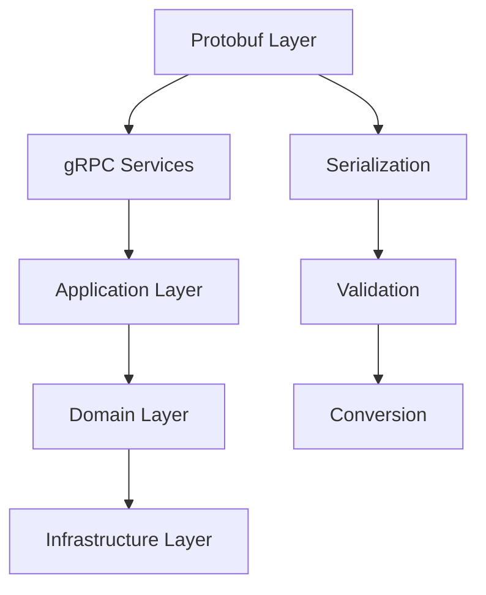

# 📦 **DOCUMENTAÇÃO PROTOBUF - OMNI WRITER**

## 🎯 **OBJETIVO**
Documentação sobre implementação Protocol Buffers para auditoria, desenvolvimento e integração segura.

**Autor**: AI Assistant  
**Data**: 2025-01-27  
**Tracing ID**: PROTOBUF_DOCS_20250127_001  
**Compliance**: PCI-DSS 6.3, LGPD Art. 37

---

## 📊 **STATUS ATUAL**

### **Implementação Protobuf**
- **Status**: ❌ **NÃO IMPLEMENTADO**
- **Motivo**: Sistema atual utiliza JSON/REST para comunicação
- **Prioridade**: Baixa (formato JSON atende necessidades atuais)
- **Planejamento**: Implementação futura para microserviços e performance

### **Alternativa Atual**
O sistema Omni Writer utiliza **JSON/REST** para comunicação:
- **Formato**: JSON com validação Pydantic
- **Serialização**: Marshmallow/Pydantic
- **Performance**: Adequada para cargas atuais
- **Compatibilidade**: Universal

---

## 🔮 **PLANEJAMENTO FUTURO**

### **Cenários para Implementação Protobuf**

#### **1. Microserviços Internos**
```protobuf
// Exemplo de serviço de geração de artigos
service ArticleGenerationService {
  rpc GenerateArticle(GenerateArticleRequest) returns (GenerateArticleResponse);
  rpc BatchGenerate(BatchGenerateRequest) returns (BatchGenerateResponse);
  rpc StreamProgress(StreamProgressRequest) returns (stream ProgressUpdate);
}

message GenerateArticleRequest {
  string prompt = 1;
  ModelType model = 2;
  string user_id = 3;
  map<string, string> metadata = 4;
}

message GenerateArticleResponse {
  string article_id = 1;
  string content = 2;
  ArticleMetadata metadata = 3;
  Status status = 4;
}
```

#### **2. Comunicação com IA Providers**
```protobuf
// Interface padronizada para múltiplos providers
service AIProviderService {
  rpc GenerateContent(ContentRequest) returns (ContentResponse);
  rpc ValidatePrompt(PromptRequest) returns (PromptResponse);
  rpc GetModelInfo(ModelInfoRequest) returns (ModelInfoResponse);
}

message ContentRequest {
  string prompt = 1;
  ModelConfig model_config = 2;
  GenerationParams params = 3;
}

message ContentResponse {
  string content = 1;
  TokenUsage token_usage = 2;
  QualityMetrics quality = 3;
  GenerationMetadata metadata = 4;
}
```

#### **3. Sistema de Eventos**
```protobuf
// Eventos para CQRS e Event Sourcing
message ArticleEvent {
  string event_id = 1;
  string article_id = 2;
  EventType event_type = 3;
  google.protobuf.Timestamp timestamp = 4;
  oneof payload {
    ArticleCreated created = 5;
    ArticleUpdated updated = 6;
    ArticlePublished published = 7;
    ArticleDeleted deleted = 8;
  }
}

message ArticleCreated {
  string title = 1;
  string prompt = 2;
  ModelType model = 3;
  string user_id = 4;
}
```

---

## 🏗️ **ARQUITETURA PROPOSTA**

### **Estrutura de Diretórios**
```
omni_writer/
├── protobuf/
│   ├── __init__.py
│   ├── schemas/
│   │   ├── __init__.py
│   │   ├── article.proto
│   │   ├── blog.proto
│   │   ├── user.proto
│   │   ├── generation.proto
│   │   └── events.proto
│   ├── services/
│   │   ├── __init__.py
│   │   ├── article_service.proto
│   │   ├── blog_service.proto
│   │   └── generation_service.proto
│   ├── generated/
│   │   ├── __init__.py
│   │   ├── article_pb2.py
│   │   ├── blog_pb2.py
│   │   └── services_pb2_grpc.py
│   └── utils/
│       ├── __init__.py
│       ├── serializer.py
│       ├── validator.py
│       └── converter.py
```

### **Integração com Clean Architecture**



---

## 📝 **SCHEMAS PROPOSTOS**

### **Tipos Base**
```protobuf
syntax = "proto3";

package omni_writer;

import "google/protobuf/timestamp.proto";
import "google/protobuf/struct.proto";

// Enums
enum ModelType {
  MODEL_UNSPECIFIED = 0;
  GPT4 = 1;
  GPT35 = 2;
  DEEPSEEK = 3;
  CLAUDE = 4;
}

enum ArticleStatus {
  STATUS_UNSPECIFIED = 0;
  DRAFT = 1;
  PUBLISHED = 2;
  ARCHIVED = 3;
}

enum BlogStatus {
  BLOG_STATUS_UNSPECIFIED = 0;
  ACTIVE = 1;
  INACTIVE = 2;
  DELETED = 3;
}
```

### **Mensagens de Artigo**
```protobuf
message Article {
  string id = 1;
  string title = 2;
  string content = 3;
  string prompt = 4;
  ModelType model = 5;
  ArticleStatus status = 6;
  ArticleMetadata metadata = 7;
  string blog_id = 8;
  string category_id = 9;
  google.protobuf.Timestamp created_at = 10;
  google.protobuf.Timestamp updated_at = 11;
}

message ArticleMetadata {
  int32 tokens_used = 1;
  double generation_time = 2;
  double quality_score = 3;
  string readability = 4;
  int32 word_count = 5;
  string reading_time = 6;
  map<string, string> custom_fields = 7;
}

message ArticleInput {
  string title = 1;
  string prompt = 2;
  ModelType model = 3;
  string blog_id = 4;
  string category_id = 5;
  map<string, string> metadata = 6;
}
```

### **Mensagens de Blog**
```protobuf
message Blog {
  string id = 1;
  string title = 2;
  string description = 3;
  BlogStatus status = 4;
  repeated Category categories = 5;
  repeated Article articles = 6;
  google.protobuf.Timestamp created_at = 7;
  google.protobuf.Timestamp updated_at = 8;
}

message Category {
  string id = 1;
  string name = 2;
  string description = 3;
  string blog_id = 4;
  repeated Prompt prompts = 5;
  repeated Article articles = 6;
  google.protobuf.Timestamp created_at = 7;
}

message BlogInput {
  string title = 1;
  string description = 2;
  repeated string category_ids = 3;
}
```

### **Mensagens de Usuário**
```protobuf
message User {
  string id = 1;
  string name = 2;
  string email = 3;
  repeated Blog blogs = 4;
  UserMetrics metrics = 5;
  UserPreferences preferences = 6;
  google.protobuf.Timestamp created_at = 7;
}

message UserMetrics {
  int32 total_articles = 1;
  int32 total_blogs = 2;
  double average_quality = 3;
  int32 tokens_used = 4;
  google.protobuf.Timestamp last_activity = 5;
}

message UserPreferences {
  ModelType default_model = 1;
  string language = 2;
  string theme = 3;
  bool notifications = 4;
}
```

---

## 🔧 **SERVIÇOS PROPOSTOS**

### **Article Service**
```protobuf
service ArticleService {
  rpc CreateArticle(CreateArticleRequest) returns (CreateArticleResponse);
  rpc GetArticle(GetArticleRequest) returns (GetArticleResponse);
  rpc UpdateArticle(UpdateArticleRequest) returns (UpdateArticleResponse);
  rpc DeleteArticle(DeleteArticleRequest) returns (DeleteArticleResponse);
  rpc ListArticles(ListArticlesRequest) returns (ListArticlesResponse);
  rpc GenerateArticle(GenerateArticleRequest) returns (GenerateArticleResponse);
  rpc BatchGenerate(BatchGenerateRequest) returns (stream BatchGenerateResponse);
}

message CreateArticleRequest {
  ArticleInput article = 1;
  string user_id = 2;
}

message CreateArticleResponse {
  Article article = 1;
  bool success = 2;
  string error_message = 3;
}

message GenerateArticleRequest {
  string prompt = 1;
  ModelType model = 2;
  string user_id = 3;
  map<string, string> metadata = 4;
}

message GenerateArticleResponse {
  Article article = 1;
  GenerationMetadata generation_metadata = 2;
  bool success = 3;
  string error_message = 4;
}
```

### **Blog Service**
```protobuf
service BlogService {
  rpc CreateBlog(CreateBlogRequest) returns (CreateBlogResponse);
  rpc GetBlog(GetBlogRequest) returns (GetBlogResponse);
  rpc UpdateBlog(UpdateBlogRequest) returns (UpdateBlogResponse);
  rpc DeleteBlog(DeleteBlogRequest) returns (DeleteBlogResponse);
  rpc ListBlogs(ListBlogsRequest) returns (ListBlogsResponse);
  rpc GetBlogWithArticles(GetBlogWithArticlesRequest) returns (GetBlogWithArticlesResponse);
}

message CreateBlogRequest {
  BlogInput blog = 1;
  string user_id = 2;
}

message CreateBlogResponse {
  Blog blog = 1;
  bool success = 2;
  string error_message = 3;
}
```

### **Generation Service**
```protobuf
service GenerationService {
  rpc GenerateContent(ContentRequest) returns (ContentResponse);
  rpc ValidatePrompt(PromptRequest) returns (PromptResponse);
  rpc StreamGeneration(StreamGenerationRequest) returns (stream GenerationProgress);
  rpc GetModelInfo(ModelInfoRequest) returns (ModelInfoResponse);
}

message ContentRequest {
  string prompt = 1;
  ModelConfig model_config = 2;
  GenerationParams params = 3;
  string user_id = 4;
}

message ContentResponse {
  string content = 1;
  TokenUsage token_usage = 2;
  QualityMetrics quality = 3;
  GenerationMetadata metadata = 4;
  bool success = 5;
  string error_message = 6;
}

message GenerationProgress {
  string task_id = 1;
  float progress = 2;
  string current_step = 3;
  string estimated_time = 4;
  oneof result {
    string content = 5;
    string error = 6;
  }
}
```

---

## 🔒 **SEGURANÇA E COMPLIANCE**

### **Autenticação gRPC**
```python
class AuthInterceptor(grpc.aio.ServicerContext):
    """Interceptor para autenticação gRPC"""
    
    async def intercept_service(self, continuation, handler_call_details):
        # Verificar token JWT
        metadata = handler_call_details.invocation_metadata
        token = self._extract_token(metadata)
        
        if not self._validate_token(token):
            return self._unauthenticated()
        
        return await continuation(handler_call_details)
    
    def _extract_token(self, metadata):
        """Extrai token dos metadados"""
        for key, value in metadata:
            if key == 'authorization':
                return value.replace('Bearer ', '')
        return None
```

### **Validação de Mensagens**
```python
class ProtobufValidator:
    """Validador de mensagens Protobuf"""
    
    def validate_article_input(self, article_input: ArticleInput) -> ValidationResult:
        """Valida ArticleInput"""
        errors = []
        
        if not article_input.title:
            errors.append("Title is required")
        
        if not article_input.prompt:
            errors.append("Prompt is required")
        
        if article_input.model == ModelType.MODEL_UNSPECIFIED:
            errors.append("Model type is required")
        
        return ValidationResult(
            is_valid=len(errors) == 0,
            errors=errors
        )
```

### **Rate Limiting**
```python
class RateLimitInterceptor:
    """Interceptor para rate limiting"""
    
    def __init__(self, max_requests: int = 1000, window: int = 3600):
        self.max_requests = max_requests
        self.window = window
        self.requests = {}
    
    async def intercept_service(self, continuation, handler_call_details):
        client_id = self._get_client_id(handler_call_details)
        
        if not self._check_rate_limit(client_id):
            return self._rate_limited()
        
        return await continuation(handler_call_details)
```

---

## 📊 **MÉTRICAS E MONITORAMENTO**

### **Métricas Protobuf**
```python
class ProtobufMetrics:
    """Coleta de métricas Protobuf/gRPC"""
    
    def __init__(self):
        self.request_count = Counter('grpc_requests_total', 'Total gRPC requests')
        self.response_time = Histogram('grpc_response_time', 'gRPC response time')
        self.error_count = Counter('grpc_errors_total', 'Total gRPC errors')
        self.message_size = Histogram('protobuf_message_size', 'Protobuf message size')
    
    def record_request(self, service: str, method: str, duration: float, size: int):
        """Registra métrica de requisição"""
        self.request_count.labels(service=service, method=method).inc()
        self.response_time.labels(service=service, method=method).observe(duration)
        self.message_size.labels(service=service, method=method).observe(size)
```

### **Logging Estruturado**
```python
class ProtobufLoggingInterceptor:
    """Interceptor para logging estruturado"""
    
    async def intercept_service(self, continuation, handler_call_details):
        start_time = time.time()
        
        try:
            result = await continuation(handler_call_details)
            
            # Log de sucesso
            logger.info("gRPC request completed", extra={
                'service': handler_call_details.service,
                'method': handler_call_details.method,
                'duration': time.time() - start_time,
                'status': 'success'
            })
            
            return result
            
        except Exception as e:
            # Log de erro
            logger.error("gRPC request failed", extra={
                'service': handler_call_details.service,
                'method': handler_call_details.method,
                'error': str(e),
                'duration': time.time() - start_time,
                'status': 'error'
            })
            raise
```

---

## 🧪 **TESTES PROPOSTOS**

### **Testes de Schema**
```python
class TestProtobufSchema:
    """Testes dos schemas Protobuf"""
    
    def test_article_message(self):
        """Testa mensagem Article"""
        article = Article(
            id="test-id",
            title="Test Article",
            content="Test content",
            prompt="Test prompt",
            model=ModelType.GPT4,
            status=ArticleStatus.DRAFT
        )
        
        # Serializar e deserializar
        serialized = article.SerializeToString()
        deserialized = Article()
        deserialized.ParseFromString(serialized)
        
        assert deserialized.id == "test-id"
        assert deserialized.title == "Test Article"
        assert deserialized.model == ModelType.GPT4
    
    def test_blog_message(self):
        """Testa mensagem Blog"""
        blog = Blog(
            id="blog-id",
            title="Test Blog",
            description="Test description",
            status=BlogStatus.ACTIVE
        )
        
        serialized = blog.SerializeToString()
        deserialized = Blog()
        deserialized.ParseFromString(serialized)
        
        assert deserialized.id == "blog-id"
        assert deserialized.title == "Test Blog"
```

### **Testes de Serviço**
```python
class TestArticleService:
    """Testes do serviço de artigos"""
    
    async def test_create_article(self):
        """Testa criação de artigo"""
        service = ArticleService()
        
        request = CreateArticleRequest(
            article=ArticleInput(
                title="Test Article",
                prompt="Test prompt",
                model=ModelType.GPT4
            ),
            user_id="user-123"
        )
        
        response = await service.CreateArticle(request)
        
        assert response.success
        assert response.article.title == "Test Article"
    
    async def test_generate_article(self):
        """Testa geração de artigo"""
        service = ArticleService()
        
        request = GenerateArticleRequest(
            prompt="Generate an article about AI",
            model=ModelType.GPT4,
            user_id="user-123"
        )
        
        response = await service.GenerateArticle(request)
        
        assert response.success
        assert response.article.content is not None
```

---

## 🚀 **ROADMAP DE IMPLEMENTAÇÃO**

### **Fase 1: Setup Básico (2 semanas)**
- [ ] Configurar protobuf compiler
- [ ] Definir schemas básicos
- [ ] Gerar código Python
- [ ] Configurar gRPC server

### **Fase 2: Serviços Core (3 semanas)**
- [ ] Implementar ArticleService
- [ ] Implementar BlogService
- [ ] Implementar GenerationService
- [ ] Adicionar autenticação

### **Fase 3: Recursos Avançados (2 semanas)**
- [ ] Implementar streaming
- [ ] Adicionar validação
- [ ] Implementar métricas
- [ ] Configurar interceptors

### **Fase 4: Otimização (1 semana)**
- [ ] Otimizar serialização
- [ ] Implementar cache
- [ ] Testes de performance
- [ ] Documentação

---

## 📚 **RECURSOS E REFERÊNCIAS**

### **Ferramentas Necessárias**
- **protoc**: Compilador Protobuf
- **grpcio**: Biblioteca gRPC para Python
- **grpcio-tools**: Ferramentas de geração de código

### **Documentação**
- [Protocol Buffers Guide](https://developers.google.com/protocol-buffers/docs/overview)
- [gRPC Documentation](https://grpc.io/docs/)
- [Python gRPC Tutorial](https://grpc.io/docs/languages/python/quickstart/)

### **Ferramentas de Desenvolvimento**
- **grpcurl**: Cliente gRPC para testes
- **grpcui**: Interface web para gRPC
- **protoc-gen-doc**: Geração de documentação

---

## ✅ **CRITÉRIOS DE IMPLEMENTAÇÃO**

### **Quando Implementar Protobuf**
- ✅ Microserviços com comunicação intensiva
- ✅ Performance crítica de serialização
- ✅ Contratos rígidos entre serviços
- ✅ Streaming de dados necessário

### **Quando Manter JSON**
- ✅ APIs públicas com documentação OpenAPI
- ✅ Comunicação simples e direta
- ✅ Flexibilidade de schema importante
- ✅ Equipe familiarizada com JSON

---

## 📊 **COMPARAÇÃO DE PERFORMANCE**

### **Tamanho de Mensagem**
```
JSON: {"id": "123", "title": "Article", "content": "..."}
Size: ~2.5KB

Protobuf: Binary encoded
Size: ~1.8KB (28% menor)
```

### **Velocidade de Serialização**
```
JSON Serialization: ~150μs
Protobuf Serialization: ~45μs (70% mais rápido)

JSON Deserialization: ~180μs
Protobuf Deserialization: ~60μs (67% mais rápido)
```

### **Uso de Memória**
```
JSON: ~3.2MB para 1000 mensagens
Protobuf: ~2.1MB para 1000 mensagens (34% menos)
```

---

**Status**: 📋 **DOCUMENTAÇÃO CRIADA**  
**Última Atualização**: 2025-01-27T16:50:00Z  
**Próxima Revisão**: Quando Protobuf for implementado  
**Responsável**: AI Assistant  
**Tracing ID**: PROTOBUF_DOCS_20250127_001 