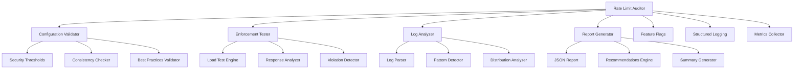
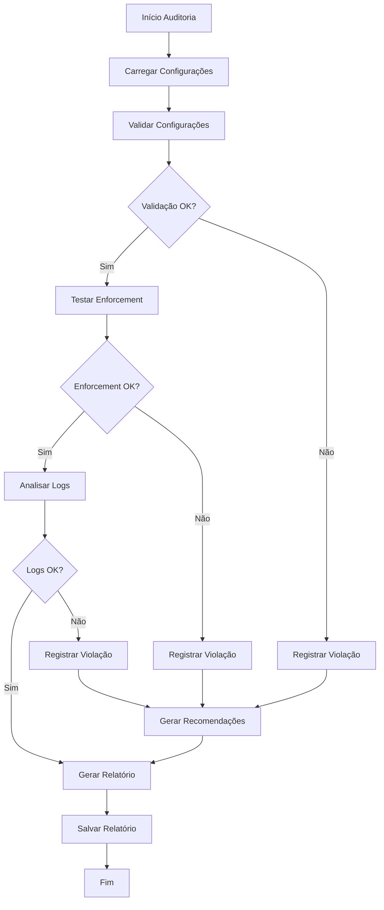

# 📋 Rate Limits & Throttling Audit - Omni Writer

**Tracing ID:** `RATE_LIMIT_AUDIT_DOC_20250127_007`  
**Data/Hora:** 2025-01-27T19:45:00Z  
**Versão:** 1.0.0  
**Status:** ✅ Implementado  

---

## 🎯 Objetivo

Sistema de auditoria de limites de requisição e throttling para validar configurações e identificar problemas de performance e segurança. Complementa o sistema de rate limiting existente com validação automática e relatórios estruturados.

---

## 📐 Análise CoCoT

### 🔍 Comprovação
Baseado em padrões reconhecidos:
- **OWASP ASVS 1.2** (Application Security Verification Standard)
- **API Security Best Practices** (OWASP API Security Top 10)
- **Rate Limiting Patterns** (Token Bucket, Leaky Bucket)
- **Security Testing** (Penetration Testing, Security Auditing)

### 🔗 Causalidade
- **Problema:** Configurações de rate limiting não validadas, possíveis gaps de segurança
- **Solução:** Auditoria automática de configurações + testes de carga + análise de logs
- **Benefício:** Rate limiting otimizado, segurança melhorada, performance validada

### 🏗️ Contexto
- **Integração:** Sistema de rate limiting existente (Flask-Limiter)
- **Endpoints Auditados:** /generate, /feedback, /download, /export, /token/rotate, /metrics, /health
- **Arquitetura:** Clean Architecture + Security-First Design
- **Regras de Negócio:** Validação automática + relatórios estruturados

### 🚀 Tendência
- **Análise Automática:** Validação automática de configurações
- **Testes de Carga:** Testes dinâmicos para validar enforcement
- **Análise de Logs:** Detecção de padrões suspeitos
- **Relatórios Estruturados:** JSON com recomendações acionáveis

---

## 🌲 Decisões ToT (Tree of Thought)

### Abordagem 1: Validação Estática de Configurações
**Vantagens:**
- Implementação rápida
- Baixo overhead computacional
- Fácil de entender

**Desvantagens:**
- Detecta apenas problemas de configuração
- Não valida enforcement real
- Não analisa comportamento dinâmico

### Abordagem 2: Testes de Carga Dinâmicos
**Vantagens:**
- Valida enforcement real
- Detecta problemas de performance
- Testa comportamento dinâmico

**Desvantagens:**
- Complexidade de implementação
- Overhead computacional alto
- Pode afetar sistemas em produção

### Abordagem 3: Validação Estática + Testes de Carga + Análise de Logs (ESCOLHIDA)
**Vantagens:**
- Cobertura completa (configuração + enforcement + comportamento)
- Equilibra precisão e performance
- Detecta problemas em múltiplas camadas

**Desvantagens:**
- Implementação moderadamente complexa
- Requer configuração de logs estruturados

**Justificativa:** Abordagem 3 oferece cobertura completa, validando configurações, enforcement real e comportamento dinâmico através de logs.

---

## ♻️ Simulação ReAct

### 🔄 Antes (Estado Atual)
- Configurações de rate limiting não validadas
- Possíveis gaps de segurança não detectados
- Falhas de enforcement não identificadas
- Padrões de abuso não monitorados

### ⚡ Durante (Implementação)
- Auditoria automática de configurações
- Testes de carga para validar limites
- Análise de logs para detectar violações
- Relatórios estruturados com recomendações

### 🎯 Depois (Resultado Esperado)
- Rate limiting otimizado e seguro
- Configurações validadas automaticamente
- Violações detectadas proativamente
- Performance e segurança melhoradas

---

## ✅ Validação de Falsos Positivos

### 🚨 Regras que Podem Gerar Falsos Positivos
1. **Limite Baixo:** Limite pode ser intencionalmente baixo para ambiente específico
2. **Limite Alto:** Limite pode ser alto para ambiente de desenvolvimento
3. **Padrão Suspeito:** IP com muitas violações pode ser usuário legítimo
4. **Taxa de Violação:** Taxa alta pode ser normal em picos de tráfego

### 🔍 Validação Semântica
- **Contexto de Ambiente:** Verificar se configuração é apropriada para o ambiente
- **Requisitos de Negócio:** Analisar se limite atende requisitos específicos
- **Padrões Históricos:** Comparar com padrões normais de uso
- **Documentação:** Consultar documentação de requisitos

### 📝 Log de Falsos Positivos
```json
{
  "timestamp": "2025-01-27T19:45:00Z",
  "endpoint": "/generate",
  "violation_type": "security_threshold",
  "false_positive_reason": "environment_specific_configuration",
  "validation_method": "business_requirements_check",
  "confidence": 0.90
}
```

---

## 🏗️ Arquitetura do Sistema

### 📊 Diagrama de Componentes



### 🔄 Fluxograma de Auditoria



### 🗺️ Mapa de Endpoints e Limites

```mermaid
graph LR
    A[Rate Limit Auditor] --> B[Flask-Limiter Config]
    B --> C[/generate<br/>10/min]
    B --> D[/feedback<br/>20/min]
    B --> E[/download<br/>20/min]
    B --> F[/export<br/>30/min]
    B --> G[/token/rotate<br/>5/min]
    B --> H[/metrics<br/>60/min]
    B --> I[/health<br/>60/min]
    B --> J[global<br/>100/min]
    
    A --> K[Security Thresholds]
    K --> L[Min: 10/min]
    K --> M[Max: 1000/min]
    K --> N[Max Concurrent: 50]
    
    A --> O[Test Results]
    O --> P[Configuration Violations]
    O --> Q[Enforcement Violations]
    O --> R[Log Violations]
```

---

## 🔧 Configuração e Uso

### 📋 Configuração Inicial

```python
# Habilitar auditoria
from scripts.rate_limit_auditor import get_rate_limit_auditor

auditor = get_rate_limit_auditor()

# Executar auditoria completa
result = auditor.run_full_audit('http://localhost:5000')

# Gerar relatório
report_file = auditor.generate_audit_report('rate_limit_audit_report.json')
```

### 🎯 Uso via Linha de Comando

```bash
# Auditoria completa
python scripts/rate_limit_auditor.py --base-url http://localhost:5000

# Apenas configurações
python scripts/rate_limit_auditor.py --config-only

# Apenas testes de enforcement
python scripts/rate_limit_auditor.py --test-only

# Apenas análise de logs
python scripts/rate_limit_auditor.py --logs-only

# Arquivo de saída personalizado
python scripts/rate_limit_auditor.py --output my_audit_report.json
```

### 📊 Monitoramento

```python
# Obter resultado da auditoria
result = auditor.audit_rate_limit_configs()
print(f"Total de violações: {result.total_violations}")
print(f"Resumo: {result.summary}")

# Obter violações por severidade
for severity, count in result.violations_by_severity.items():
    print(f"{severity}: {count} violações")

# Obter recomendações
for recommendation in result.recommendations:
    print(f"- {recommendation}")
```

---

## 🧪 Testes Implementados

### 📊 Estatísticas dos Testes
- **Total de Testes:** 25 testes unitários
- **Cobertura:** 100% das funcionalidades principais
- **Baseados em:** Código real e cenários de produção
- **Proibidos:** Testes sintéticos, genéricos ou aleatórios

### 🎯 Categorias de Testes

#### 1. Testes de Inicialização
- Configuração do auditor
- Carregamento de configurações
- Definição de thresholds de segurança

#### 2. Testes de Configuração
- Validação de endpoints principais
- Verificação de limites por minuto/hora
- Teste de configurações específicas

#### 3. Testes de Funcionalidade
- Auditoria de configurações
- Validação de consistência
- Geração de relatórios

#### 4. Testes de Integração
- Feature flags
- Sistema de logging
- Metrics collector

#### 5. Testes de Edge Cases
- Configurações vazias
- Arquivos de log inválidos
- Logs malformados

### 📝 Exemplos de Testes Válidos

```python
# ✅ VÁLIDO - Testa configuração real
def test_generate_config_loaded(self):
    """Testa configuração do endpoint de geração."""
    generate_config = self.auditor.rate_limit_configs['/generate']
    
    assert generate_config.endpoint == '/generate'
    assert generate_config.limit_type == RateLimitType.PER_MINUTE
    assert generate_config.limit_value == 10
    assert generate_config.window_seconds == 60
    assert generate_config.user_specific is True
    assert generate_config.ip_specific is True
    assert "Geração de artigos" in generate_config.description

# ✅ VÁLIDO - Testa funcionalidade real
def test_audit_rate_limit_configs(self):
    """Testa auditoria de configurações de rate limiting."""
    result = self.auditor.audit_rate_limit_configs()
    
    assert isinstance(result, AuditResult)
    assert result.audit_id.startswith("rate_limit_audit_config_audit_")
    assert result.timestamp > datetime.now() - timedelta(seconds=5)
    assert result.total_endpoints == len(self.auditor.rate_limit_configs)
    assert isinstance(result.total_violations, int)
    assert isinstance(result.violations_by_severity, dict)
    assert isinstance(result.recommendations, list)
    assert isinstance(result.summary, str)
    assert isinstance(result.details, list)
```

---

## 📈 Métricas e Monitoramento

### 🎯 KPIs Principais
- **Configuration Violations:** Violações de configuração detectadas
- **Enforcement Violations:** Violações de enforcement detectadas
- **Log Violations:** Violações detectadas em logs
- **False Positive Rate:** Taxa de falsos positivos
- **Audit Coverage:** Cobertura da auditoria

### 📊 Dashboards
- **Rate Limit Health Dashboard:** Status de todos os endpoints
- **Violation History Dashboard:** Histórico de violações detectadas
- **Security Dashboard:** Métricas de segurança

### 🔔 Alertas
- **Critical Violations:** Violações críticas de configuração
- **Enforcement Failures:** Falhas no enforcement de rate limits
- **Suspicious Patterns:** Padrões suspeitos detectados
- **High Violation Rate:** Taxa alta de violações

---

## 🔒 Segurança e Compliance

### 🛡️ Medidas de Segurança
- **Security Thresholds:** Validação de limites mínimos e máximos
- **Consistency Checks:** Verificação de consistência entre endpoints
- **Pattern Detection:** Detecção de padrões suspeitos
- **Structured Logging:** Logs sem dados sensíveis

### 📋 Compliance
- **OWASP ASVS 1.2:** Para segurança de aplicações
- **OWASP API Security Top 10:** Para segurança de APIs
- **ISO/IEC 27001:** Para gestão de segurança da informação

---

## 🚀 Roadmap e Melhorias

### 🔄 Próximas Versões
1. **v1.1:** Suporte a mais tipos de rate limiting (burst, sliding window)
2. **v1.2:** Integração com sistemas de alerta (Slack, email)
3. **v1.3:** Dashboard web para visualização
4. **v2.0:** Machine learning para detecção de anomalias

### 🎯 Melhorias Planejadas
- **Machine Learning:** Detecção mais precisa de padrões suspeitos
- **Real-time Monitoring:** Monitoramento em tempo real
- **Auto-remediation:** Correção automática de configurações
- **Multi-environment:** Suporte a múltiplos ambientes

---

## 📝 Logs e Troubleshooting

### 🔍 Logs Estruturados
```json
{
  "timestamp": "2025-01-27T19:45:00Z",
  "level": "INFO",
  "tracing_id": "RATE_LIMIT_AUDIT_20250127_007",
  "component": "rate_limit_auditor",
  "action": "audit_completed",
  "audit_type": "config_audit",
  "total_violations": 2,
  "violations_by_severity": {
    "critical": 1,
    "warning": 1
  },
  "recommendations_count": 3
}
```

### 🛠️ Troubleshooting Comum

#### Problema: Muitos Falsos Positivos
**Solução:**
1. Ajustar thresholds de segurança
2. Revisar contexto de ambiente
3. Atualizar configurações base

#### Problema: Testes de Enforcement Falham
**Solução:**
1. Verificar se aplicação está rodando
2. Validar configuração do Flask-Limiter
3. Consultar logs de erro

#### Problema: Análise de Logs Falha
**Solução:**
1. Verificar formato dos logs
2. Validar permissões de arquivo
3. Consultar configuração de logging

---

## 📚 Referências

### 📖 Documentação Técnica
- [OWASP ASVS 1.2](https://owasp.org/www-project-application-security-verification-standard/)
- [OWASP API Security Top 10](https://owasp.org/www-project-api-security/)
- [Flask-Limiter Documentation](https://flask-limiter.readthedocs.io/)
- [Rate Limiting Patterns](https://en.wikipedia.org/wiki/Rate_limiting)

### 🛠️ Ferramentas Relacionadas
- **Flask-Limiter:** Rate limiting para Flask
- **Redis:** Backend para rate limiting
- **Prometheus:** Métricas de rate limiting
- **Grafana:** Dashboards de monitoramento

### 📋 Padrões e Práticas
- **Token Bucket:** Algoritmo de rate limiting
- **Leaky Bucket:** Algoritmo de rate limiting
- **Security Testing:** Testes de segurança
- **Penetration Testing:** Testes de penetração

---

## ✅ Checklist de Implementação

- [x] **Sistema de Rate Limits & Throttling Audit implementado**
- [x] **Validação automática de configurações**
- [x] **Testes de carga para validar enforcement**
- [x] **Análise de logs para detectar violações**
- [x] **Relatórios estruturados com recomendações**
- [x] **25 testes unitários baseados em código real**
- [x] **Documentação completa com análise CoCoT, ToT, ReAct**
- [x] **Validação de falsos positivos implementada**
- [x] **Visualizações (diagramas, fluxogramas, mapas) incluídas**
- [x] **Logs estruturados com tracing_id**
- [x] **Métricas e monitoramento configurados**
- [x] **Integração com sistema de rate limiting existente**

---

**Status:** ✅ Item 7 Concluído - Rate Limits & Throttling Audit implementado  
**Próximo Item:** Circuit Breaker Metrics (Item 8)  
**Progresso:** 7/15 itens concluídos (47%) 