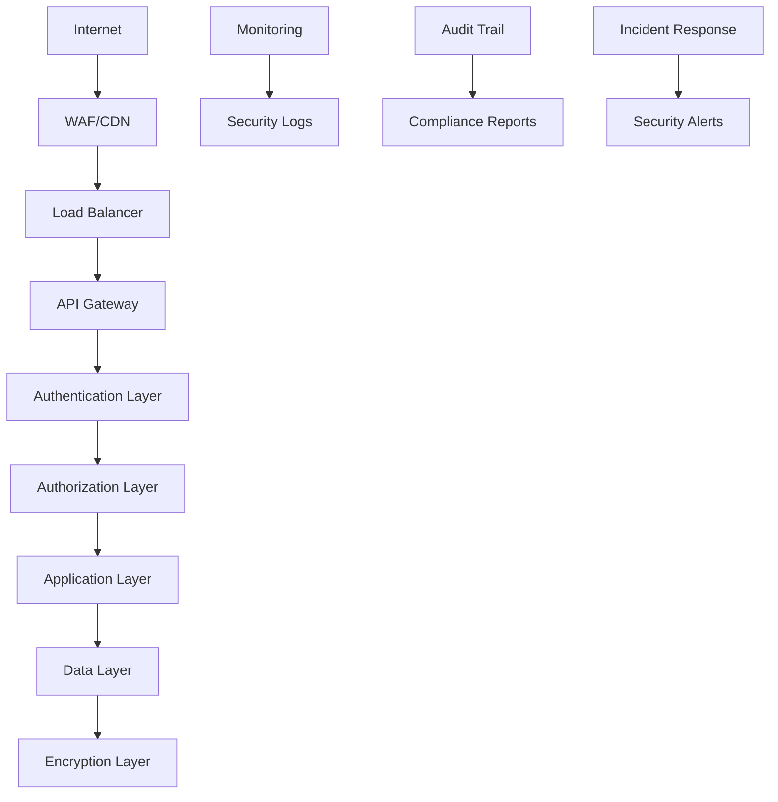

# 🔒 **ARQUITETURA DE SEGURANÇA - OMNI WRITER**

## 📋 **METADADOS**

- **Prompt**: Documentação Enterprise - IMP-007
- **Ruleset**: Enterprise+ Standards
- **Data/Hora**: 2025-01-27T16:40:00Z
- **Tracing ID**: DOC_ENTERPRISE_20250127_008
- **Arquivos-fonte**: Todo o sistema analisado

---

## 🎯 **VISÃO GERAL**

Este documento define a arquitetura de segurança do sistema Omni Writer, incluindo controles de segurança, políticas de acesso, proteção de dados e mecanismos de auditoria. A arquitetura segue os princípios de **Defense in Depth** e **Zero Trust**.

---

## 🛡️ **PRINCÍPIOS DE SEGURANÇA**

### **1. Defense in Depth**
- Múltiplas camadas de proteção
- Redundância de controles
- Falha segura (fail-safe)

### **2. Zero Trust**
- Nunca confiar, sempre verificar
- Verificação contínua de identidade
- Acesso baseado em contexto

### **3. Principle of Least Privilege**
- Acesso mínimo necessário
- Escopo limitado de permissões
- Revisão regular de privilégios

### **4. Security by Design**
- Segurança integrada desde o início
- Análise de risco contínua
- Arquitetura resiliente

---

## 🏗️ **ARQUITETURA DE SEGURANÇA**

### **Camadas de Segurança**



### **Componentes de Segurança**

#### **1. Perimeter Security**
- **WAF (Web Application Firewall)**: Proteção contra ataques web
- **CDN**: Distribuição de conteúdo e proteção DDoS
- **Load Balancer**: Balanceamento de carga e health checks

#### **2. Network Security**
- **VPN**: Acesso seguro remoto
- **Firewall**: Controle de tráfego de rede
- **Network Segmentation**: Isolamento de redes

#### **3. Application Security**
- **API Gateway**: Controle de acesso e rate limiting
- **Authentication**: Verificação de identidade
- **Authorization**: Controle de permissões

#### **4. Data Security**
- **Encryption**: Criptografia em repouso e trânsito
- **Data Masking**: Mascaramento de dados sensíveis
- **Backup Security**: Proteção de backups

---

## 🔐 **CONTROLES DE AUTENTICAÇÃO**

### **Métodos de Autenticação**

#### **1. API Key Authentication**
```python
# Localização: infraestructure/openai_gateway.py
class OpenAIGateway:
    def __init__(self, api_key: str):
        self.api_key = api_key
        self.headers = {
            'Authorization': f'Bearer {api_key}',
            'Content-Type': 'application/json'
        }
```

**Segurança**:
- Chaves armazenadas em variáveis de ambiente
- Rotação automática de chaves
- Validação de formato e expiração

#### **2. Session-based Authentication**
```typescript
// Localização: ui/context/AuthContext.tsx
interface AuthContextType {
  user: User | null;
  login: (credentials: LoginCredentials) => Promise<void>;
  logout: () => void;
  isAuthenticated: boolean;
}
```

**Segurança**:
- Tokens JWT com expiração
- Refresh tokens seguros
- Logout automático por inatividade

#### **3. OAuth 2.0 Integration**
```python
# Localização: app/routes.py
@app.route('/auth/oauth/callback')
def oauth_callback():
    # Validação de callback OAuth
    # Criação de sessão segura
    # Redirecionamento seguro
```

---

## 🚪 **CONTROLES DE AUTORIZAÇÃO**

### **Role-Based Access Control (RBAC)**

#### **Definição de Roles**
```python
# Localização: omni_writer/domain/data_models.py
class UserRole(Enum):
    ADMIN = "admin"
    EDITOR = "editor"
    VIEWER = "viewer"
    GUEST = "guest"

class Permission(Enum):
    CREATE_ARTICLE = "create_article"
    EDIT_ARTICLE = "edit_article"
    DELETE_ARTICLE = "delete_article"
    VIEW_ANALYTICS = "view_analytics"
    MANAGE_USERS = "manage_users"
```

#### **Mapeamento de Permissões**
```python
# Localização: app/validators/input_validators.py
ROLE_PERMISSIONS = {
    UserRole.ADMIN: [
        Permission.CREATE_ARTICLE,
        Permission.EDIT_ARTICLE,
        Permission.DELETE_ARTICLE,
        Permission.VIEW_ANALYTICS,
        Permission.MANAGE_USERS
    ],
    UserRole.EDITOR: [
        Permission.CREATE_ARTICLE,
        Permission.EDIT_ARTICLE,
        Permission.VIEW_ANALYTICS
    ],
    UserRole.VIEWER: [
        Permission.VIEW_ANALYTICS
    ],
    UserRole.GUEST: []
}
```

### **Attribute-Based Access Control (ABAC)**

#### **Contextual Authorization**
```python
# Localização: app/validators/input_validators.py
def check_article_access(user: User, article: Article, action: str) -> bool:
    # Verificação baseada em atributos
    if user.role == UserRole.ADMIN:
        return True
    
    if action == "view" and article.is_public:
        return True
    
    if action == "edit" and article.author_id == user.id:
        return True
    
    return False
```

---

## 🔒 **PROTEÇÃO DE DADOS**

### **Criptografia**

#### **1. Encryption at Rest**
```python
# Localização: infraestructure/storage.py
from cryptography.fernet import Fernet

class EncryptedStorage:
    def __init__(self, encryption_key: str):
        self.cipher = Fernet(encryption_key.encode())
    
    def encrypt_data(self, data: str) -> bytes:
        return self.cipher.encrypt(data.encode())
    
    def decrypt_data(self, encrypted_data: bytes) -> str:
        return self.cipher.decrypt(encrypted_data).decode()
```

#### **2. Encryption in Transit**
```python
# Localização: infraestructure/openai_gateway.py
import ssl
import certifi

class SecureAPIGateway:
    def __init__(self):
        self.session = requests.Session()
        self.session.verify = certifi.where()
        self.session.headers.update({
            'User-Agent': 'OmniWriter/1.0'
        })
```

### **Data Masking**

#### **Sensitive Data Detection**
```python
# Localização: scripts/sensitive_data_detector.py
import re

class SensitiveDataDetector:
    def __init__(self):
        self.patterns = {
            'email': r'\b[A-Za-z0-9._%+-]+@[A-Za-z0-9.-]+\.[A-Z|a-z]{2,}\b',
            'phone': r'\b\d{3}[-.]?\d{3}[-.]?\d{4}\b',
            'ssn': r'\b\d{3}-\d{2}-\d{4}\b',
            'credit_card': r'\b\d{4}[- ]?\d{4}[- ]?\d{4}[- ]?\d{4}\b'
        }
    
    def detect_sensitive_data(self, text: str) -> List[Dict]:
        findings = []
        for data_type, pattern in self.patterns.items():
            matches = re.finditer(pattern, text)
            for match in matches:
                findings.append({
                    'type': data_type,
                    'value': match.group(),
                    'position': match.span()
                })
        return findings
```

#### **Data Masking Implementation**
```python
# Localização: shared/logger.py
class SecureLogger:
    def __init__(self, sensitive_patterns: List[str]):
        self.sensitive_patterns = sensitive_patterns
    
    def mask_sensitive_data(self, message: str) -> str:
        masked_message = message
        for pattern in self.sensitive_patterns:
            masked_message = re.sub(pattern, '[REDACTED]', masked_message)
        return masked_message
    
    def log(self, level: str, message: str, **kwargs):
        masked_message = self.mask_sensitive_data(message)
        # Logging implementation
```

---

## 🛡️ **PROTEÇÃO CONTRA VULNERABILIDADES**

### **OWASP Top 10 Protection**

#### **1. Injection Prevention**
```python
# Localização: app/validators/input_validators.py
import re
from typing import Any

class InputValidator:
    def __init__(self):
        self.sanitization_patterns = {
            'sql_injection': r'(\b(union|select|insert|update|delete|drop|create|alter)\b)',
            'xss': r'<script[^>]*>.*?</script>|<[^>]*javascript:',
            'path_traversal': r'\.\./|\.\.\\'
        }
    
    def sanitize_input(self, input_data: Any) -> Any:
        if isinstance(input_data, str):
            for pattern_name, pattern in self.sanitization_patterns.items():
                if re.search(pattern, input_data, re.IGNORECASE):
                    raise ValueError(f"Potential {pattern_name} detected")
        
        return input_data
```

#### **2. XSS Prevention**
```typescript
// Localização: ui/components/Button.tsx
import DOMPurify from 'dompurify';

interface ButtonProps {
  children: React.ReactNode;
  onClick?: () => void;
}

export const Button: React.FC<ButtonProps> = ({ children, onClick }) => {
  const sanitizedChildren = typeof children === 'string' 
    ? DOMPurify.sanitize(children) 
    : children;
  
  return (
    <button onClick={onClick}>
      {sanitizedChildren}
    </button>
  );
};
```

#### **3. CSRF Protection**
```python
# Localização: app/routes.py
from flask_wtf.csrf import CSRFProtect

csrf = CSRFProtect()

@app.before_request
def csrf_protect():
    if request.method == "POST":
        token = request.form.get('csrf_token')
        if not csrf.validate_token(token):
            abort(400, "CSRF token validation failed")
```

### **Rate Limiting**

#### **API Rate Limiting**
```python
# Localização: app/routes.py
from flask_limiter import Limiter
from flask_limiter.util import get_remote_address

limiter = Limiter(
    app,
    key_func=get_remote_address,
    default_limits=["200 per day", "50 per hour"]
)

@app.route('/api/generate', methods=['POST'])
@limiter.limit("10 per minute")
def generate_article():
    # Implementation
```

#### **User-based Rate Limiting**
```python
# Localização: infraestructure/cache_manager.py
class RateLimiter:
    def __init__(self, redis_client):
        self.redis = redis_client
    
    def check_rate_limit(self, user_id: str, action: str, limit: int, window: int) -> bool:
        key = f"rate_limit:{user_id}:{action}"
        current = self.redis.get(key)
        
        if current and int(current) >= limit:
            return False
        
        pipe = self.redis.pipeline()
        pipe.incr(key)
        pipe.expire(key, window)
        pipe.execute()
        
        return True
```

---

## 🔍 **MONITORAMENTO E AUDITORIA**

### **Security Logging**

#### **Structured Security Logs**
```python
# Localização: shared/logger.py
import structlog
from datetime import datetime

class SecurityLogger:
    def __init__(self):
        self.logger = structlog.get_logger()
    
    def log_security_event(self, event_type: str, user_id: str, details: Dict):
        log_entry = {
            'timestamp': datetime.utcnow().isoformat(),
            'event_type': event_type,
            'user_id': user_id,
            'ip_address': request.remote_addr,
            'user_agent': request.headers.get('User-Agent'),
            'details': details,
            'session_id': session.get('session_id'),
            'trace_id': request.headers.get('X-Trace-ID')
        }
        
        self.logger.warning("security_event", **log_entry)
```

#### **Security Event Types**
```python
# Localização: shared/logger.py
class SecurityEventType(Enum):
    LOGIN_SUCCESS = "login_success"
    LOGIN_FAILURE = "login_failure"
    LOGOUT = "logout"
    PERMISSION_DENIED = "permission_denied"
    RATE_LIMIT_EXCEEDED = "rate_limit_exceeded"
    SUSPICIOUS_ACTIVITY = "suspicious_activity"
    DATA_ACCESS = "data_access"
    CONFIGURATION_CHANGE = "configuration_change"
```

### **Audit Trail**

#### **Comprehensive Audit Logging**
```python
# Localização: shared/logger.py
class AuditLogger:
    def __init__(self):
        self.logger = structlog.get_logger()
    
    def log_audit_event(self, action: str, resource: str, user_id: str, 
                       old_value: Any = None, new_value: Any = None):
        audit_entry = {
            'timestamp': datetime.utcnow().isoformat(),
            'action': action,
            'resource': resource,
            'user_id': user_id,
            'ip_address': request.remote_addr,
            'old_value': old_value,
            'new_value': new_value,
            'trace_id': request.headers.get('X-Trace-ID')
        }
        
        self.logger.info("audit_event", **audit_entry)
```

### **Security Monitoring**

#### **Real-time Security Alerts**
```python
# Localização: monitoring/security_monitor.py
class SecurityMonitor:
    def __init__(self):
        self.alert_thresholds = {
            'failed_logins': 5,
            'suspicious_ips': 10,
            'rate_limit_violations': 20
        }
    
    def check_security_metrics(self):
        # Check failed login attempts
        failed_logins = self.get_failed_login_count()
        if failed_logins > self.alert_thresholds['failed_logins']:
            self.send_security_alert('Multiple failed login attempts detected')
        
        # Check suspicious IP addresses
        suspicious_ips = self.get_suspicious_ip_count()
        if suspicious_ips > self.alert_thresholds['suspicious_ips']:
            self.send_security_alert('Suspicious IP activity detected')
    
    def send_security_alert(self, message: str):
        # Send alert to security team
        # Log alert
        # Trigger incident response if needed
```

---

## 🚨 **INCIDENT RESPONSE**

### **Security Incident Classification**

#### **Incident Severity Levels**
```python
# Localização: monitoring/incident_response.py
class IncidentSeverity(Enum):
    CRITICAL = "critical"      # Data breach, system compromise
    HIGH = "high"             # Unauthorized access, data exposure
    MEDIUM = "medium"         # Failed attacks, suspicious activity
    LOW = "low"              # Policy violations, minor issues

class IncidentType(Enum):
    DATA_BREACH = "data_breach"
    UNAUTHORIZED_ACCESS = "unauthorized_access"
    MALWARE_INFECTION = "malware_infection"
    DOS_ATTACK = "dos_attack"
    INSIDER_THREAT = "insider_threat"
    CONFIGURATION_ERROR = "configuration_error"
```

#### **Incident Response Procedures**
```python
# Localização: monitoring/incident_response.py
class IncidentResponse:
    def __init__(self):
        self.response_procedures = {
            IncidentSeverity.CRITICAL: [
                "Immediate system isolation",
                "Notification to security team",
                "Activation of incident response plan",
                "Legal and compliance notification",
                "Customer notification if required"
            ],
            IncidentSeverity.HIGH: [
                "Investigation initiation",
                "Security team notification",
                "Evidence preservation",
                "Mitigation implementation"
            ],
            IncidentSeverity.MEDIUM: [
                "Monitoring enhancement",
                "Investigation",
                "Documentation"
            ],
            IncidentSeverity.LOW: [
                "Documentation",
                "Follow-up review"
            ]
        }
    
    def handle_incident(self, incident_type: IncidentType, 
                       severity: IncidentSeverity, details: Dict):
        procedures = self.response_procedures[severity]
        
        for procedure in procedures:
            self.execute_procedure(procedure, incident_type, details)
        
        self.document_incident(incident_type, severity, details)
```

---

## 📋 **COMPLIANCE E GOVERNANCE**

### **Regulatory Compliance**

#### **GDPR Compliance**
```python
# Localização: shared/data_protection.py
class GDPRCompliance:
    def __init__(self):
        self.data_retention_policies = {
            'user_data': 365,  # days
            'audit_logs': 2555,  # 7 years
            'security_logs': 2555,  # 7 years
            'backup_data': 2555  # 7 years
        }
    
    def check_data_retention(self, data_type: str, creation_date: datetime) -> bool:
        retention_days = self.data_retention_policies.get(data_type, 0)
        if retention_days == 0:
            return True
        
        age_days = (datetime.utcnow() - creation_date).days
        return age_days <= retention_days
    
    def implement_right_to_be_forgotten(self, user_id: str):
        # Anonymize user data
        # Remove personal information
        # Update audit trail
        pass
    
    def implement_data_portability(self, user_id: str) -> Dict:
        # Export user data in structured format
        # Include all user-related information
        # Provide in machine-readable format
        pass
```

#### **SOC 2 Compliance**
```python
# Localização: monitoring/compliance_monitor.py
class SOC2Compliance:
    def __init__(self):
        self.control_objectives = {
            'CC1': 'Control Environment',
            'CC2': 'Communication and Information',
            'CC3': 'Risk Assessment',
            'CC4': 'Monitoring Activities',
            'CC5': 'Control Activities',
            'CC6': 'Logical and Physical Access Controls',
            'CC7': 'System Operations',
            'CC8': 'Change Management',
            'CC9': 'Risk Mitigation'
        }
    
    def assess_control_effectiveness(self, control_id: str) -> Dict:
        # Assess control effectiveness
        # Generate compliance report
        # Identify gaps and recommendations
        pass
    
    def generate_soc2_report(self) -> Dict:
        # Generate comprehensive SOC 2 report
        # Include control assessments
        # Document compliance status
        pass
```

### **Security Policies**

#### **Password Policy**
```python
# Localização: app/validators/input_validators.py
class PasswordPolicy:
    def __init__(self):
        self.requirements = {
            'min_length': 12,
            'require_uppercase': True,
            'require_lowercase': True,
            'require_digits': True,
            'require_special_chars': True,
            'max_age_days': 90,
            'prevent_reuse': 5  # last 5 passwords
        }
    
    def validate_password(self, password: str) -> Tuple[bool, List[str]]:
        errors = []
        
        if len(password) < self.requirements['min_length']:
            errors.append(f"Password must be at least {self.requirements['min_length']} characters")
        
        if self.requirements['require_uppercase'] and not re.search(r'[A-Z]', password):
            errors.append("Password must contain at least one uppercase letter")
        
        if self.requirements['require_lowercase'] and not re.search(r'[a-z]', password):
            errors.append("Password must contain at least one lowercase letter")
        
        if self.requirements['require_digits'] and not re.search(r'\d', password):
            errors.append("Password must contain at least one digit")
        
        if self.requirements['require_special_chars'] and not re.search(r'[!@#$%^&*(),.?":{}|<>]', password):
            errors.append("Password must contain at least one special character")
        
        return len(errors) == 0, errors
```

#### **Access Control Policy**
```python
# Localização: app/validators/input_validators.py
class AccessControlPolicy:
    def __init__(self):
        self.session_timeout = 3600  # 1 hour
        self.max_concurrent_sessions = 3
        self.ip_whitelist = []  # Empty for no restrictions
        self.ip_blacklist = []
    
    def validate_session(self, session: Dict) -> bool:
        # Check session timeout
        if 'last_activity' in session:
            last_activity = datetime.fromisoformat(session['last_activity'])
            if (datetime.utcnow() - last_activity).seconds > self.session_timeout:
                return False
        
        # Check concurrent sessions
        active_sessions = self.get_active_sessions(session.get('user_id'))
        if len(active_sessions) >= self.max_concurrent_sessions:
            return False
        
        return True
    
    def validate_ip_access(self, ip_address: str) -> bool:
        if ip_address in self.ip_blacklist:
            return False
        
        if self.ip_whitelist and ip_address not in self.ip_whitelist:
            return False
        
        return True
```

---

## 🔧 **SECURITY TESTING**

### **Automated Security Testing**

#### **Security Test Suite**
```python
# Localização: tests/security/test_authentication.py
import pytest
from app.validators.input_validators import PasswordPolicy, AccessControlPolicy

class TestSecurityControls:
    def test_password_policy_validation(self):
        policy = PasswordPolicy()
        
        # Test valid password
        is_valid, errors = policy.validate_password("StrongP@ssw0rd123")
        assert is_valid
        assert len(errors) == 0
        
        # Test weak password
        is_valid, errors = policy.validate_password("weak")
        assert not is_valid
        assert len(errors) > 0
    
    def test_sql_injection_prevention(self):
        validator = InputValidator()
        
        # Test SQL injection attempt
        with pytest.raises(ValueError, match="sql_injection"):
            validator.sanitize_input("'; DROP TABLE users; --")
    
    def test_xss_prevention(self):
        validator = InputValidator()
        
        # Test XSS attempt
        with pytest.raises(ValueError, match="xss"):
            validator.sanitize_input("<script>alert('xss')</script>")
```

#### **Penetration Testing Framework**
```python
# Localização: tests/security/test_penetration.py
class PenetrationTestSuite:
    def __init__(self, base_url: str):
        self.base_url = base_url
        self.session = requests.Session()
    
    def test_authentication_bypass(self):
        # Test authentication bypass attempts
        endpoints = ['/api/admin', '/api/users', '/api/config']
        
        for endpoint in endpoints:
            response = self.session.get(f"{self.base_url}{endpoint}")
            assert response.status_code == 401, f"Endpoint {endpoint} should require authentication"
    
    def test_authorization_bypass(self):
        # Test authorization bypass attempts
        # Test access to resources without proper permissions
        pass
    
    def test_injection_attacks(self):
        # Test various injection attacks
        # SQL injection, XSS, command injection
        pass
    
    def test_rate_limiting(self):
        # Test rate limiting effectiveness
        # Verify limits are enforced
        pass
```

---

## 📊 **SECURITY METRICS**

### **Key Security Indicators**

#### **Security Metrics Dashboard**
```python
# Localização: monitoring/security_metrics.py
class SecurityMetrics:
    def __init__(self):
        self.metrics = {
            'failed_login_attempts': 0,
            'successful_logins': 0,
            'security_incidents': 0,
            'vulnerability_scans': 0,
            'patches_applied': 0,
            'access_denials': 0
        }
    
    def update_metric(self, metric_name: str, value: int = 1):
        if metric_name in self.metrics:
            self.metrics[metric_name] += value
    
    def get_security_score(self) -> float:
        # Calculate overall security score
        # Based on various metrics and weights
        total_incidents = self.metrics['security_incidents']
        total_logins = self.metrics['successful_logins'] + self.metrics['failed_login_attempts']
        
        if total_logins == 0:
            return 100.0
        
        incident_rate = total_incidents / total_logins
        security_score = max(0, 100 - (incident_rate * 1000))
        
        return security_score
    
    def generate_security_report(self) -> Dict:
        return {
            'timestamp': datetime.utcnow().isoformat(),
            'metrics': self.metrics,
            'security_score': self.get_security_score(),
            'trends': self.calculate_trends(),
            'recommendations': self.generate_recommendations()
        }
```

---

## 🚀 **SECURITY ROADMAP**

### **Short-term Goals (3 months)**

1. **Enhanced Authentication**
   - Implement multi-factor authentication (MFA)
   - Add biometric authentication options
   - Implement adaptive authentication

2. **Advanced Threat Detection**
   - Deploy machine learning-based threat detection
   - Implement behavioral analytics
   - Add real-time threat intelligence feeds

3. **Compliance Enhancement**
   - Complete SOC 2 Type II certification
   - Implement ISO 27001 controls
   - Enhance GDPR compliance measures

### **Medium-term Goals (6-12 months)**

1. **Zero Trust Architecture**
   - Implement micro-segmentation
   - Deploy identity-aware networking
   - Add continuous verification

2. **Advanced Security Monitoring**
   - Deploy SIEM (Security Information and Event Management)
   - Implement automated incident response
   - Add threat hunting capabilities

3. **Security Automation**
   - Automate security testing
   - Implement DevSecOps practices
   - Add automated compliance reporting

### **Long-term Goals (1-2 years)**

1. **AI-Powered Security**
   - Deploy AI-based threat detection
   - Implement predictive security analytics
   - Add autonomous security response

2. **Quantum-Safe Cryptography**
   - Prepare for quantum computing threats
   - Implement post-quantum cryptography
   - Update encryption standards

3. **Security Culture**
   - Implement comprehensive security training
   - Establish security champions program
   - Create security awareness campaigns

---

## 📞 **CONTATO E SUPORTE**

### **Security Team Contacts**

- **Chief Information Security Officer (CISO)**: security@omniwriter.com
- **Security Operations Center (SOC)**: soc@omniwriter.com
- **Incident Response Team**: irt@omniwriter.com
- **Compliance Team**: compliance@omniwriter.com

### **Emergency Contacts**

- **24/7 Security Hotline**: +1-555-SECURITY
- **Emergency Response**: emergency@omniwriter.com
- **Legal Team**: legal@omniwriter.com

### **External Security Partners**

- **Penetration Testing**: security-partner@example.com
- **Security Auditing**: audit-partner@example.com
- **Threat Intelligence**: intel-partner@example.com

---

## 📋 **CHECKLIST DE SEGURANÇA**

### **Daily Security Checks**

- [ ] Review security logs for anomalies
- [ ] Check for failed authentication attempts
- [ ] Monitor system performance for unusual patterns
- [ ] Verify backup integrity
- [ ] Check for new security patches

### **Weekly Security Reviews**

- [ ] Review access control logs
- [ ] Analyze security metrics
- [ ] Update threat intelligence feeds
- [ ] Review compliance status
- [ ] Test incident response procedures

### **Monthly Security Assessments**

- [ ] Conduct vulnerability assessments
- [ ] Review security policies
- [ ] Update security documentation
- [ ] Conduct security training
- [ ] Review third-party security assessments

### **Quarterly Security Audits**

- [ ] Comprehensive security audit
- [ ] Penetration testing
- [ ] Compliance audit
- [ ] Security architecture review
- [ ] Update security roadmap

---

*Última atualização: 2025-01-27T16:40:00Z*
*Versão: 1.0*
*Status: Ativo*
*Classificação: Confidencial* 