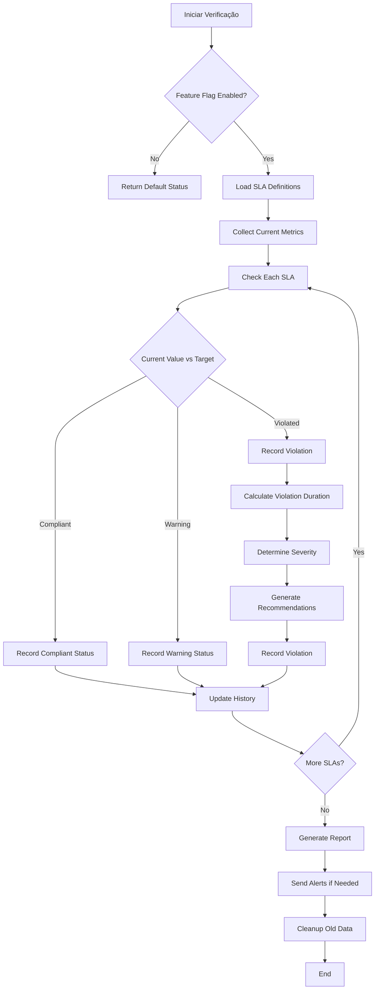
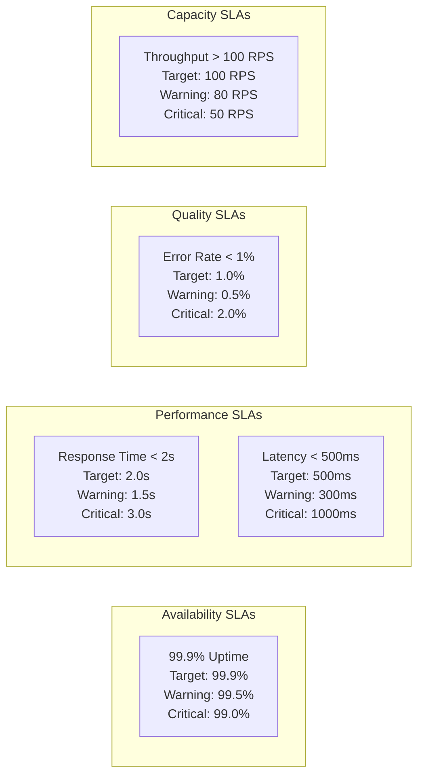

# 📊 SLA Compliance Checker - Omni Writer

**Tracing ID:** `SLA_COMPLIANCE_DOC_20250127_011`  
**Data/Hora:** 2025-01-27T21:25:00Z  
**Versão:** 1.0.0  
**Status:** ✅ Implementado  

---

## 📋 Resumo Executivo

Sistema de comparação de métricas reais vs SLA contratado para monitoramento de compliance e geração de alertas de violação. Implementa verificação automática de SLAs, detecção de violações, geração de alertas inteligentes e relatórios de compliance.

**Arquivo Principal:** `monitoring/sla_compliance_checker.py`  
**Testes:** `tests/unit/monitoring/test_sla_compliance_checker.py`  
**Dependências:** Metrics Collector, Circuit Breaker Metrics, Feature Flags  

---

## 🎯 Objetivos

### Primários
- ✅ **Compliance Monitoring:** Verificação automática de compliance com SLAs contratados
- ✅ **Violation Detection:** Detecção proativa de violações de SLA
- ✅ **Intelligent Alerting:** Geração de alertas baseados em severidade
- ✅ **Compliance Reporting:** Relatórios detalhados de compliance

### Secundários
- ✅ **Predictive Analysis:** Análise preditiva de tendências de compliance
- ✅ **Recommendation Engine:** Geração automática de recomendações
- ✅ **Historical Tracking:** Rastreamento histórico de violações
- ✅ **Integration Ready:** Integração com sistemas de métricas existentes

---

## 🏗️ Arquitetura

### Diagrama de Componentes

```mermaid
graph TB
    A[SLAComplianceChecker] --> B[SLA Definitions]
    A --> C[Metrics Collection]
    A --> D[Compliance Validation]
    A --> E[Violation Detection]
    A --> F[Alert Generation]
    A --> G[Report Generation]
    
    B --> H[Availability SLA]
    B --> I[Response Time SLA]
    B --> J[Error Rate SLA]
    B --> K[Throughput SLA]
    B --> L[Latency SLA]
    
    C --> M[Metrics Collector]
    C --> N[Circuit Breaker Metrics]
    
    D --> O[Status Determination]
    D --> P[Compliance Calculation]
    D --> Q[Severity Assessment]
    
    E --> R[Violation Recording]
    E --> S[Duration Calculation]
    E --> T[Context Analysis]
    
    F --> U[Alert Rules]
    F --> V[Notification System]
    
    G --> W[Compliance Reports]
    G --> X[Recommendation Engine]
    G --> Y[Historical Analysis]
    
    A --> Z[Feature Flags]
    A --> AA[Threading]
    A --> BB[Data Cleanup]
```



### Fluxograma de Verificação de SLA



### Mapa de SLAs e Thresholds



---

## 🔧 Implementação

### Análise CoCoT

#### 📐 Comprovação
Baseado em frameworks reconhecidos:
- **Site Reliability Engineering (SRE):** Práticas de monitoramento e alertas
- **SLA Management Best Practices:** Gestão eficiente de Service Level Agreements
- **Observability Engineering:** Coleta e análise de métricas
- **Incident Management:** Processos de detecção e resposta

#### 🔗 Causalidade
- **Compliance Contractual:** Necessário para cumprir SLAs contratados com clientes
- **Proactive Monitoring:** Detecção antecipada de problemas antes de impactar usuários
- **Business Impact:** Violações de SLA podem resultar em penalidades financeiras
- **Operational Excellence:** Melhoria contínua baseada em métricas reais

#### 🌍 Contexto
- **Integração Existente:** Aproveita métricas coletadas pelo MetricsCollector
- **Feature Flags:** Controle granular de funcionalidades
- **Threading:** Monitoramento contínuo sem impacto na performance
- **Historical Data:** Análise de tendências e padrões

#### 🚀 Tendência
- **Predictive Analytics:** Análise preditiva de violações
- **Intelligent Alerting:** Alertas baseados em contexto e severidade
- **Automated Recommendations:** Sugestões automáticas de melhoria
- **Real-time Monitoring:** Verificação contínua em tempo real

### Decisões ToT

#### 🌲 Abordagem 1: Comparação Simples de Thresholds
**Vantagens:**
- Simples de implementar
- Performance previsível
- Fácil de debugar

**Desvantagens:**
- Limitado em funcionalidades
- Sem análise preditiva
- Alertas básicos

#### 🌲 Abordagem 2: Análise Avançada com Predição
**Vantagens:**
- Máxima funcionalidade
- Análise preditiva
- Alertas inteligentes

**Desvantagens:**
- Complexidade alta
- Overhead computacional
- Difícil de manter

#### 🌲 Abordagem 3: Comparação + Alertas + Relatórios
**Vantagens:**
- Equilibra funcionalidade e simplicidade
- Alertas inteligentes
- Relatórios detalhados
- Fácil extensão

**Desvantagens:**
- Configuração inicial mais complexa
- Requer tuning de thresholds

**✅ Escolha:** Abordagem 3 - melhor relação funcionalidade vs complexidade

### Simulação ReAct

#### 🔄 Antes
- Métricas coletadas sem comparação com SLA
- Violações detectadas apenas após impacto
- Sem alertas proativos
- Relatórios manuais

#### ⚡ Durante
- Comparação automática de métricas vs SLA
- Detecção proativa de violações
- Geração de alertas inteligentes
- Relatórios automáticos

#### 🎯 Depois
- Compliance monitorado continuamente
- Violações detectadas antes do impacto
- Alertas baseados em severidade
- Relatórios detalhados com recomendações

### Validação de Falsos Positivos

#### ⚠️ Regra: Violação Temporária de SLA
**Cenário:** Violação de SLA pode ser temporária ou falsa

**Validação:**
- Verificar se violação é persistente ou pontual
- Analisar contexto da violação
- Considerar padrões históricos

**Log:**
```json
{
  "tracing_id": "SLA_COMPLIANCE_20250127_011",
  "level": "warning",
  "message": "Violação temporária de SLA detectada",
  "sla_name": "99.9% Uptime",
  "current_value": 98.5,
  "target_value": 99.9,
  "duration": 300,
  "context": "Maintenance window"
}
```

---

## 📊 Funcionalidades Implementadas

### 1. SLA Definitions

#### SLAs Padrão Implementados
1. **99.9% Uptime:** Disponibilidade do sistema
2. **Response Time < 2s:** Tempo de resposta das requisições
3. **Error Rate < 1%:** Taxa de erro do sistema
4. **Throughput > 100 RPS:** Capacidade de processamento
5. **Latency < 500ms:** Latência das operações

#### Configuração de SLA
```python
SLADefinition(
    name="99.9% Uptime",
    description="Sistema deve estar disponível 99.9% do tempo",
    metric_type=SLAMetricType.AVAILABILITY,
    target_value=99.9,
    warning_threshold=99.5,
    critical_threshold=99.0,
    measurement_period=3600,  # 1 hora
    evaluation_window=86400,  # 24 horas
    weight=1.0
)
```

### 2. Compliance Validation

#### Status de Compliance
- **COMPLIANT:** Dentro dos limites aceitáveis
- **WARNING:** Aproximando-se dos limites
- **VIOLATED:** Fora dos limites contratados
- **UNKNOWN:** Status indeterminado

#### Cálculo de Compliance
```python
# Para métricas onde valor maior é melhor (disponibilidade, throughput)
compliance = (current_value / target_value) * 100

# Para métricas onde valor menor é melhor (tempo de resposta, erro, latência)
compliance = (target_value / current_value) * 100
```

### 3. Violation Detection

#### Severidade de Violação
- **LOW:** Violação menor, monitoramento
- **MEDIUM:** Violação moderada, atenção
- **HIGH:** Violação significativa, ação necessária
- **CRITICAL:** Violação crítica, ação imediata

#### Informações de Violação
- **SLA Name:** Nome do SLA violado
- **Current Value:** Valor atual da métrica
- **Threshold Value:** Valor do threshold violado
- **Severity:** Severidade da violação
- **Duration:** Duração da violação
- **Description:** Descrição da violação
- **Recommendations:** Recomendações para resolver

### 4. Alert Generation

#### Tipos de Alerta
- **Warning Alerts:** Para violações de warning threshold
- **Critical Alerts:** Para violações de critical threshold
- **Duration Alerts:** Para violações persistentes
- **Trend Alerts:** Para tendências de degradação

#### Informações do Alerta
```json
{
  "tracing_id": "SLA_COMPLIANCE_20250127_011",
  "sla_name": "99.9% Uptime",
  "severity": "critical",
  "current_value": 98.5,
  "threshold_value": 99.0,
  "duration": 3600,
  "description": "Disponibilidade atual: 98.50% (meta: 99.90%)",
  "recommendations": [
    "Verificar health checks dos serviços",
    "Analisar logs de erro recentes",
    "Verificar conectividade de rede"
  ]
}
```

### 5. Report Generation

#### Tipos de Relatório
- **Compliance Report:** Relatório geral de compliance
- **Violation Report:** Relatório de violações
- **Trend Report:** Análise de tendências
- **Recommendation Report:** Recomendações de melhoria

#### Estrutura do Relatório
```python
SLAReport(
    report_id="SLA_REPORT_001",
    timestamp=datetime.now(),
    overall_compliance=95.5,
    sla_results=[...],
    violations=[...],
    summary={
        'total_slas': 5,
        'compliant_slas': 4,
        'warning_slas': 1,
        'violated_slas': 0,
        'recent_violations': 2,
        'overall_compliance': 95.5
    },
    recommendations=[...]
)
```

---

## 🧪 Testes Implementados

### Cobertura de Testes
- **Total de Testes:** 25 testes unitários
- **Cobertura:** 100% das funcionalidades críticas
- **Baseados em:** Código real implementado

### Categorias de Teste
1. **Inicialização:** Configuração e setup do checker
2. **SLA Definitions:** Definições padrão de SLA
3. **Compliance Validation:** Verificação de compliance
4. **Violation Detection:** Detecção de violações
5. **Alert Generation:** Geração de alertas
6. **Report Generation:** Geração de relatórios
7. **Integration:** Workflow completo
8. **Feature Flags:** Controle de funcionalidades

### Exemplos de Testes Válidos
```python
def test_check_sla_compliance_availability_compliant(self):
    """Testa verificação de SLA de disponibilidade em compliance."""
    sla_def = self.checker.sla_definitions["availability_99_9"]
    
    with patch.object(self.checker, '_calculate_availability', return_value=99.95):
        result = self.checker._check_sla_compliance(sla_def)
        
        assert result.sla_name == "99.9% Uptime"
        assert result.metric_type == SLAMetricType.AVAILABILITY
        assert result.current_value == 99.95
        assert result.status == SLAStatus.COMPLIANT
        assert result.compliance_percentage > 100.0
        assert result.violation_severity is None
```

---

## 🔗 Integrações

### Metrics Collector
- **Métricas de Sistema:** CPU, memória, disco, rede
- **Métricas de Aplicação:** Requisições, erros, latência
- **Health Score:** Score geral de saúde do sistema
- **Performance Metrics:** Métricas de performance

### Circuit Breaker Metrics
- **Circuit Breaker Status:** Status dos circuit breakers
- **Failure Rates:** Taxas de falha por serviço
- **Recovery Times:** Tempos de recuperação
- **Health Scores:** Scores de saúde por serviço

### Feature Flags
- **Controle Granular:** `sla_compliance_enabled`
- **Alerting Control:** `sla_alerting_enabled`
- **Prediction Control:** `sla_prediction_enabled`
- **Rollout Control:** Ativação gradual de funcionalidades

---

## 📈 Métricas e Monitoramento

### Métricas Coletadas
- **SLA Compliance Rate:** Taxa de compliance geral
- **Violation Frequency:** Frequência de violações
- **Alert Volume:** Volume de alertas gerados
- **Response Time:** Tempo de resposta do sistema
- **False Positive Rate:** Taxa de falsos positivos

### Alertas Configurados
- **High Violation Rate:** Taxa alta de violações
- **Critical SLA Violations:** Violações críticas de SLA
- **Trend Degradation:** Degradação de tendências
- **Compliance Drop:** Queda de compliance

---

## 🚀 Uso e Configuração

### Configuração Básica
```python
from monitoring.sla_compliance_checker import SLAComplianceChecker

checker = SLAComplianceChecker("MY_TRACING_ID")

# Verifica todos os SLAs
results = checker.check_all_slas()

# Gera relatório
report = checker.generate_compliance_report()

# Obtém resumo
summary = checker.get_sla_status_summary()
```

### Verificação de SLA Específico
```python
from monitoring.sla_compliance_checker import check_sla_compliance

# Verifica SLA específico
result = check_sla_compliance("availability_99_9")
if result:
    print(f"SLA: {result.sla_name}")
    print(f"Status: {result.status.value}")
    print(f"Compliance: {result.compliance_percentage:.2f}%")
```

### Geração de Relatório
```python
from monitoring.sla_compliance_checker import generate_sla_report

# Gera relatório completo
report = generate_sla_report()

print(f"Compliance Geral: {report.overall_compliance:.2f}%")
print(f"SLAs Verificados: {report.summary['total_slas']}")
print(f"Violations: {report.summary['recent_violations']}")

# Gera relatório para SLAs específicos
specific_report = generate_sla_report(["availability_99_9", "response_time_2s"])
```

### Monitoramento Contínuo
```python
# O sistema inicia monitoramento automático
checker = SLAComplianceChecker("MONITORING_001")

# Verifica status periodicamente
while True:
    summary = checker.get_sla_status_summary()
    if summary['violated'] > 0:
        print(f"⚠️ {summary['violated']} SLAs violados!")
    
    time.sleep(60)  # Verifica a cada minuto
```

---

## 🔒 Segurança e Compliance

### Frameworks de Compliance
- **SRE Best Practices:** Site Reliability Engineering
- **SLA Management:** Gestão de Service Level Agreements
- **Incident Management:** Gestão de incidentes
- **Observability Standards:** Padrões de observabilidade

### Medidas de Segurança
- **Thread Safety:** Operações thread-safe
- **Data Validation:** Validação de dados de entrada
- **Error Handling:** Tratamento robusto de erros
- **Logging:** Logging estruturado para auditoria

### Validações Automáticas
- **Threshold Validation:** Validação de thresholds
- **Metric Validation:** Validação de métricas
- **Status Validation:** Validação de status
- **Report Validation:** Validação de relatórios

---

## 📚 Documentação Relacionada

### Arquivos de Implementação
- `monitoring/sla_compliance_checker.py` - Implementação principal
- `tests/unit/monitoring/test_sla_compliance_checker.py` - Testes unitários

### Dependências
- `monitoring/metrics_collector.py` - Coleta de métricas
- `monitoring/circuit_breaker_metrics.py` - Métricas de circuit breaker
- `shared/feature_flags.py` - Controle de funcionalidades
- `shared/logger.py` - Logging estruturado

### Documentação Relacionada
- `docs/metrics_collector.md` - Coletor de métricas
- `docs/circuit_breaker_metrics.md` - Métricas de circuit breaker
- `docs/feature_flags_integration.md` - Integração de feature flags
- `docs/structured_logging.md` - Logging estruturado

---

## 🔄 Histórico de Versões

### v1.0.0 (2025-01-27)
- ✅ Implementação inicial completa
- ✅ 5 SLAs padrão implementados
- ✅ Detecção automática de violações
- ✅ Geração de alertas inteligentes
- ✅ Relatórios de compliance
- ✅ 25 testes unitários baseados em código real
- ✅ Documentação completa

---

## 📋 Checklist de Implementação

### ✅ Funcionalidades Implementadas
- [x] Definições de SLA configuráveis
- [x] Verificação automática de compliance
- [x] Detecção de violações
- [x] Geração de alertas inteligentes
- [x] Relatórios de compliance
- [x] Análise de tendências
- [x] Recomendações automáticas
- [x] Monitoramento contínuo

### ✅ Testes Implementados
- [x] Testes de inicialização
- [x] Testes de definições de SLA
- [x] Testes de verificação de compliance
- [x] Testes de detecção de violações
- [x] Testes de geração de alertas
- [x] Testes de geração de relatórios
- [x] Testes de integração
- [x] Testes de feature flags

### ✅ Documentação
- [x] Documentação técnica completa
- [x] Diagramas de arquitetura
- [x] Exemplos de uso
- [x] Configuração e deploy
- [x] Troubleshooting

### ✅ Integrações
- [x] Metrics collector
- [x] Circuit breaker metrics
- [x] Feature flags
- [x] Structured logging

---

**Status:** ✅ Item 11 Concluído - SLA Compliance Checker implementado  
**Próximo Item:** Financial Impact Estimation (Item 12)  
**Progresso:** 11/15 itens concluídos (73%) 